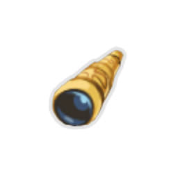

| Image | Name | Rarity | Color | Description | Flavor |
| ----- | ---- | ------ | ----- | ----------- | ------ |
|  | Old Locket | Starter | Hermit_yellow | At the start of each combat, add a #yMemento into your hand. | There's a faded picture inside. |
|  | Brass Tacks | Common |  | Start each combat with #b2 #yMetallicize. | The luster on these tacks never seems to fade. |
|  | Rye Stalk | Common | Hermit_yellow | At the end of your turn, ALL enemies lose HP equal to their #yhermit:Bruise. | Still in mint condition, despite being chewed on for so long. |
|  | Broken Tooth | Uncommon |  | Whenever you beat an Elite encounter, gain #b1 #yStrength at the start of each combat for the rest of the Act. | Appears too large to have come from a human jaw... |
|  | Spyglass | Uncommon | Hermit_yellow | If you end your turn #yhermit:Concentrated, gain an additional [E] next turn . | Property of Kestin Highfin. |
|  | Straight Razor | Uncommon | Hermit_yellow | Whenever you remove a card from your deck, heal #b15 HP. | For a cleaner shave... |
|  | Black Powder | Rare | Hermit_yellow | At the end of your turn, deal #b2 damage to ALL enemies for each #yhermit:Dead_On effect triggered. | Handle with care. |
|  | Charred Glove | Rare | Hermit_yellow | Whenever you draw a #rCurse, your next attack deals #b3 more damage. | Parts of the glove still glow with otherworldly cinders. |
|  | Red Scarf | Rare | Hermit_yellow | Whenever you apply a debuff to an enemy, gain #b2 #yBlock. | It's warm and fuzzy. |
|  | Clasped Locket | Boss | Hermit_yellow | Replaces #yOld #yLocket. First time you draw a #rCurse each turn, #yExhaust it and draw #b2 cards. Upon pickup, obtain #b2 #rInjuries. | It won't open anymore. |
|  | Dented Plate | Boss | Hermit_yellow | While your HP is at or below #b50%, gain [E] and draw #b1 card at the start of your turn. | Several bullets are still lodged inside. |
