## Cards

| Name | Image | Upgraded image | Rarity | Type | Cost | Description |
| ---- | ----- | -------------- | ------ | ---- | ---- | ----------- |
| Static Buildup | 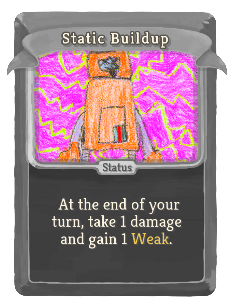 |  | Common | Status |  | At the end of your turn, take 1 damage and gain 1 Weak. |
| Defend |  | 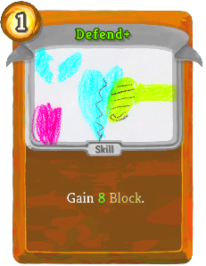 | Basic | Skill | 1 | Gain 5(8) Block. |
| Lucky Find | 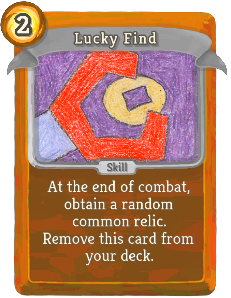 |  | Basic | Skill | 2(1) | At the end of combat, obtain a random common relic. Remove this card from your deck. |
| Mini Lasers | 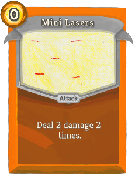 | 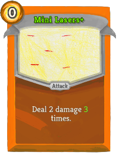 | Basic | Attack | 0 | Deal 2 damage 2(3) times. |
| Scan | 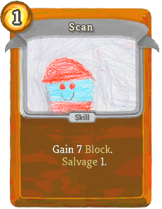 |  | Basic | Skill | 1 | Gain 7(10) Block. robotspaceexplorer:Salvage 1. |
| Strike | 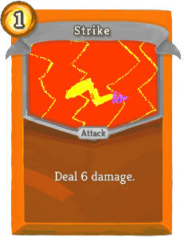 | 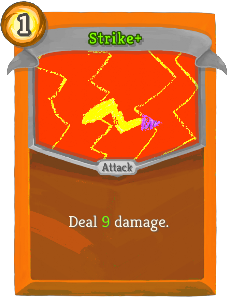 | Basic | Attack | 1 | Deal 6(9) damage. |
| Aftershock |  | 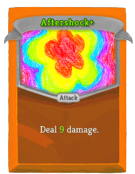 | Special | Attack |  | Deal 7(9) damage. |
| Ammunition | 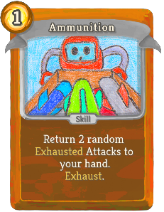 | 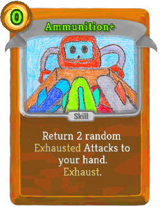 | Common | Skill | 1(0) | Return 2 random Exhausted Attacks to your hand. Exhaust. |
| Counterblock | 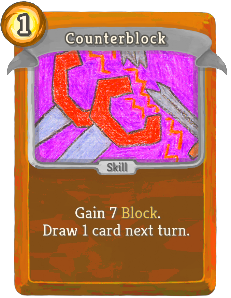 | 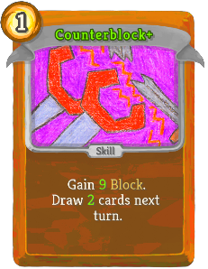 | Common | Skill | 1 | Gain 7(9) Block. Draw 1(2) card(s) next turn. |
| Frantic Search | 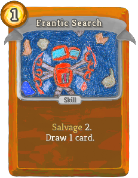 | 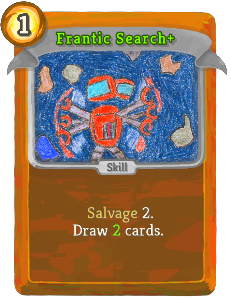 | Common | Skill | 1 | robotspaceexplorer:Salvage 2. Draw 1(2) card(s). |
| Frost Missile | 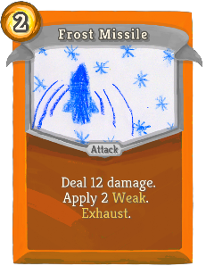 |  | Common | Attack | 2 | Deal 12(15) damage. Apply 2(3) Weak. Exhaust. |
| Glue Shot |  | 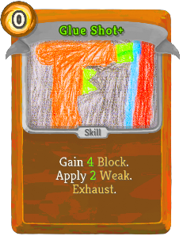 | Common | Skill | 0 | Gain 3(4) Block. Apply 1(2) Weak. Exhaust. |
| Improvised Attack | 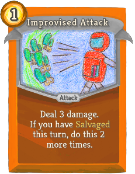 | 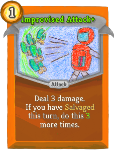 | Common | Attack | 1 | Deal 3 damage. If you have robotspaceexplorer:Salvaged this turn, do this 2(3) more times. |
| Metal Strike | 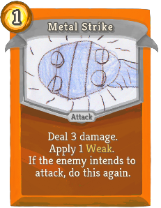 | 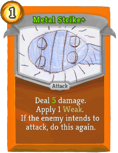 | Common | Attack | 1 | Deal 3(5) damage. Apply 1 Weak. If the enemy intends to attack, do this again. |
| Mini Drones | 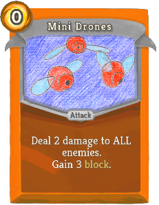 | 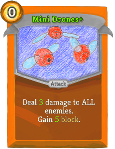 | Common | Attack | 0 | Deal 2(3) damage to ALL enemies. Gain 3(5) block. |
| Probe | 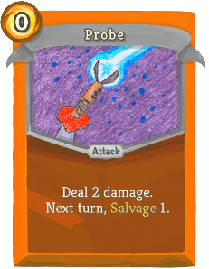 | 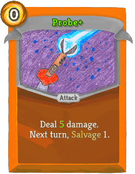 | Common | Attack | 0 | Deal 2(5) damage. Next turn, robotspaceexplorer:Salvage 1. |
| Pulsar |  | 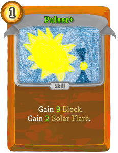 | Common | Skill | 1 | Gain 7(9) Block. Gain 1(2) robotspaceexplorer:Solar_Flare. |
| Scrap Missile | 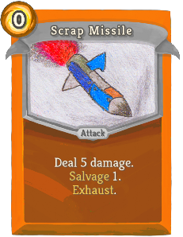 | 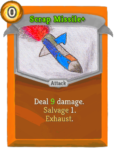 | Common | Attack | 0 | Deal 5(9) damage. robotspaceexplorer:Salvage 1. Exhaust. |
| Shock Kick | 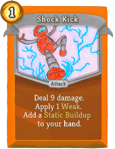 |  | Common | Attack | 1 | Deal 9(13) damage. Apply 1(2) Weak. Add a *Static *Buildup to your hand. |
| Shovel Strike | 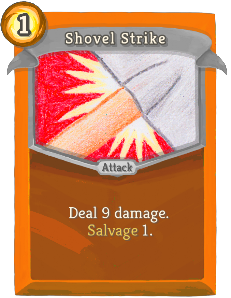 | 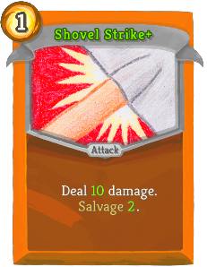 | Common | Attack | 1 | Deal 9(10) damage. robotspaceexplorer:Salvage 1(2). |
| Slime Missile |  | 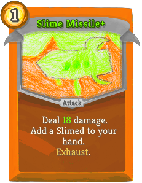 | Common | Attack | 1 | Deal 13(18) damage. Add a Slimed to your hand. Exhaust. |
| Stun Grenade | 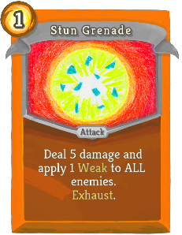 | 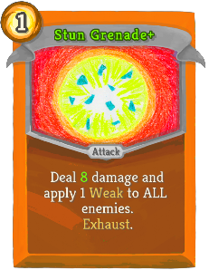 | Common | Attack | 1 | Deal 5(8) damage and apply 1 Weak to ALL enemies. Exhaust. |
| Surging Shield |  | 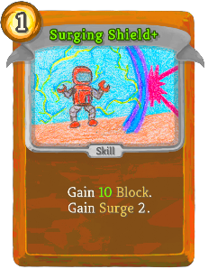 | Common | Skill | 1 | Gain 7(10) Block. Gain robotspaceexplorer:Surge 2. |
| Surging Strike | 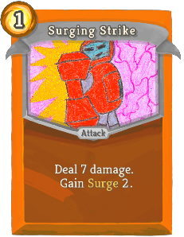 | 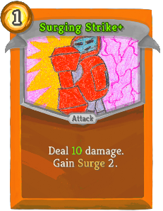 | Common | Attack | 1 | Deal 7(10) damage. Gain robotspaceexplorer:Surge 2. |
| Swift Step | 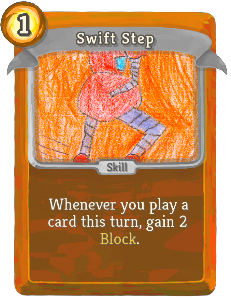 | 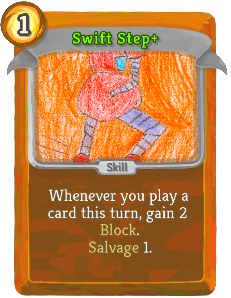 | Common | Skill | 1 | Whenever you play a card this turn, gain 2 Block.  (robotspaceexplorer:Salvage 1.) |
| Big Missile | 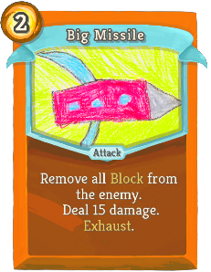 | 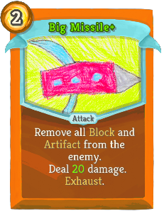 | Uncommon | Attack | 2 | Remove all Block (and Artifact) from the enemy. Deal 15(20) damage. Exhaust. |
| Blitz | 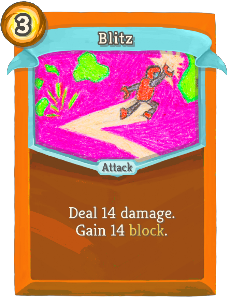 | 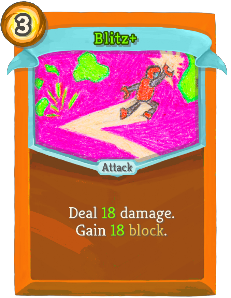 | Uncommon | Attack | 3 | Deal 14(18) damage. Gain 14(18) block. |
| Calculate | 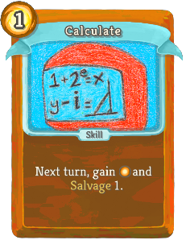 | 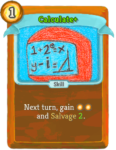 | Uncommon | Skill | 1 | Next turn, gain [E] ([E]) and robotspaceexplorer:Salvage 1(2). |
| Discharger | 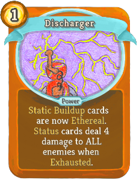 | 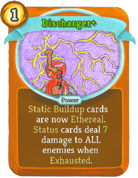 | Uncommon | Power | 1 | *Static *Buildup cards are now Ethereal. Status cards deal 4(7) damage to ALL enemies when Exhausted. |
| Double Block | 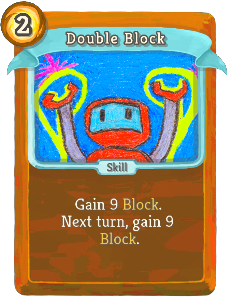 | 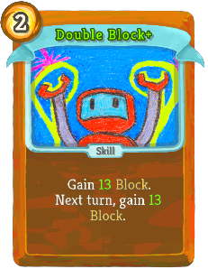 | Uncommon | Skill | 2 | Gain 9(13) Block. Next turn, gain 9(13) Block. |
| Double Find | 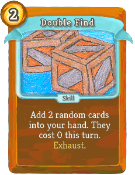 |  | Uncommon | Skill | 2(1) | Add 2 random cards into your hand. They cost 0 this turn. Exhaust. |
| Dual Core |  |  | Uncommon | Power | 1 | Every time you play 5 cards in a single turn, gain 3(5) Vigor and 3(5) Block. |
| Electropulse |  |  | Uncommon | Attack | 1 | Deal 9(12) damage to ALL enemies. Add a *Static *Buildup to your hand. Gain robotspaceexplorer:Surge 2(3). |
| Electroshield |  |  | Uncommon | Skill | 1 | Gain 14(19) Block. Add a *Static *Buildup to your hand. |
| Exhaust Fan |  |  | Uncommon | Power | 1 | Lose !RobotSpaceExplorer:SecondMagic! Dexterity. Gain 2(3) Block whenever you play an attack. |
| Fix |  |  | Uncommon | Skill | 1 | Gain 1(2) Artifact. Heal !RobotSpaceExplorer:SecondMagic! HP. Exhaust. |
| Freeze Ray |  |  | Uncommon | Power | 0 | Whenever you apply Weak to an enemy, deal 4(7) damage to it. |
| Freezing Shield |  |  | Uncommon | Skill | 1 | Gain 6(9) Block. Enemy loses 1(2) Strength this turn. |
| Gear Shield |  |  | Uncommon | Skill | 1 | Gain 8(12) Block. Gain 1 Artifact. Exhaust. |
| Glue Spray |  |  | Uncommon | Skill | X | Add X (Upgraded) Glue Shots to your hand. Exhaust. |
| Iron Shell |  |  | Uncommon | Skill | 1 | Gain 6(8) Block. Increase this card's Block by 3(4) this combat. |
| Jetpack |  |  | Uncommon | Skill | 0 | Gain 3(4) Block. Gain 1(2) temporary Dexterity. |
| Junk Dive |  |  | Uncommon | Skill | 0 | robotspaceexplorer:Salvage 3(4). Exhaust. |
| Laser Burst |  |  | Uncommon | Attack | 2 | Deal 3 damage to a random enemy 4(6) times. |
| Lucky Strike |  |  | Uncommon | Attack | 0 | Deal 5(8) damage. Whenever you robotspaceexplorer:Salvage, if this is in your draw pile, play it. |
| Makeshift Volley |  |  | Uncommon | Attack | 2(1) | Discard your hand. Deal 5 damage to a random enemy for each card discarded. |
| MiniBoosters |  |  | Uncommon | Power | 1 | Whenever you play a card costing 0, deal 1(2) damage to ALL enemies and gain 1(2) Block. |
| Plasma Missile |  |  | Uncommon | Attack | 2 | Deal 12(15) damage. Gain 3(5) robotspaceexplorer:Solar_Flare. Exhaust. |
| Power Collector |  |  | Uncommon | Power | 1 | (Innate.)  Whenever you play a power, gain 2 Strength. |
| Power Glove |  |  | Uncommon | Power | 1 | Whenever you would deal 5 or less unblocked attack damage, increase it by 4(6). |
| Reload |  |  | Uncommon | Skill | 1 | Play a random (Choose and play an) Attack from your Exhaust pile. |
| Rig Explosive |  |  | Uncommon | Skill | 1(0) | Obtain a Fire Potion. Exhaust. |
| Scrap Shield |  |  | Uncommon | Skill | 1 | Gain 6(9) Block. robotspaceexplorer:Salvage 2. |
| Scrap Toss |  |  | Uncommon | Attack | 0 | Deal 2(5) damage. robotspaceexplorer:Salvage 1. Shuffle this card into your draw pile. |
| Self-Cleaning |  |  | Uncommon | Skill | 1 | Add a Slimed to your hand, then Exhaust all Status cards in your hand. Gain 3(5) Block and draw a card for each card Exhausted. |
| Smokescreen |  |  | Uncommon | Skill | 1 | Gain 4(7) Block. Apply 1 Weak to ALL enemies. |
| Star Dust |  |  | Uncommon | Power | 2 | At the start of each turn, gain 1 less [E] and gain 5(8) robotspaceexplorer:Solar_Flare. |
| Star Lightning |  |  | Uncommon | Attack | 1 | Deal 5(7) damage. Gain 5(7) block. Gain 2(3) robotspaceexplorer:Solar_Flare. |
| Toxic Bomb |  |  | Uncommon | Skill | 2 | Apply !RobotSpaceExplorer:SecondMagic! Weak to ALL enemies. After 2 turns, deal 14(18) damage to ALL enemies. |
| Turbo Dodge |  |  | Uncommon | Skill | 2 | Gain 12(15) Block. Next turn, gain [E] ([E]). |
| Accelerator |  |  | Rare | Power | 3(2) | The first time you play a card costing 0 each turn, draw 1 card and gain [E]. |
| Arsenal |  |  | Rare | Skill | X | Play a random attack from your Exhaust pile X (X+1) times. Exhaust. |
| Asteroid |  |  | Rare | Attack | 2 | Deal 23(33) damage. |
| Autoloader |  |  | Rare | Power | 3 | Ethereal. (not Ethereal.) Choose an attack in your hand and remove it from combat. At the start of each turn, play that card. |
| Blast Shield |  |  | Rare | Skill | 3(2) | Gain Block equal to the amount an enemy intends to deal. Exhaust. |
| Blaster |  |  | Rare | Attack | 1 | Deal 7 damage. Apply 1(2) Weak. Apply 1(2) Vulnerable. |
| Charging Laser |  |  | Rare | Attack | 0 | Deal 5 damage. Increase this card's damage by 3(6) this combat. |
| Comet |  |  | Rare | Skill | 1 | Gain 3(5) robotspaceexplorer:Solar_Flare, then deal damage equal to your robotspaceexplorer:Solar_Flare to ALL enemies. |
| Drone Swarm |  |  | Rare | Power | X | (Innate.)  At the end of your turn, deal 2X damage to ALL enemies and gain 2X Block. |
| Exploration |  |  | Rare | Skill | 4(3) | At the end of combat, obtain a random relic. Remove this card from your deck. |
| Explosion |  |  | Rare | Attack | 3 | Play a random (Upgraded) robotspaceexplorer:Missile card, then play an Aftershock (Aftershock+) for each Attack Exhausted this combat. |
| High Voltage |  |  | Rare | Attack | 2 | Deal 21(28) damage to ALL enemies. Add 2 *Static *Buildups to your hand. |
| Multitool |  |  | Rare | Power | 1 | (Upgrade ALL cards in your hand for the rest of combat.)  At the start of your turn, upgrade a random card in your hand for the rest of combat. |
| Scanner |  |  | Rare | Power | 1(0) | Whenever you robotspaceexplorer:Salvage, prioritize higher rarity cards. |
| Shock Missile |  |  | Rare | Attack | 1 | Deal 7(8) damage. Enemy loses 1(2) Strength. Exhaust. |
| Trailblazer Form |  |  | Rare | Power | 3 | Ethereal. (not Ethereal.) At the start of your turn, gain 1 Artifact and !RobotSpaceExplorer:SecondMagic! Plated Armor. |
| Wormhole |  |  | Rare | Skill | 1(0) | Choose a card in your hand. Permanently remove it and this card from your deck. |

## Potions

| Image | Name | Rarity | Description |
| ----- | ---- | ------ | ----------- |
|  | Recycle Potion | Common | Salvage 3 cards and upgrade them. |
|  | Plasma Flask | Uncommon | Gain 8 Solar Flare. |
|  | Liquid Fusion | Rare | Every card in your hand costs 0 until played this turn. |

## Relics

| Image | Name | Rarity | Color | Description | Flavor |
| ----- | ---- | ------ | ----- | ----------- | ------ |
|  | RoboCore | Starter | Robot_orange_color | At the start of each combat, gain #b1 temporary #yStrength and draw #b1 additional card. | Standard issue power drive that activates when danger is detected. |
|  | Clockwork Sextant | Common | Robot_orange_color | At the start of your #b2nd turn, gain #b1 #yArtifact. | "Was this ever used by sailors?" |
|  | Foglands Knife | Common | Robot_orange_color | #yAttacks that cost #b0 deal #b2 additional damage. | A small knife used by assassins that appears to have been discarded. |
|  | Bottled Gravity | Uncommon | Robot_orange_color | Choose a card. It costs 1 less [E] in combat. | The essence of pure gravity somehow makes the bottle feel lighter. |
|  | Plasma Hourglass | Uncommon | Robot_orange_color | At the start of your turn, gain #b1 #ySolar #yFlare. | A scientific marvel that swirls with pure plasma. |
|  | Ring of the Newt | Rare | Robot_orange_color | Every #b2 turns, draw #b1 additional card. | An odd fossilized ring that appears to have been discarded. |
|  | Tough Plating | Rare | Robot_orange_color | Whenever you #ySalvage, gain #b2 #yBlock. | A strong exoskeleton useful for persevering while exploring the depths of space. |
|  | Reprocessor | Boss | Robot_orange_color | At the start of your turn, #ySalvage #b1. | This advanced device allows spacefarers to reuse valuable resources. |
|  | Search Specs | Boss | Robot_orange_color | The first time you Salvage each turn, gain [E] . | This fashionable accessory is widely used by robotic explorers. |
|  | TurboCore | Boss | Robot_orange_color | Replaces #rRoboCore. NL At the start of each combat, gain #b2 temporary #yStrength, draw #b2 additional cards, and gain #b1 [E] . | Upgraded power drive that activates when danger is detected. |
|  | Slide Rule | Shop | Robot_orange_color | Whenever you shuffle your draw pile, play a random #yAttack from your #yExhaust pile. | "Log base 10 of 800 is 2.903..." |

| Image | Name |
| ----- | ---- |
|  | the Robonaut |

