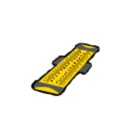

| Image | Name | Rarity | Color | Description | Flavor |
| ----- | ---- | ------ | ----- | ----------- | ------ |
|  | RoboCore | Starter | Robot_orange_color | At the start of each combat, gain #b1 temporary #yStrength and draw #b1 additional card. | Standard issue power drive that activates when danger is detected. |
|  | Clockwork Sextant | Common | Robot_orange_color | At the start of your #b2nd turn, gain #b1 #yArtifact. | "Was this ever used by sailors?" |
|  | Foglands Knife | Common | Robot_orange_color | #yAttacks that cost #b0 deal #b2 additional damage. | A small knife used by assassins that appears to have been discarded. |
|  | Bottled Gravity | Uncommon | Robot_orange_color | Choose a card. It costs 1 less [E] in combat. | The essence of pure gravity somehow makes the bottle feel lighter. |
|  | Plasma Hourglass | Uncommon | Robot_orange_color | At the start of your turn, gain #b1 #ySolar #yFlare. | A scientific marvel that swirls with pure plasma. |
|  | Ring of the Newt | Rare | Robot_orange_color | Every #b2 turns, draw #b1 additional card. | An odd fossilized ring that appears to have been discarded. |
|  | Tough Plating | Rare | Robot_orange_color | Whenever you #ySalvage, gain #b2 #yBlock. | A strong exoskeleton useful for persevering while exploring the depths of space. |
|  | Reprocessor | Boss | Robot_orange_color | At the start of your turn, #ySalvage #b1. | This advanced device allows spacefarers to reuse valuable resources. |
|  | Search Specs | Boss | Robot_orange_color | The first time you Salvage each turn, gain [E] . | This fashionable accessory is widely used by robotic explorers. |
|  | TurboCore | Boss | Robot_orange_color | Replaces #rRoboCore. NL At the start of each combat, gain #b2 temporary #yStrength, draw #b2 additional cards, and gain #b1 [E] . | Upgraded power drive that activates when danger is detected. |
|  | Slide Rule | Shop | Robot_orange_color | Whenever you shuffle your draw pile, play a random #yAttack from your #yExhaust pile. | "Log base 10 of 800 is 2.903..." |
