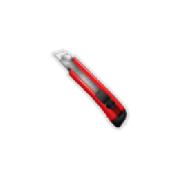
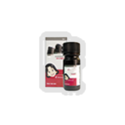
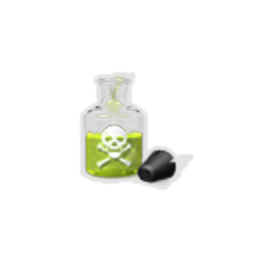
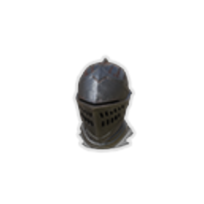
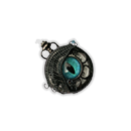
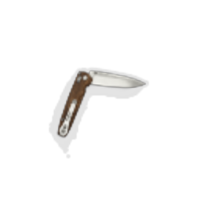

| Image | Name | Rarity | Color | Description | Flavor |
| ----- | ---- | ------ | ----- | ----------- | ------ |
|  | Shadowed Necklace | Starter | Color_chaser | At the start of each combat, apply #b2 #yTargeting to a random enemy. | A necklace with a small glass bottle, created from the abyssal darkness. |
|  | Scotch Stone | Common | Color_chaser | Whenever you deal damage by triggering #yTargeting, deal #b1 additional damage. | A fine-grained grey stone used for sharpening weapons. |
|  | Box Cutter | Uncommon | Color_chaser | Your first Attack that triggers #yTargeting each turn triggers it #btwice. | A very peculiar sword. So peculiar, that its purpose is unknown. |
|  | R-B0-7 | Uncommon | Color_chaser | At the start of each turn, enemies which have debuffs lose #b5 #yHP. | A dangerous secret weapon. Its lethality is complemented with an infamous drug. |
|  | Acid Solution | Rare | Color_chaser | Whenever you play an Attack, if you are #yWeak, apply #b1 #yWeak to the enemy. If you are #yFrail, remove all Block from the enemy. | Extremely corrosive. Hopefully no one else carelessly sprinkles this on something...or someone. |
|  | Assassin's Cloak | Rare | Color_chaser | At the start of each combat, #yHide for #b2 turns. | This mass-produced cloak boasts the most reliable camouflage. |
|  | Rusty Helmet | Rare | Color_chaser | At the start of each turn, apply #b1 #yBlindsided to ALL enemies. | An old helmet used in wars of the past. It's unlikely to see use today. |
|  | Broken Ticker | Boss | Color_chaser | At the start of each combat, apply #ySlow to ALL enemies. | It is already broken, yet a faint ticking can still be heard. |
|  | Masked Shadows | Boss | Color_chaser | Replaces #pShadowed #pNecklace. At the start of your turn, apply #b1 #yTargeting to ALL enemies and trigger #yTargeting once. | Behind a mask, nobody can see the abyss. |
|  | Pocket Knife | Boss | Color_chaser | After #yTarget is triggered for the fourth time each turn, gain [E] . | A portable knife used to cut ropes. |
|  | Letter of Request | Shop | Color_chaser | At the start of each combat, apply #b3 #yTargeting to ALL enemies. | A letter of request from an unknown client. |
