| Name | Image | Upgraded image | Rarity | Type | Cost | Description |
| ---- | ----- | -------------- | ------ | ---- | ---- | ----------- |
| Defend |  |  | Basic | Skill | 1 | Gain 5(8) Block. |
| Dualcast | 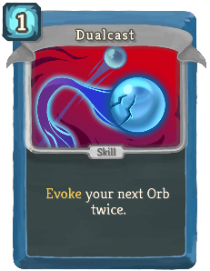 | 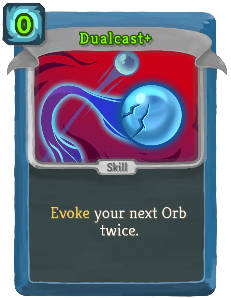 | Basic | Skill | 1(0) | Evoke your next Orb twice. |
| Strike |  |  | Basic | Attack | 1 | Deal 6(9) damage. |
| Zap |  | 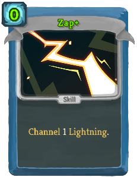 | Basic | Skill | 1(0) | Channel 1 Lightning. |
| Ball Lightning | 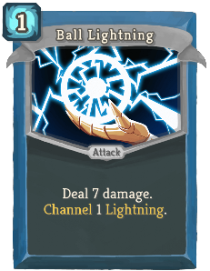 | 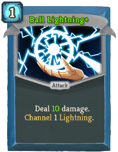 | Common | Attack | 1 | Deal 7(10) damage. Channel 1 Lightning. |
| Barrage | 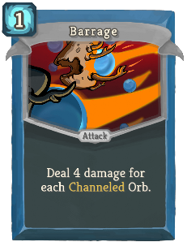 | 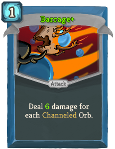 | Common | Attack | 1 | Deal 4(6) damage for each Channeled Orb. |
| Beam Cell | 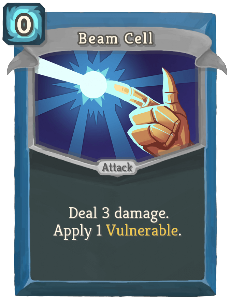 | 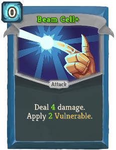 | Common | Attack | 0 | Deal 3(4) damage. Apply 1(2) Vulnerable. |
| Charge Battery | 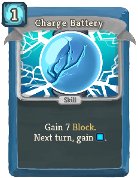 | 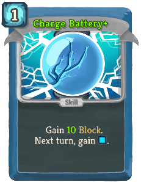 | Common | Skill | 1 | Gain 7(10) Block. Next turn, gain [B]. |
| Claw | 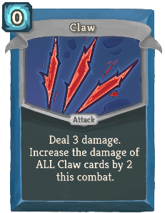 | 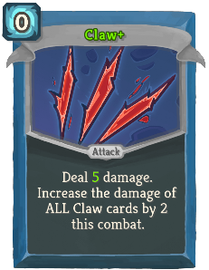 | Common | Attack | 0 | Deal 3(5) damage. Increase the damage of ALL Claw cards by 2 this combat. |
| Cold Snap | 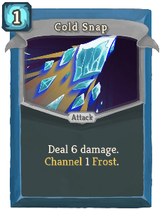 | 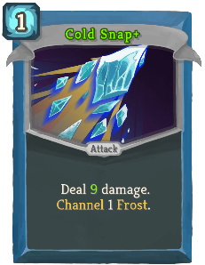 | Common | Attack | 1 | Deal 6(9) damage. Channel 1 Frost. |
| Compile Driver | 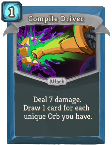 | 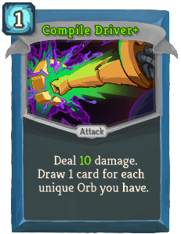 | Common | Attack | 1 | Deal 7(10) damage. Draw 1 card for each unique Orb you have. |
| Coolheaded | 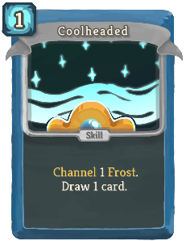 | 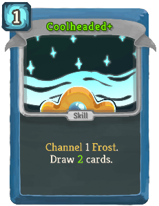 | Common | Skill | 1 | Channel 1 Frost. Draw 1(2) card(s). |
| Go for the Eyes |  | 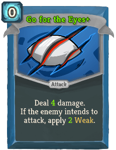 | Common | Attack | 0 | Deal 3(4) damage. If the enemy intends to attack, apply 1(2) Weak. |
| Hologram | 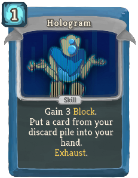 | 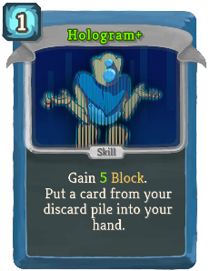 | Common | Skill | 1 | Gain 3(5) Block. Put a card from your discard pile into your hand. Exhaust. (not Exhaust.) |
| Leap | 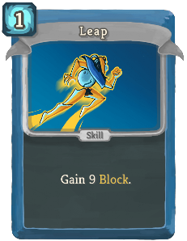 | 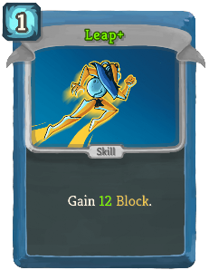 | Common | Skill | 1 | Gain 9(12) Block. |
| Rebound | 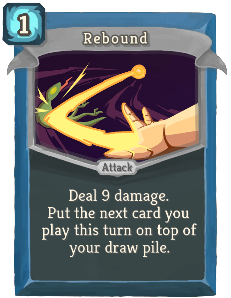 | 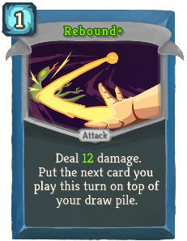 | Common | Attack | 1 | Deal 9(12) damage. Put the next card you play this turn on top of your draw pile. |
| Recursion | 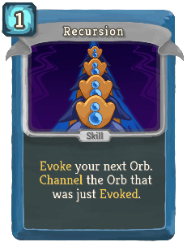 | 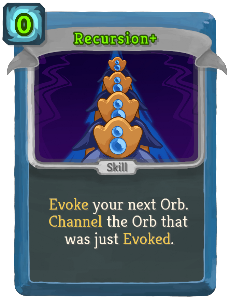 | Common | Skill | 1(0) | Evoke your next Orb. Channel the Orb that was just Evoked. |
| Stack |  | 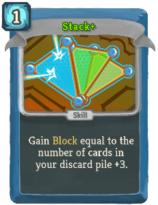 | Common | Skill | 1 | Gain Block equal to the number of cards in your discard pile (+3). |
| Steam Barrier | 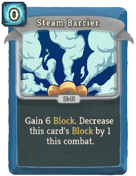 | 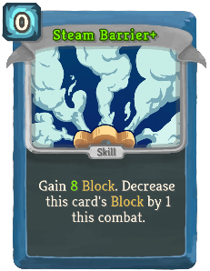 | Common | Skill | 0 | Gain 6(8) Block. Decrease this card's Block by 1 this combat. |
| Streamline | 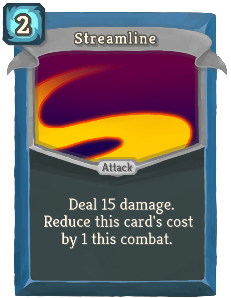 | 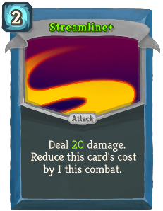 | Common | Attack | 2 | Deal 15(20) damage. Reduce this card's cost by 1 this combat. |
| Sweeping Beam | 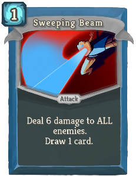 | 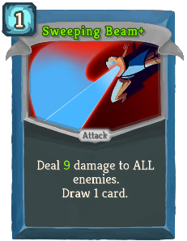 | Common | Attack | 1 | Deal 6(9) damage to ALL enemies. Draw 1 card. |
| TURBO | 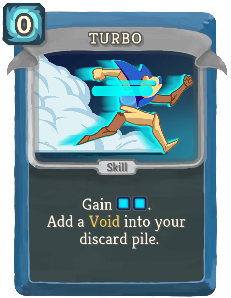 | 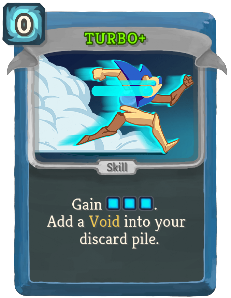 | Common | Skill | 0 | Gain [B] [B] ([B]). Add a *Void into your discard pile. |
| Aggregate | 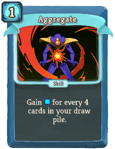 | 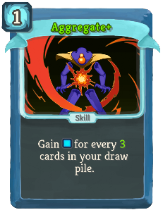 | Uncommon | Skill | 1 | Gain [B] for every 4(3) cards in your draw pile. |
| Auto-Shields | 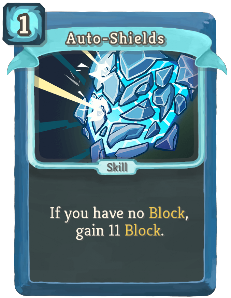 | 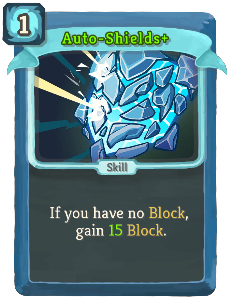 | Uncommon | Skill | 1 | If you have no Block, gain 11(15) Block. |
| Blizzard | 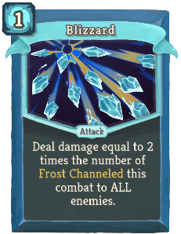 | 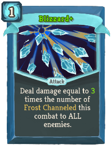 | Uncommon | Attack | 1 | Deal damage equal to 2(3) times the number of Frost Channeled this combat to ALL enemies. |
| Boot Sequence | 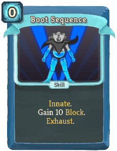 | 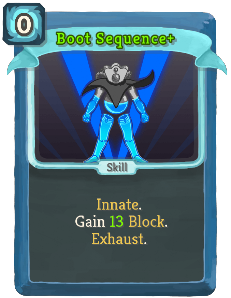 | Uncommon | Skill | 0 | Innate. Gain 10(13) Block. Exhaust. |
| Bullseye | 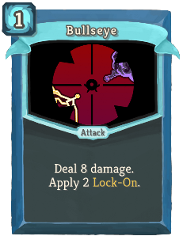 | 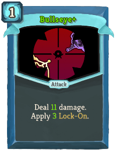 | Uncommon | Attack | 1 | Deal 8(11) damage. Apply 2(3) Lock-On. |
| Capacitor | 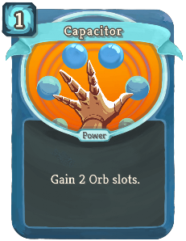 |  | Uncommon | Power | 1 | Gain 2(3) Orb slots. |
| Chaos | 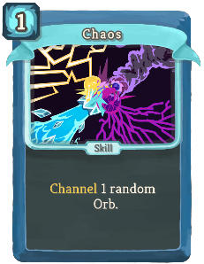 |  | Uncommon | Skill | 1 | Channel 1(2) random Orb(s). |
| Chill |  | 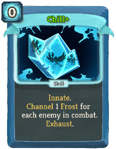 | Uncommon | Skill | 0 | (Innate.)  Channel 1 Frost for each enemy in combat. Exhaust. |
| Consume |  |  | Uncommon | Skill | 2 | Gain 2(3) Focus. Lose 1 Orb slot. |
| Darkness |  |  | Uncommon | Skill | 1 | Channel 1 Dark.  (Trigger the passive ability of all Dark orbs.) |
| Defragment |  |  | Uncommon | Power | 1 | Gain 1(2) Focus. |
| Doom and Gloom |  |  | Uncommon | Attack | 2 | Deal 10(14) damage to ALL enemies. Channel 1 Dark. |
| Double Energy |  |  | Uncommon | Skill | 1(0) | Double your Energy. Exhaust. |
| Equilibrium |  |  | Uncommon | Skill | 2 | Gain 13(16) Block. Retain your hand this turn. |
| FTL |  |  | Uncommon | Attack | 0 | Deal 5(6) damage. If you have played less than 3(4) cards this turn, draw 1 card. |
| Force Field |  |  | Uncommon | Skill | 4 | Costs 1 less [B] for each Power card played this combat. Gain 12(16) Block. |
| Fusion |  |  | Uncommon | Skill | 2(1) | Channel 1 Plasma. |
| Genetic Algorithm |  |  | Uncommon | Skill | 1 | Gain 1 Block. Permanently increase this card's Block by 2(3). Exhaust. |
| Glacier |  |  | Uncommon | Skill | 2 | Gain 7(10) Block. Channel 2 Frost. |
| Heatsinks |  |  | Uncommon | Power | 1 | Whenever you play a Power card, draw 1(2) card(s). |
| Hello World |  |  | Uncommon | Power | 1 | (Innate.)  At the start of your turn, add a random Common card into your hand. |
| Loop |  |  | Uncommon | Power | 1 | At the start of your turn, trigger the passive ability of your next Orb (1(2) times). |
| Melter |  |  | Uncommon | Attack | 1 | Remove all Block from the enemy. Deal 10(14) damage. |
| Overclock |  |  | Uncommon | Skill | 0 | Draw 2(3) cards. Add a *Burn into your discard pile. |
| Recycle |  |  | Uncommon | Skill | 1(0) | Exhaust a card. Gain [B] equal to its cost. |
| Reinforced Body |  |  | Uncommon | Skill | X | Gain 7(9) Block X times. |
| Reprogram |  |  | Uncommon | Skill | 1 | Lose 1(2) Focus. Gain 1(2) Strength. Gain 1(2) Dexterity. |
| Rip and Tear |  |  | Uncommon | Attack | 1 | Deal 7(9) damage to a random enemy twice. |
| Scrape |  |  | Uncommon | Attack | 1 | Deal 7(10) damage. Draw 4(5) cards. Discard all cards drawn this way that do not cost 0. |
| Self Repair |  |  | Uncommon | Power | 1 | At the end of combat, heal 7(10) HP. |
| Skim |  |  | Uncommon | Skill | 1 | Draw 3(4) cards. |
| Static Discharge |  |  | Uncommon | Power | 1 | Whenever you receive unblocked attack damage, Channel 1(2) Lightning. |
| Storm |  |  | Uncommon | Power | 1 | (Innate.)  Whenever you play a Power card, Channel 1 Lightning. |
| Sunder |  |  | Uncommon | Attack | 3 | Deal 24(32) damage. If this kills an enemy, gain [B] [B] [B]. |
| Tempest |  |  | Uncommon | Skill | X | Channel X (X+1) Lightning. Exhaust. |
| White Noise |  |  | Uncommon | Skill | 1(0) | Add a random Power card into your hand. It costs 0 this turn. Exhaust. |
| All for One |  |  | Rare | Attack | 2 | Deal 10(14) damage. Put all cost 0 cards from your discard pile into your hand. |
| Amplify |  |  | Rare | Skill | 1 | This turn, your next (1(2)) Power card(s) is (are) played twice. |
| Biased Cognition |  |  | Rare | Power | 1 | Gain 4(5) Focus. At the start of your turn, lose 1 Focus. |
| Buffer |  |  | Rare | Power | 2 | Prevent the next (1(2)) time(s) you would lose HP. |
| Core Surge |  |  | Rare | Attack | 1 | Deal 11(15) damage. Gain 1 Artifact. Exhaust. |
| Creative AI |  |  | Rare | Power | 3(2) | At the start of your turn, add a random Power card into your hand. |
| Echo Form |  |  | Rare | Power | 3 | Ethereal. (not Ethereal.) The first card you play each turn is played twice. |
| Electrodynamics |  |  | Rare | Power | 2 | Lightning now hits ALL enemies. Channel 2(3) Lightning. |
| Fission |  |  | Rare | Skill | 0 | Remove (Evoke) all your Orbs. Gain [B] and draw 1 card for each Orb removed (Evoked). Exhaust. |
| Hyperbeam |  |  | Rare | Attack | 2 | Deal 26(34) damage to ALL enemies. Lose 3 Focus. |
| Machine Learning |  |  | Rare | Power | 1 | (Innate.)  At the start of your turn, draw 1 additional card. |
| Meteor Strike |  |  | Rare | Attack | 5 | Deal 24(30) damage. Channel 3 Plasma. |
| Multi-Cast |  |  | Rare | Skill | X | Evoke your next Orb X (X+1) times. |
| Rainbow |  |  | Rare | Skill | 2 | Channel 1 Lightning. Channel 1 Frost. Channel 1 Dark. Exhaust. (not Exhaust.) |
| Reboot |  |  | Rare | Skill | 0 | Shuffle ALL your cards into your draw pile. Draw 4(6) cards. Exhaust. |
| Seek |  |  | Rare | Skill | 0 | Put 1(2) card(s) from your draw pile into your hand. Exhaust. |
| Thunder Strike |  |  | Rare | Attack | 3 | Deal 7(9) damage to a random enemy for each Lightning Channeled this combat. |
