| Name | Image | Upgraded image | Rarity | Type | Cost | Description |
| ---- | ----- | -------------- | ------ | ---- | ---- | ----------- |
| Amethyst |  | 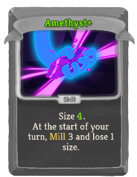 | Special | Skill |  | Size 3(4). At the start of your turn, thevacant:Mill 3 and lose 1 size. |
| Apparition |  |  | Special | Skill | 1 | Ethereal. (not Ethereal.) Gain 1 Intangible. Exhaust. |
| Beast Slayer |  |  | Special | Attack | 1 | Deal 12(15) damage. In Elite combats, deal !fishing:sd! damage instead. |
| Become Almighty |  |  | Special | Power |  | Gain 3(4) Strength. |
| Beta |  | 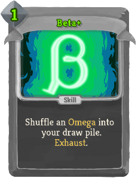 | Special | Skill | 2(1) | Shuffle an *Omega into your draw pile. Exhaust. |
| Bite |  |  | Special | Attack | 1 | Deal 7(8) damage. Heal 2(3) HP. |
| Boot |  |  | Special | Attack | 0 | Deal 2 damage to ALL enemies. Draw !fishing:m3! card(s). Exhaust. |
| Cheat |  |  | Special | Attack | 1 | Remove the enemy's Block. Deal 9(12) damage. Add a *Steal into your hand. Exhaust. |
| Crystalline Confluence |  |  | Special | Skill | X | Shuffle X (X+1) fishing:Foil *Star *Shards into your draw pile. Exhaust. |
| Diamond |  |  | Special | Skill |  | Size 3(4). Prevent the next time you would take damage and lose 1 size. At the start of your turn, lose 1 size. |
| Eel |  |  | Special | Skill | 0 | {@@}Gain {1|1=[E]|2=[E] [E]|3=[E] [E] [E]|4=[E] [E] [E] [E]|>4=1 [E]}. Draw !fishing:m3! card(s). Exhaust. |
| Emerald |  | 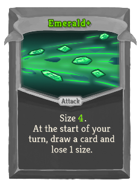 | Special | Attack |  | Size 3(4). At the start of your turn, draw a card and lose 1 size. |
| Exhaustion |  |  | Special | Status |  | Unplayable. While in hand, you cannot gain or consume Charge-up. |
| Expunger | 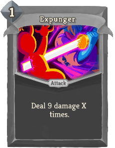 | 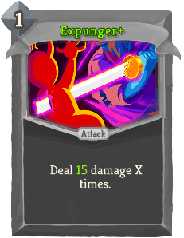 | Special | Attack | 1 | Deal 9(15) damage X times. |
| Fame and Fortune |  | 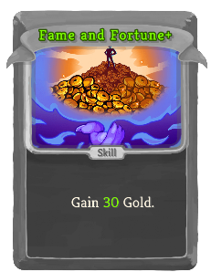 | Special | Skill |  | Gain 25(30) Gold. |
| Flag |  |  | Special | Skill | 0 | Retain. Gain 6(9) Block. Exhaust. |
| Flight |  |  | Special | Skill | 1 | Ethereal. Gain 10(14) Block. Exhaust. |
| Guppy |  |  | Special | Skill | 0 | Gain 3 Block. Draw !fishing:m3! card(s). Exhaust. |
| Hammerhead |  |  | Special | Skill | 0 | Gain 1 Strength. Draw !fishing:m3! card(s). Exhaust. |
| Hello There! |  |  | Special | Skill | 0 | Innate. Apply 1(2) Weak. Apply 1(2) Vulnerable. Draw 1 card. Exhaust. |
| Hindsight | 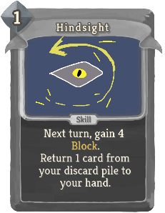 |  | Special | Skill | 1 | Next turn, gain 4(6) Block. Return 1 card from your discard pile to your hand. |
| Insight | 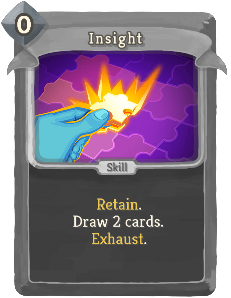 |  | Special | Skill | 0 | Retain. Draw 2(3) cards. Exhaust. |
| J.A.X. |  |  | Special | Skill | 0 | Lose 3 HP. Gain 2(3) Strength. |
| Live Forever |  |  | Special | Power |  | Gain 6(8) *Plated *Armor. |
| Maw |  |  | Special | Attack | 0 | Deal 3 damage twice. Draw !fishing:m3! card(s). Exhaust. |
| Miracle |  |  | Special | Skill | 0 | Retain. Gain [W] ([W]). Exhaust. |
| Octopus |  |  | Special | Skill | 0 | {@@}Draw 1 card{1|>1=s}. Draw !fishing:m3! card(s). Exhaust. |
| Omega | 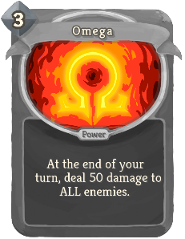 |  | Special | Power | 3 | At the end of your turn, deal 50(60) damage to ALL enemies. |
| Onyx |  |  | Special | Attack |  | Size 3(4). At the start of your turn, apply 1 thevacant:Doom to ALL enemies and lose 1 size. |
| Opal |  |  | Special | Skill |  | Size 3(4). At the start of your turn, gain [E] and lose 1 size. |
| Pinball |  | 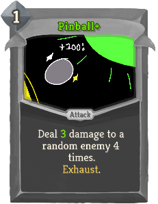 | Special | Attack | 1 | Deal 2(3) damage to a random enemy 4 times. Exhaust. |
| Piranha |  |  | Special | Attack | 0 | Deal 4 damage. Draw !fishing:m3! card(s). Exhaust. |
| Power Pellet |  |  | Special | Skill | 0 | *Waka *Wakas deal 6(9) additional damage. Exhaust. |
| Qwilfish |  | 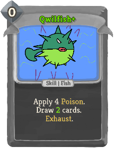 | Special | Skill | 0 | Apply 4 Poison. Draw !fishing:m3! card(s). Exhaust. |
| Ritual Dagger |  |  | Special | Attack | 1 | Deal 15 damage. If Fatal, permanently increase this card's damage by 3(5). Exhaust. |
| Ruby | 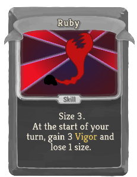 |  | Special | Skill |  | Size 3(4). At the start of your turn, gain 3 Vigor and lose 1 size. |
| Safety |  | 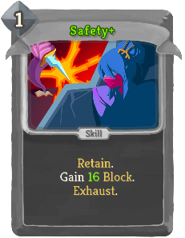 | Special | Skill | 1 | Retain. Gain 12(16) Block. Exhaust. |
| Sapphire |  |  | Special | Power |  | Size 3(4). At the start of your turn, gain 3 thevacant:Temperance and lose 1 size. |
| Sea Monster |  |  | Special | Skill | 0 | Add 2 fishing:Fish into your hand. Draw !fishing:m3! card(s). Exhaust. |
| Shark |  |  | Special | Attack | 0 | Deal 3 damage. Apply 1 Vulnerable. Draw !fishing:m3! card(s). Exhaust. |
| Shiv |  |  | Special | Attack | 0 | Deal 4(6) damage. Exhaust. |
| Smite | 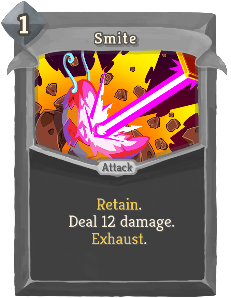 |  | Special | Attack | 1 | Retain. Deal 12(16) damage. Exhaust. |
| Spin Attack | 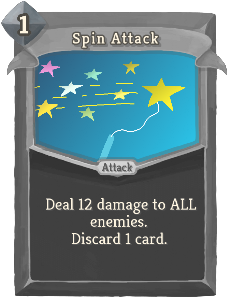 | 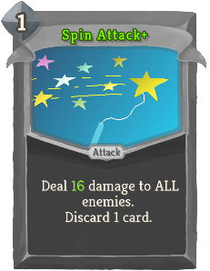 | Special | Attack | 1 | Deal 12(16) damage to ALL enemies. Discard 1 card. |
| Star Shard | 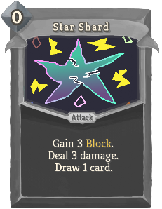 |  | Special | Attack | 0 | Gain 3(4) Block. Deal 3(4) damage. Draw 1 card. |
| Starfish |  |  | Special | Attack | 0 | Deal 3 damage. Apply 1 Weak. Draw !fishing:m3! card(s). Exhaust. |
| Steal |  |  | Special | Skill | 1 | If the enemy has positive Strength, steal up to 2(3) of it. Exhaust. |
| Swordfish |  | 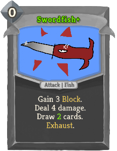 | Special | Attack | 0 | Gain 3 Block. Deal 4 damage. Draw !fishing:m3! card(s). Exhaust. |
| The Eternity Gem |  |  | Special | Attack | 1 | Deal 11(12) damage to a random enemy 11(12) times. Exhaust. |
| The Gem Search |  |  | Special | Power | 1(0) | fishing:Quest: End your turn with an empty hand. *Reward: Shuffle *The *Eternity *Gem into your draw pile. |
| The Key Finisher |  |  | Special | Attack | 2 | Deal 11(13) damage to ALL enemies twice. Complete your fishing:Quests. |
| The Whale |  |  | Special | Skill | 0 | Enemy loses 20 HP. Draw !fishing:m3! card(s). Exhaust. |
| Through Violence |  |  | Special | Attack | 0 | Retain. Deal 20(30) damage. Exhaust. |
| Topaz |  |  | Special | Attack |  | Size 2(3). At the start of your turn, gain 1 Artifact and lose 1 size. |
| Za Hando |  |  | Special | Attack | 1 | Deal 13(17) damage. Exhaust the middle card(s) of your hand. |
| Burn | 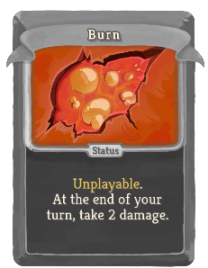 |  | Common | Status |  | Unplayable. At the end of your turn, take 2 damage. |
| Dazed |  |  | Common | Status |  | Unplayable. Ethereal. |
| Slimed |  |  | Common | Status | 1 | Exhaust. |
| Static Buildup | 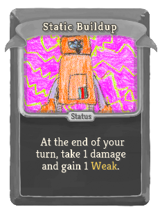 |  | Common | Status |  | At the end of your turn, take 1 damage and gain 1 Weak. |
| Void |  |  | Common | Status |  | Unplayable. Ethereal. Whenever this card is drawn, lose 1 Energy. |
| Wound |  |  | Common | Status |  | Unplayable. |
| Bandage Up |  |  | Uncommon | Skill | 0 | Heal 4(6) HP. Exhaust. |
| Blind |  |  | Uncommon | Skill | 0 | Apply 2 Weak (to ALL enemies). |
| Dark Shackles |  | 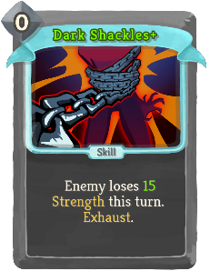 | Uncommon | Skill | 0 | Enemy loses 9(15) Strength this turn. Exhaust. |
| Deep Breath |  |  | Uncommon | Skill | 0 | Shuffle your discard pile into your draw pile. Draw 1(2) card(s). |
| Discovery |  |  | Uncommon | Skill | 1 | Choose 1 of 3 random cards to add into your hand. It costs 0 this turn. Exhaust. (not Exhaust.) |
| Dramatic Entrance |  |  | Uncommon | Attack | 0 | Innate. Deal 8(12) damage to ALL enemies. Exhaust. |
| Enlightenment |  |  | Uncommon | Skill | 0 | Reduce the cost of all cards in your hand to 1 this turn (combat). |
| Finesse |  |  | Uncommon | Skill | 0 | Gain 2(4) Block. Draw 1 card. |
| Flash of Steel |  |  | Uncommon | Attack | 0 | Deal 3(6) damage. Draw 1 card. |
| Good Instincts |  |  | Uncommon | Skill | 0 | Gain 6(9) Block. |
| Impatience |  |  | Uncommon | Skill | 0 | If you have no Attacks in your hand, draw 2(3) cards. |
| Jack of All Trades |  |  | Uncommon | Skill | 0 | Add 1(2) random Colorless card(s) into your hand. Exhaust. |
| Madness |  | 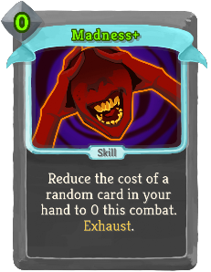 | Uncommon | Skill | 1(0) | Reduce the cost of a random card in your hand to 0 this combat. Exhaust. |
| Mind Blast |  |  | Uncommon | Attack | 2(1) | Innate. Deal damage equal to the number of cards in your draw pile. |
| Panacea |  | 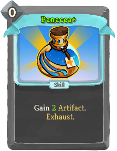 | Uncommon | Skill | 0 | Gain 1(2) Artifact. Exhaust. |
| Panic Button |  |  | Uncommon | Skill | 0 | Gain 30(40) Block. You cannot gain Block from cards for 2 turns. Exhaust. |
| Purity |  |  | Uncommon | Skill | 0 | Exhaust up to 3(5) cards in your hand. Exhaust. |
| Swift Strike |  |  | Uncommon | Attack | 0 | Deal 7(10) damage. |
| Trip |  |  | Uncommon | Skill | 0 | Apply 2 Vulnerable (to ALL enemies). |
| Apotheosis | 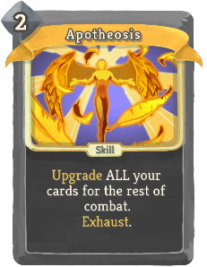 |  | Rare | Skill | 2(1) | Upgrade ALL your cards for the rest of combat. Exhaust. |
| Chrysalis |  |  | Rare | Skill | 2 | Shuffle 3(5) random Skills into your draw pile. They cost 0 this combat. Exhaust. |
| Hand of Greed |  |  | Rare | Attack | 2 | Deal 20(25) damage. If Fatal, gain 20(25) Gold. |
| Magnetism | 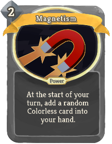 | 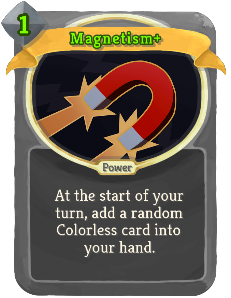 | Rare | Power | 2(1) | At the start of your turn, add a random Colorless card into your hand. |
| Master of Strategy |  |  | Rare | Skill | 0 | Draw 3(4) cards. Exhaust. |
| Mayhem |  | 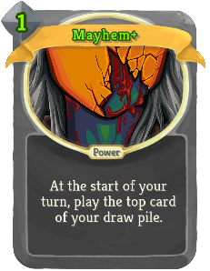 | Rare | Power | 2(1) | At the start of your turn, play the top card of your draw pile. |
| Metamorphosis |  | 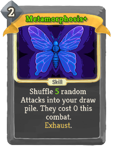 | Rare | Skill | 2 | Shuffle 3(5) random Attacks into your draw pile. They cost 0 this combat. Exhaust. |
| Panache |  |  | Rare | Power | 0 | Every time you play 5 cards in a single turn, deal 10(14) damage to ALL enemies. |
| Sadistic Nature |  |  | Rare | Power | 0 | Whenever you apply a debuff to an enemy, they take 5(7) damage. |
| Secret Technique |  |  | Rare | Skill | 0 | Put a Skill from your draw pile into your hand. Exhaust. (not Exhaust.) |
| Secret Weapon |  |  | Rare | Skill | 0 | Put an Attack from your draw pile into your hand. Exhaust. (not Exhaust.) |
| The Bomb |  |  | Rare | Skill | 2 | At the end of 3 turns, deal 40(50) damage to ALL enemies. |
| Thinking Ahead |  |  | Rare | Skill | 0 | Draw 2 cards. Put a card from your hand on top of your draw pile. Exhaust. (not Exhaust.) |
| Transmutation |  |  | Rare | Skill | X | Add X random (Upgraded) Colorless cards into your hand. They cost 0 this turn. Exhaust. |
| Violence |  |  | Rare | Skill | 0 | Put 3(4) random Attacks from your draw pile into your hand. Exhaust. |
