| Name | Image | Upgraded image | Rarity | Type | Cost | Description |
| ---- | ----- | -------------- | ------ | ---- | ---- | ----------- |
| Defend | 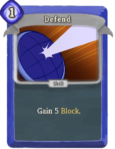 |  | Basic | Skill | 1 | Gain 5(8) Block. |
| Flawed Stealth |  | 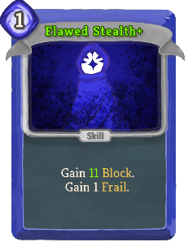 | Basic | Skill | 1 | Gain 8(11) Block. Gain 1 Frail. |
| Reactive Shot | 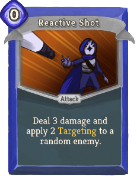 |  | Basic | Attack | 0 | Deal 3(4) damage and apply 2(3) thechaser:Targeting to a random enemy. |
| Strike |  |  | Basic | Attack | 1 | Deal 6(9) damage. |
| Aggravate | 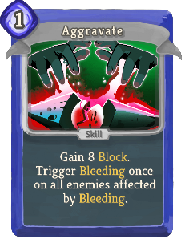 |  | Common | Skill | 1 | Gain 8(11) Block. Trigger thechaser:Bleeding once on all enemies affected by thechaser:Bleeding. |
| Alertness |  |  | Common | Skill | 1 | Gain 9(12) Block. Gain thechaser:Proxy 1(2) times. thechaser:Quickstep 1(2). |
| Blitzkrieg |  | 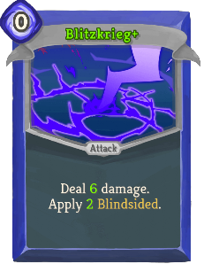 | Common | Attack | 0 | Deal 5(6) damage. Apply 1(2) thechaser:Blindsided. |
| Brass Tacks |  | 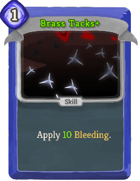 | Common | Skill | 1 | Apply 7(10) thechaser:Bleeding. |
| Continuous Slash |  | 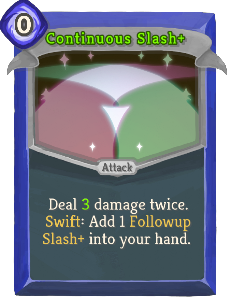 | Common | Attack | 0 | Deal 2(3) damage twice. thechaser:Swift: Add 1 *Followup *Slash (*Slash+) into your hand. |
| Draw Knives |  | 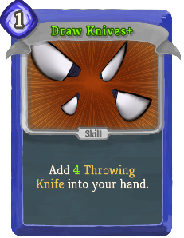 | Common | Skill | 1 | Add 3(4) *Throwing *Knife into your hand. |
| Fatal Blitz | 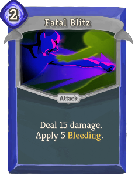 | 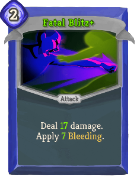 | Common | Attack | 2 | Deal 15(17) damage. Apply 5(7) thechaser:Bleeding. |
| Illusionary Strike |  |  | Common | Attack | 2 | Deal 15(20) damage. If you are Weak, gain [E] [E]. |
| Inertial Strike |  | 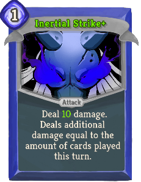 | Common | Attack | 1 | Deal 7(10) damage. Deals additional damage equal to the amount of cards played this turn. |
| Leave a Mark |  |  | Common | Attack | 1 | Deal 6(9) damage and apply 1 thechaser:Targeting to ALL enemies. |
| Malicious Trick | 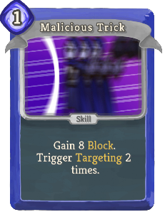 | 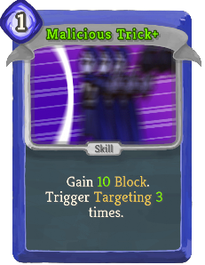 | Common | Skill | 1 | Gain 8(10) Block. Trigger thechaser:Targeting 2(3) times. |
| Nullify Defenses |  |  | Common | Skill | 0 | Apply 1(2) thechaser:Blindsided and thechaser:Targeting to ALL enemies. |
| Open Vein | 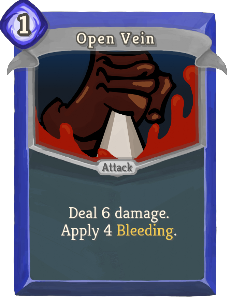 |  | Common | Attack | 1 | Deal 6(8) damage. Apply 4(5) thechaser:Bleeding. |
| Pass Through |  | 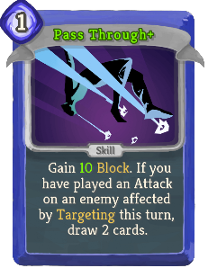 | Common | Skill | 1 | Gain 7(10) Block. If you have played an Attack on an enemy affected by thechaser:Targeting this turn, draw 2 cards. |
| Preparation | 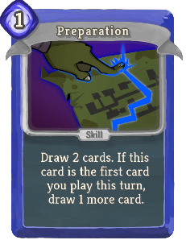 |  | Common | Skill | 1 | Draw 2(3) cards. If this card is the first card you play this turn, draw 1 more card. |
| Pursuit |  |  | Common | Attack | 1 | Deal 8(11) damage. Draw 1 card for each enemy affected by thechaser:Targeting. |
| Stalling |  | 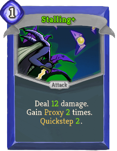 | Common | Attack | 1 | Deal 9(12) damage. Gain thechaser:Proxy 1(2) times. thechaser:Quickstep 1(2). |
| Thornmail | 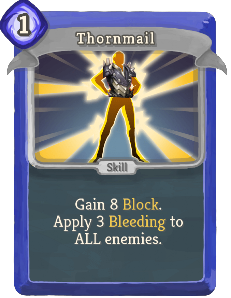 |  | Common | Skill | 1 | Gain 8(10) Block. Apply 3(4) thechaser:Bleeding to ALL enemies. |
| Watch |  | 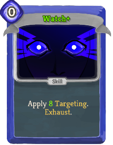 | Common | Skill | 0 | Apply 5(8) thechaser:Targeting. Exhaust. |
| Armorslayer |  |  | Uncommon | Skill | 1 | Remove ALL stacks of thechaser:Targeting on the enemy. (not Remove ALL stacks of thechaser:Targeting on the enemy.)Apply Vulnerable, Weak, and thechaser:Bleeding equal to the amount removed (of thechaser:Targeting on the enemy). Exhaust. |
| Blade Genesis | 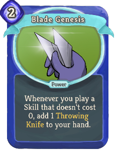 |  | Uncommon | Power | 2(1) | Whenever you play a Skill that doesn't cost 0, add 1 *Throwing *Knife to your hand. |
| Chaser's Luck | 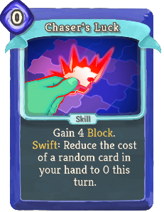 | 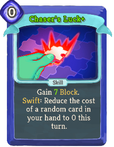 | Uncommon | Skill | 0 | Gain 4(7) Block. thechaser:Swift: Reduce the cost of a random card in your hand to 0 this turn. |
| Chaser's Trick |  |  | Uncommon | Skill | 0 | Draw 1 card. If it's an Attack, trigger thechaser:Targeting 2(3) times. |
| Combat Spacing | 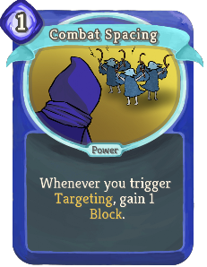 |  | Uncommon | Power | 1 | Whenever you trigger thechaser:Targeting, gain 1(2) Block. |
| Counter Manoeuvre |  | 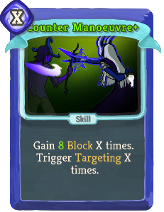 | Uncommon | Skill | X | Gain 6(8) Block X times. Trigger thechaser:Targeting X times. |
| Deceptive Defense |  |  | Uncommon | Skill | 1 | Gain 9 Block. If you are Frail, triple (quadruple) the amount of Block gained. |
| Deceptive Strike |  | 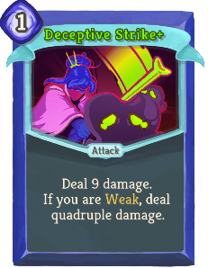 | Uncommon | Attack | 1 | Deal 9 damage. If you are Weak, deal triple (quadruple) damage. |
| Disguise | 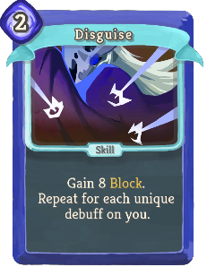 |  | Uncommon | Skill | 2 | Gain 8(10) Block. Repeat for each unique debuff on you. |
| Evasive Fall |  |  | Uncommon | Skill | 1 | Gain 15(18) Block. Gain 2(1) Weak. |
| Flexibility |  |  | Uncommon | Skill | 2 | Choose two: Trigger thechaser:Targeting 3(4) times; gain thechaser:Proxy 3(4) times; apply 3(4) thechaser:Bleeding to ALL enemies. Exhaust. |
| Gale Strike | 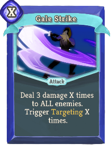 | 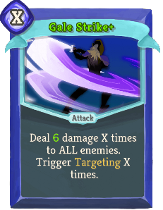 | Uncommon | Attack | X | Deal 3(6) damage X times to ALL enemies. Trigger thechaser:Targeting X times. |
| Gore Scars |  |  | Uncommon | Attack | 1 | Deal 7(10) damage. If the enemy has thechaser:Bleeding, trigger it once (twice). |
| Grand Plan |  |  | Uncommon | Power | 1 | Whenever you apply a debuff to yourself, gain 1(2) Strength. |
| Hack Away |  |  | Uncommon | Attack | 2 | Deal 2(3) damage 6 times. |
| Hidden Dagger |  |  | Uncommon | Skill | 0 | Gain 3 Block. Add 1(2) *Throwing *Knife into your hand. thechaser:Swift: Upgrade ALL *Throwing *Knife cards in your hand. |
| Internal Hemorrhage |  |  | Uncommon | Skill | 2 | Apply 6(9) thechaser:Bleeding and 2 Weak to ALL enemies. Exhaust. |
| Open Sore | 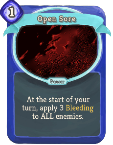 |  | Uncommon | Power | 1 | At the start of your turn, apply 3(5) thechaser:Bleeding to ALL enemies. |
| Paralyze |  | 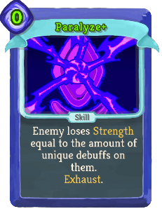 | Uncommon | Skill | 1(0) | Enemy loses Strength equal to the amount of unique debuffs on them. Exhaust. |
| Penetrate |  | 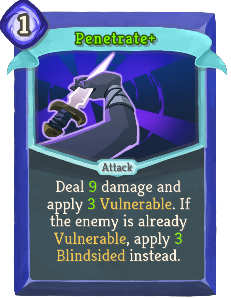 | Uncommon | Attack | 1 | Deal 7(9) damage and apply 2(3) Vulnerable. If the enemy is already Vulnerable, apply 2(3) thechaser:Blindsided instead. |
| Piercing Blows |  |  | Uncommon | Power | 1 | Whenever you deal damage by triggering thechaser:Targeting, deal 2(3) additional damage. |
| Pluck Out Daggers |  |  | Uncommon | Attack | 3 | Costs 1 [E] less for each time you have triggered thechaser:Targeting this turn. Deal 5(7) damage 3 times. |
| Replicating Daggers |  |  | Uncommon | Power | 1 | (Innate.)  At the start of your turn, add a *Throwing *Knife into your hand and apply 1 thechaser:Targeting to a random enemy. |
| Slash Sequence | 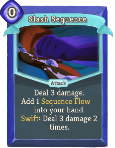 | 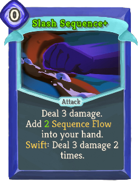 | Uncommon | Attack | 0 | Deal 3 damage. Add 1(2) *Sequence *Flow into your hand. thechaser:Swift: Deal 3 damage 2 times. |
| Spirit of Conquest |  |  | Uncommon | Skill | 1 | Gain Strength equal to the cumulative stacks of ALL debuffs you have. Exhaust. (not Exhaust.) |
| Strong Bulwark |  | 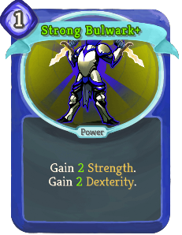 | Uncommon | Power | 1 | Gain 1(2) Strength. Gain 1(2) Dexterity. |
| Take Initiative |  |  | Uncommon | Skill | 0 | Gain [E] [E]. At the start of your next turn, draw 2(1) less card. |
| Test the Waters |  |  | Uncommon | Attack | 2 | Deal 10(12) damage and apply 2(3) Vulnerable to ALL enemies. |
| Throes of Rage |  |  | Uncommon | Attack | 1 | Deal 12(16) damage and apply 3(4) thechaser:Blindsided. Gain 1 Vulnerable. |
| Unstable Defense |  |  | Uncommon | Skill | 2 | Gain 30 Block and 1 Vulnerable (thechaser:Blindsided). |
| Weakpoint Strike |  | 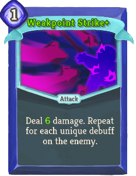 | Uncommon | Attack | 1 | Deal 4(6) damage. Repeat for each unique debuff on the enemy. |
| Win the Exchange | 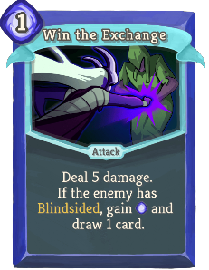 | 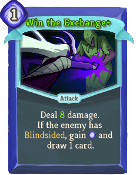 | Uncommon | Attack | 1 | Deal 5(8) damage. If the enemy has thechaser:Blindsided, gain [E] and draw 1 card. |
| Winds of Fury |  |  | Uncommon | Skill | 1(0) | Trigger thechaser:Targeting 1 times. Permanently increase this card's thechaser:Targeting trigger amount by 1. Exhaust. |
| Wither | 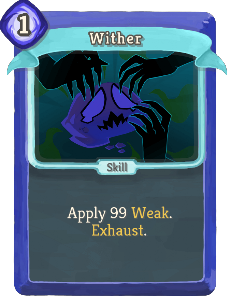 |  | Uncommon | Skill | 1(0) | Apply 99 Weak. Exhaust. |
| Absolute Edge | 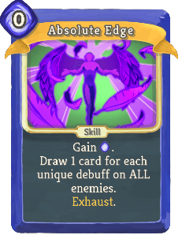 | 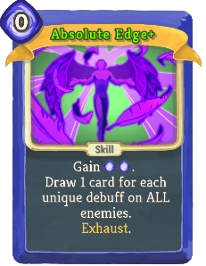 | Rare | Skill | 0 | Gain [E] ([E]). Draw 1 card for each unique debuff on ALL enemies. Exhaust. |
| Acceleration |  |  | Rare | Power | 2(1) | Whenever you play an Attack, gain 1 temporary Strength. |
| Bloodhound |  |  | Rare | Attack | 0 | Deal 3(8) damage to ALL enemies. Trigger thechaser:Targeting equal to the amount of cards played this turn. End your turn. |
| Chaser's Guard |  |  | Rare | Skill | 1 | Gain 4(6) Block for each unique debuff on ALL enemies. |
| Confounding Assault |  |  | Rare | Power | 2(1) | Dealing damage by triggering thechaser:Targeting also applies thechaser:Blindsided. |
| Cruel Ruin |  |  | Rare | Attack | 2 | Deal 16(20) damage. Apply 2(3) Vulnerable, Weak, and thechaser:Blindsided. |
| Dual Wielding |  |  | Rare | Skill | 1(0) | Whenever you trigger thechaser:Targeting this turn, trigger it twice. |
| High-Speed Advance |  |  | Rare | Skill | 0 | (Retain.) thechaser:Quickstep 10. Apply 10 thechaser:Bleeding to ALL enemies. Exhaust. |
| Lust for Power |  |  | Rare | Power | 2(1) | All your buffs count as debuffs, for the purposes of effects which check for debuffs on you. |
| Neckcutter |  | 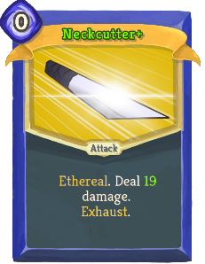 | Rare | Attack | 0 | Ethereal. Deal 14(19) damage. Exhaust. |
| Perfected Stealth | 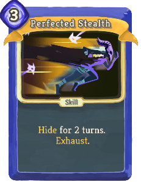 | 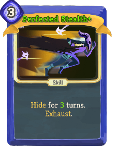 | Rare | Skill | 3 | thechaser:Hide for 2(3) turns. Exhaust. |
| Phrenitis | 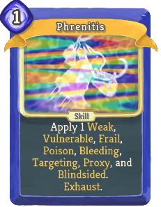 |  | Rare | Skill | 1(0) | Apply 1 Weak, Vulnerable, Frail, Poison, thechaser:Bleeding, thechaser:Targeting, thechaser:Proxy, and thechaser:Blindsided. Exhaust. |
| Preemptive Offense |  |  | Rare | Power | 1(0) | At the start of your turn, draw 1 additional card and trigger thechaser:Targeting once. |
| Prepay | 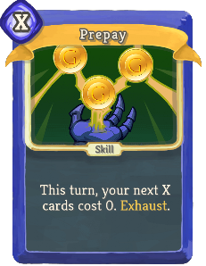 | 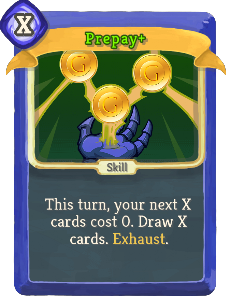 | Rare | Skill | X | This turn, your next X cards cost 0. (Draw X cards.) Exhaust. |
| Sawblades | 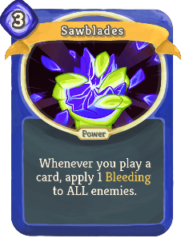 | 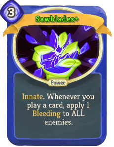 | Rare | Power | 3 | (Innate.) Whenever you play a card, apply 1 thechaser:Bleeding to ALL enemies. |
| Shakedown | 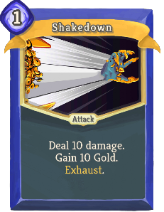 | 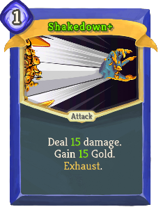 | Rare | Attack | 1 | Deal 10(15) damage. Gain 10(15) Gold. Exhaust. |
| Spectre Form |  |  | Rare | Power | 3 | At the start of your turn, increase damage dealt when triggering thechaser:Targeting by 2(3). |
| Vibrancy |  |  | Rare | Skill | 0 | (Retain.)  Heal HP equal to the amount of times you have triggered thechaser:Targeting this turn. Exhaust. |
