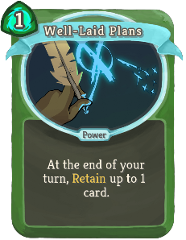

| Name | Image | Upgraded image | Rarity | Type | Cost | Description |
| ---- | ----- | -------------- | ------ | ---- | ---- | ----------- |
| Defend |  |  | Basic | Skill | 1 | Gain 5(8) Block. |
| Neutralize |  |  | Basic | Attack | 0 | Deal 3(4) damage. Apply 1(2) Weak. |
| Strike |  |  | Basic | Attack | 1 | Deal 6(9) damage. |
| Survivor |  |  | Basic | Skill | 1 | Gain 8(11) Block. Discard 1 card. |
| Acrobatics |  |  | Common | Skill | 1 | Draw 3(4) cards. Discard 1 card. |
| Backflip |  |  | Common | Skill | 1 | Gain 5(8) Block. Draw 2 cards. |
| Bane |  |  | Common | Attack | 1 | Deal 7(10) damage. If the enemy has Poison, deal 7(10) damage again. |
| Blade Dance |  |  | Common | Skill | 1 | Add 3(4) *Shivs into your hand. |
| Cloak and Dagger |  |  | Common | Skill | 1 | Gain 6 Block. Add 1(2) *Shiv(s) into your hand. |
| Dagger Spray |  |  | Common | Attack | 1 | Deal 4(6) damage to ALL enemies twice. |
| Dagger Throw |  |  | Common | Attack | 1 | Deal 9(12) damage. Draw 1 card. Discard 1 card. |
| Deadly Poison |  |  | Common | Skill | 1 | Apply 5(7) Poison. |
| Deflect |  |  | Common | Skill | 0 | Gain 4(7) Block. |
| Dodge and Roll |  |  | Common | Skill | 1 | Gain 4(6) Block. Next turn, gain 4(6) Block. |
| Flying Knee |  |  | Common | Attack | 1 | Deal 8(11) damage. Next turn, gain [G]. |
| Outmaneuver |  |  | Common | Skill | 1 | Next turn, gain [G] [G] ([G]). |
| Piercing Wail |  |  | Common | Skill | 1 | ALL enemies lose 6(8) Strength this turn. Exhaust. |
| Poisoned Stab |  |  | Common | Attack | 1 | Deal 6(8) damage. Apply 3(4) Poison. |
| Prepared |  |  | Common | Skill | 0 | Draw 1(2) card(s). Discard 1(2) card(s). |
| Quick Slash |  |  | Common | Attack | 1 | Deal 8(12) damage. Draw 1 card. |
| Slice |  |  | Common | Attack | 0 | Deal 6(9) damage. |
| Sneaky Strike |  |  | Common | Attack | 2 | Deal 12(16) damage. If you have discarded a card this turn, gain [G] [G]. |
| Sucker Punch |  |  | Common | Attack | 1 | Deal 7(9) damage. Apply 1(2) Weak. |
| Accuracy |  |  | Uncommon | Power | 1 | *Shivs deal 4(6) additional damage. |
| All-Out Attack |  |  | Uncommon | Attack | 1 | Deal 10(14) damage to ALL enemies. Discard 1 card at random. |
| Backstab |  |  | Uncommon | Attack | 0 | Innate. Deal 11(15) damage. Exhaust. |
| Blur |  |  | Uncommon | Skill | 1 | Gain 5(8) Block. Block is not removed at the start of your next turn. |
| Bouncing Flask |  |  | Uncommon | Skill | 2 | Apply 3 Poison to a random enemy 3(4) times. |
| Calculated Gamble |  |  | Uncommon | Skill | 0 | Discard your hand, then draw that many cards. Exhaust. (not Exhaust.) |
| Caltrops |  |  | Uncommon | Power | 1 | Whenever you are attacked, deal 3(5) damage back. |
| Catalyst |  |  | Uncommon | Skill | 1 | Double (Triple) the enemy's Poison. Exhaust. |
| Choke |  |  | Uncommon | Attack | 2 | Deal 12 damage. Whenever you play a card this turn, the enemy loses 3(5) HP. |
| Concentrate |  |  | Uncommon | Skill | 0 | Discard 3(2) cards. Gain [G] [G]. |
| Crippling Cloud |  |  | Uncommon | Skill | 2 | Apply 4(7) Poison and 2 Weak to ALL enemies. Exhaust. |
| Dash |  |  | Uncommon | Attack | 2 | Gain 10(13) Block. Deal 10(13) damage. |
| Distraction |  |  | Uncommon | Skill | 1(0) | Add a random Skill into your hand. It costs 0 this turn. Exhaust. |
| Endless Agony |  |  | Uncommon | Attack | 0 | Deal 4(6) damage. Whenever you draw this card, add a copy of it into your hand. Exhaust. |
| Escape Plan |  |  | Uncommon | Skill | 0 | Draw 1 card. If you draw a Skill, gain 3(5) Block. |
| Eviscerate |  |  | Uncommon | Attack | 3 | Costs 1 less [G] for each card discarded this turn. Deal 7(9) damage 3 times. |
| Expertise |  |  | Uncommon | Skill | 1 | Draw cards until you have 6(7) in your hand. |
| Finisher |  |  | Uncommon | Attack | 1 | Deal 6(8) damage for each Attack played this turn. |
| Flechettes |  |  | Uncommon | Attack | 1 | Deal 4(6) damage for each Skill in your hand. |
| Footwork |  |  | Uncommon | Power | 1 | Gain 2(3) Dexterity. |
| Heel Hook |  |  | Uncommon | Attack | 1 | Deal 5(8) damage. If the enemy has Weak, gain [G] and draw 1 card. |
| Infinite Blades |  |  | Uncommon | Power | 1 | (Innate.)  At the start of your turn, add a *Shiv into your hand. |
| Leg Sweep |  |  | Uncommon | Skill | 2 | Apply 2(3) Weak. Gain 11(14) Block. |
| Masterful Stab |  |  | Uncommon | Attack | 0 | Costs 1 additional [G] for each time you lose HP this combat. Deal 12(16) damage. |
| Noxious Fumes |  |  | Uncommon | Power | 1 | At the start of your turn, apply 2(3) Poison to ALL enemies. |
| Predator |  |  | Uncommon | Attack | 2 | Deal 15(20) damage. Next turn, draw 2 additional cards. |
| Reflex |  |  | Uncommon | Skill |  | Unplayable. If this card is discarded from your hand, draw 2(3) cards. |
| Riddle with Holes |  |  | Uncommon | Attack | 2 | Deal 3(4) damage 5 times. |
| Setup |  |  | Uncommon | Skill | 1(0) | Put a card from your hand on top of your draw pile. It costs 0 until played. |
| Skewer |  |  | Uncommon | Attack | X | Deal 7(10) damage X times. |
| Tactician |  |  | Uncommon | Skill |  | Unplayable. If this card is discarded from your hand, gain [G] ([G]). |
| Terror |  |  | Uncommon | Skill | 1(0) | Apply 99 Vulnerable. Exhaust. |
| Well-Laid Plans |  |  | Uncommon | Power | 1 | At the end of your turn, Retain up to 1(2) card(s). |
| A Thousand Cuts |  |  | Rare | Power | 2 | Whenever you play a card, deal 1(2) damage to ALL enemies. |
| Adrenaline |  |  | Rare | Skill | 0 | Gain [G] ([G]). Draw 2 cards. Exhaust. |
| After Image |  |  | Rare | Power | 1 | (Innate.)  Whenever you play a card, gain 1 Block. |
| Alchemize |  |  | Rare | Skill | 1(0) | Obtain a random potion. Exhaust. |
| Bullet Time |  |  | Rare | Skill | 3(2) | You cannot draw additional cards this turn. Reduce the cost of all cards in your hand to 0 this turn. |
| Burst |  |  | Rare | Skill | 1 | This turn, your next (1(2)) Skill(s) is (are) played twice. |
| Corpse Explosion |  |  | Rare | Skill | 2 | Apply 6(9) Poison. When the enemy dies, deal damage equal to its Max HP to ALL enemies. |
| Die Die Die |  |  | Rare | Attack | 1 | Deal 13(17) damage to ALL enemies. Exhaust. |
| Doppelganger |  |  | Rare | Skill | X | Next turn, draw X (X+1) cards and gain X (X+1) [G]. Exhaust. |
| Envenom |  |  | Rare | Power | 2(1) | Whenever an Attack deals unblocked damage, apply 1 Poison. |
| Glass Knife |  |  | Rare | Attack | 1 | Deal 8(12) damage twice. Decrease the damage of this card by 2 this combat. |
| Grand Finale |  |  | Rare | Attack | 0 | Can only be played if there are no cards in your draw pile. Deal 50(60) damage to ALL enemies. |
| Malaise |  |  | Rare | Skill | X | Enemy loses X (X+1) Strength. Apply X (X+1) Weak. Exhaust. |
| Nightmare |  |  | Rare | Skill | 3(2) | Choose a card. Next turn, add 3 copies of that card into your hand. Exhaust. |
| Phantasmal Killer |  |  | Rare | Skill | 1(0) | Next turn, your Attacks deal double damage. |
| Storm of Steel |  |  | Rare | Skill | 1 | Discard your hand. Add 1 *Shiv (*Shiv+) into your hand for each card discarded. |
| Tools of the Trade |  |  | Rare | Power | 1(0) | At the start of your turn, draw 1 card and discard 1 card. |
| Unload |  |  | Rare | Attack | 1 | Deal 14(18) damage. Discard all non-Attack cards in your hand. |
| Wraith Form |  |  | Rare | Power | 3 | Gain 2(3) Intangible. At the end of your turn, lose 1 Dexterity. |
