| Name | Image | Upgraded image | Rarity | Type | Cost | Description |
| ---- | ----- | -------------- | ------ | ---- | ---- | ----------- |
| Covet |  | 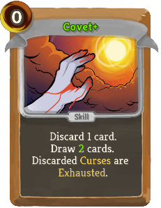 | Basic | Skill | 0 | Exhaust a card. Draw a card. If you Exhaust a Curse (or a Status), draw 1 more. |
| Defend |  |  | Basic | Skill | 1 | Gain 5(8) Block. |
| Snapshot |  |  | Basic | Attack | 2 | Deal 10(13) damage. hermit:Dead_On: Costs 0. |
| Strike |  |  | Basic | Attack | 1 | Deal 6(9) damage. |
| Body Armor | 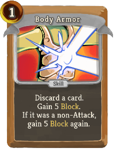 |  | Common | Skill | 1 | Gain 10(16) Block. Add a *Defend (*Defend+) to your discard pile. Exhaust. |
| Called Shot | 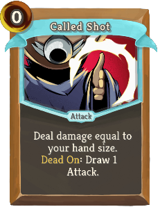 |  | Common | Attack | 1(0) | Deal damage equal to your hand size. hermit:Dead_On: Draw 2 cards. |
| Coalescence |  |  | Common | Skill | 0 | Gain 3(5) Dexterity this turn. |
| Desperado |  |  | Common | Attack | 1 | Deal 14(18) damage. Gain 2 Frail. |
| Dive |  | 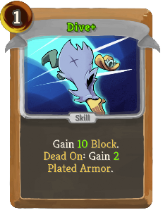 | Common | Skill | 1 | Gain 7(10) Block. hermit:Dead_On: Gain 1(2) *Plated *Armor. |
| Feint | 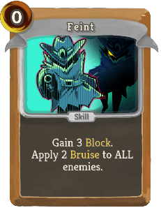 |  | Common | Skill | 0 | Gain 4(5) Block. Apply 2(3) hermit:Bruise to ALL enemies. |
| Glare |  |  | Common | Skill | 0 | Apply 1 Weak and Vulnerable.  (Apply !hermit:SecondMagic! hermit:Bruise.) |
| Headshot |  |  | Common | Attack | 1 | Deal 8(10) damage. hermit:Dead_On: Deal double damage. |
| High-Caliber |  |  | Common | Attack | 1 | Deal 12(18) damage. Add a *Strike (*Strike+) to your discard pile. Exhaust. |
| Hole Up |  |  | Common | Skill | 1 | Gain 12(16) Block. Gain 2 Weak. |
| Itchy Trigger |  |  | Common | Attack | 2 | Deal 12(16) damage. hermit:Dead_On: Reduce the cost of a random card in your hand to 0 this turn. |
| Low Profile |  |  | Common | Skill | 1 | Gain 7(9) Block. Gains 4(5) additional Block for each of your debuffs. |
| Manifest | 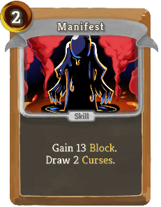 |  | Common | Skill | 2 | Gain 13(17) Block. Draw 2(3) *Curses. |
| Misfire |  |  | Common | Attack | 1 | Deal 13(17) damage to a random enemy. Shuffle a *Clumsy into your draw pile. |
| Pistol Whip |  |  | Common | Attack | 1 | Deal 6(8) damage. Apply 5(6) hermit:Bruise. |
| Quickdraw |  | 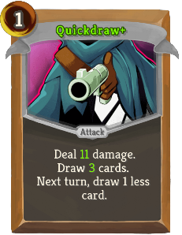 | Common | Attack | 1 | Deal 9(11) damage. Draw 2(3) cards. Next turn, draw 1 less card. |
| Roulette | 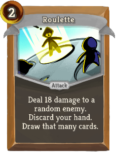 |  | Common | Attack | 2 | Deal 18(22) damage to a random enemy. Discard your hand. Draw that many cards. |
| Snipe |  |  | Common | Skill | 1(0) | hermit:Concentrate. Gain 3 Strength this turn. |
| Spray n' Pray |  | 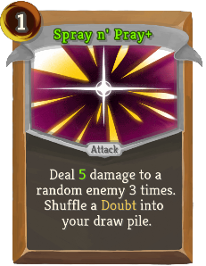 | Common | Attack | 1 | Deal 5(6) damage to a random enemy 3 times. Shuffle a *Doubt into your draw pile. |
| Tracking Shot |  | 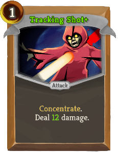 | Common | Attack | 1 | hermit:Concentrate. Deal 9(12) damage. |
| Vantage |  | 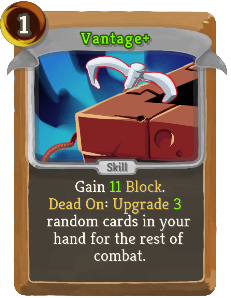 | Common | Skill | 1 | Gain 7(10) Block. hermit:Dead_On: Upgrade 2(3) random cards in your hand for the rest of combat. |
| Wide Open |  |  | Common | Attack | 1 | Deal 6(7) damage. Apply 1(2) Vulnerable. |
| Brawl |  |  | Uncommon | Power | 2 | At the start of your turn, apply 5(6) hermit:Bruise to ALL enemies. |
| Cheat |  |  | Uncommon | Skill | 1 | Play one of the top 4(6) cards in your draw pile. If hermit:Dead_On: So is the played card. |
| Combo | 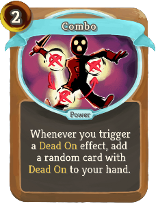 |  | Uncommon | Power | 2(1) | Whenever you trigger a hermit:Dead_On effect, add a random card with hermit:Dead_On to your hand. |
| Cursed Weapon | 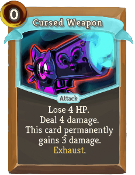 |  | Uncommon | Attack | 0 | Lose 4(3) HP. Deal 4 damage. This card permanently gains 3 damage. Exhaust. |
| Dead Man's Hand |  |  | Uncommon | Skill | 1(0) | Discard your hand. Add the 3 rarest cards from your draw pile to your hand. |
| Deadeye |  |  | Uncommon | Attack | 1 | Deal 6(8) damage. Gain 1(2) Strength. Exhaust. hermit:Dead_On: Don't Exhaust. |
| Determination |  |  | Uncommon | Power | 2 | (Innate.)  Whenever a debuff is applied to you, gain 1 Strength. |
| Enervate |  |  | Uncommon | Attack | 1 | Deal 7(10) damage. hermit:Dead_On: Gain [E] and draw a card. |
| Eye Of The Storm |  | 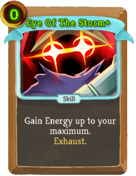 | Uncommon | Skill | 0 | (Draw a card.)  hermit:Dead_On: Gain Energy up to your maximum. Exhaust. |
| Flash Powder |  |  | Uncommon | Skill | 1 | Gain 7 Block. ALL enemies lose 1(2) Strength. Exhaust. |
| Fully Loaded |  |  | Uncommon | Skill | 1(0) | Draw ALL your *Strikes and *Defends. Exhaust. |
| Gestalt |  | 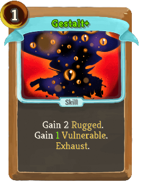 | Uncommon | Skill | 1 | Gain 2 hermit:Rugged. Gain 2(1) Vulnerable. Exhaust. |
| Ghostly Presence | 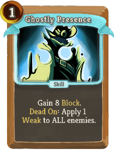 |  | Uncommon | Skill | 1 | Gain 8(11) Block. hermit:Dead_On: Apply 1 Weak to ALL enemies. |
| Golden Bullet |  |  | Uncommon | Attack | 3 | Deal 18(24) damage. If Fatal, permanently reduce this card's cost by 1. Exhaust. |
| Grudge |  |  | Uncommon | Attack | 1 | Deal 9 damage to ALL enemies. Deals 3(4) more for ALL your Curse cards. |
| Horror |  | 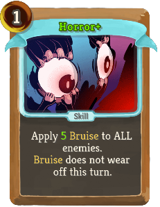 | Uncommon | Skill | 1 | Apply 4(6) hermit:Bruise to ALL enemies. hermit:Bruise does not wear off this turn. |
| Lone Wolf |  |  | Uncommon | Skill | 1(0) | Choose a card. It costs 0 this combat. Discard the rest of your hand. Exhaust. |
| Luck of the Draw |  |  | Uncommon | Skill | 1 | Draw until you draw 3(4) total [E] worth of cards. |
| Maintenance |  |  | Uncommon | Skill | 2(1) | Upgrade all *Strikes and *Defends this combat. This can upgrade them any number of times. |
| Malice |  | 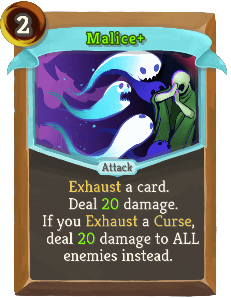 | Uncommon | Attack | 2 | Exhaust a card. Deal 16(20) damage. If you Exhaust a Curse, deal 16(20) damage to ALL enemies instead. |
| Midnight |  |  | Uncommon | Skill | 1 | Ethereal. (not Ethereal.) Gain 12(13) Block. Add an *Impending *Doom to your hand. |
| No Holds Barred |  |  | Uncommon | Attack | 2 | Deal 18(22) damage and apply 4(5) hermit:Bruise to ALL enemies. Gain 1 less [E] next turn. |
| Ricochet |  |  | Uncommon | Attack | 1 | Deal 7(9) damage. Repeat on a random enemy for each hermit:Dead_On effect this turn. |
| Scavenge |  |  | Uncommon | Skill | 1 | Gain 4(5) *Plated *Armor. hermit:Dead_On: Gain !hermit:SecondMagic! Gold. Exhaust. |
| Shadow Cloak |  |  | Uncommon | Power | 1 | Whenever you draw a Curse, gain 6(9) Block. |
| Short Fuse |  | 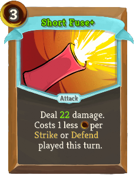 | Uncommon | Attack | 3 | Deal 18(22) damage. Costs 1 less [E] per *Strike or *Defend played this turn. |
| Showdown |  |  | Uncommon | Attack | 2(1) | Retain. Deal 9 damage. Play all *Strikes in your hand on random targets. |
| Smoking Barrel |  |  | Uncommon | Power | 1 | Whenever you trigger a hermit:Dead_On effect, your next attack deals 4(5) more damage. |
| Spite |  |  | Uncommon | Attack | 1 | Draw 2(3) *Curses. Deal 5(6) damage twice. |
| Take Aim |  |  | Uncommon | Power | 1 | (hermit:Concentrate.)  At the start of your turn, hermit:Concentrate. |
| Take Cover |  |  | Uncommon | Skill | X | Add X *Defends (*Defends+) to your hand. They cost 0 this combat. Exhaust. |
| Virtue |  |  | Uncommon | Skill | 1(0) | Reduce each of your debuffs by 2. |
| Adapt |  |  | Rare | Power | 3(2) | At the end of your turn, you can Exhaust up to 2 cards. Gain 4 Block for each. |
| Black Wind |  |  | Rare | Attack | 2(1) | Ethereal. Deal damage equal to your missing health. Exhaust. |
| Dead Or Alive |  |  | Rare | Attack | X | Deal 8(11) damage X times. If Fatal, get a hermit:Bounty. Exhaust. |
| Dissolve |  |  | Rare | Skill | 1 | Gain 1(2) Block for each card in your discard pile. Add 1 *Decay to your discard pile. |
| Eternal Form |  |  | Rare | Power | 3 | Your first 4(5) cards each turn cost 0. Gain no [E] at start of turn. |
| Fatal Desire |  |  | Rare | Power | 1 | (Innate.)  At the start of your turn, draw 2 cards and add an *Injury to your hand. |
| Final Canter |  | 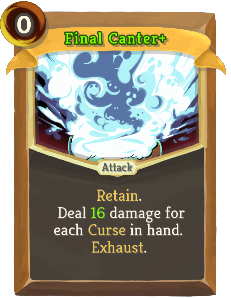 | Rare | Attack | 0 | Retain. Deal 13(16) damage for each Curse in hand. Exhaust. |
| From Beyond |  |  | Rare | Skill | 1 | For each card in your exhaust pile, a random enemy loses 3(5) HP. |
| Gambit |  |  | Rare | Skill | 0 | Put 3(4) random Attacks from your discard pile into your hand. Exhaust. |
| Heroic Bravado |  | 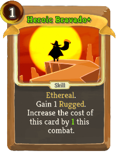 | Rare | Skill | 1(0) | Ethereal. Gain 1 hermit:Rugged. Increase the cost of this card by 1 this combat. |
| High Noon |  |  | Rare | Power | 2(1) | Whenever you play a *Strike or *Defend, draw a card. |
| Magnum | 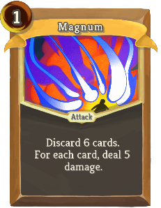 |  | Rare | Attack | 1 | Discard 6 cards. For each card, deal 6(9) damage. |
| Overwhelming Power | 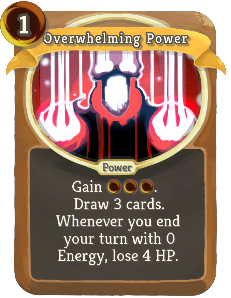 |  | Rare | Power | 1 | Gain [E] [E] [E]. Draw 3 cards. Whenever you end your turn with 0 Energy, lose 4(3) HP. |
| Purgatory |  |  | Rare | Attack | 3 | Ethereal. (not Ethereal.) Deal 30 damage to ALL enemies. |
| Reprieve |  |  | Rare | Skill | 1(0) | Exhaust any number of *Curses from your draw pile. Heal 4 HP for each. Exhaust. |
| Roughhouse |  |  | Rare | Attack | 3 | Deal 24(30) damage. hermit:Dead_On: Gain 16(20) Block. |
| Roundhouse Kick |  |  | Rare | Attack | 2 | Deal 13(18) damage to ALL enemies. *Stun any that don't intend to attack. Exhaust. |
