| Name | Image | Upgraded image | Rarity | Type | Cost | Description |
| ---- | ----- | -------------- | ------ | ---- | ---- | ----------- |
| Defend |  |  | Basic | Skill | 1 | Gain 5(8) Block. |
| Master Spark |  |  | Basic | Attack | 1 | Deal 8(11) damage. Amplify  [E]  : Deal 15(20) damage instead. |
| Rising Sweep |  |  | Basic | Attack | 0 | Deal 4(5) damage. Gain 1(2) Charge-up. |
| Simple Spark |  |  | Basic | Attack | 1 | Deal 6(9) damage. |
| 66C |  |  | Common | Attack | 1 | Innate. Deal 8(11) damage. Deals double damage if there are no cards in your discard pile. |
| 6A |  |  | Common | Attack | 1 | Deal 5(7) damage. Gain Block equal to the unblocked damage dealt. |
| Acceleration |  |  | Common | Skill | 0 | Draw top 2 cards in your draw pile. Amplify  [E] : Draw top 1(2) cards in your draw pile. |
| Asteroid Belt |  | 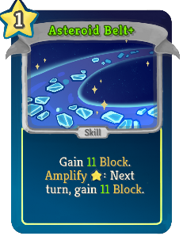 | Common | Skill | 1 | Gain 8(11) Block. Amplify  [E]  : Next turn, gain 8(11) Block. |
| Double Spark |  |  | Common | Attack | 1 | Deal 6(8) damage. Add 1 (Upgraded) Spark to your hand. |
| Galactic Halo |  |  | Common | Skill | 2 | Gain 12(14) Block and 2(3) Charge-up. |
| Grand Cross |  | 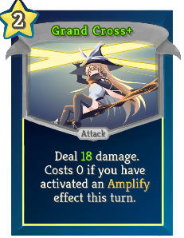 | Common | Attack | 2 | Deal 13(18) damage. Costs 0 if you have activated an Amplify effect this turn. |
| Gravity Beat |  |  | Common | Attack | 1 | Deal 6(8) damage and draw a card for every 12 cards in your master deck. |
| Illusion Star |  |  | Common | Skill | 0 | Add 2(3) random cards to your hand. Put a card from your hand on top of your draw pile. Exhaust. |
| Luminous Strike |  |  | Common | Attack | 0 | Deal damage equal to 2 (3) times the number of cards in your hand(0 damage). Amplify [E] : Deal damage equal to 4 (5) times your current energy instead(4(5) damage). |
| Milky Way |  |  | Common | Skill | 1 | Gain 5(7) Block. Draw 1 card. ALL Attacks in your hand deal 1(2) additional damage this combat. |
| Mysterious Beam | 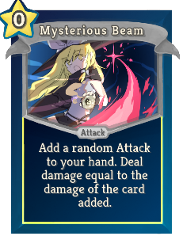 | 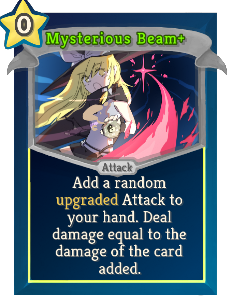 | Common | Attack | 0 | Add a random (upgraded) Attack to your hand. Deal damage equal to the damage of the card added. |
| Non-Directional Laser |  |  | Common | Attack | 1 | Deal 5(7) damage to ALL enemies, then deal 5(7) damage to a random enemy. |
| Shooting Echo |  |  | Common | Attack | 1 | Deal 10(14) damage. Exhaust a card.  If the card you exhaust is Burn ,put this card back to your hand. |
| Spore Crump |  |  | Common | Skill | 0 | Apply 2(3) Vulnerable to an enemy. Amplify  [E]  : Apply 2(3) Vulnerable to ALL enemies instead. |
| Unstable Bomb |  |  | Common | Attack | 1 | Deal random damage ( 1(2) to 4(5) ) to a random enemy 4 times. |
| Upgrade! |  |  | Common | Skill | 0 | ALL Attacks in your hand deal 2(3) additional damage this combat. |
| Witch Leyline |  |  | Common | Attack | 0 | Deal 10(14) damage. Add 1 Burns to your hand. |
| Witch Of Greed |  | 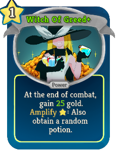 | Common | Power | 1 | At the end of combat, gain 15(25) gold.   Amplify  [E] : Also obtain a random potion. |
| Alice's Gift |  |  | Uncommon | Attack | 0 |  Retain. Deal 5(7) Damage. Exhaust . Amplify [E]  [E] : Deal triple damage. |
| Blaze Away |  |  | Uncommon | Skill | 1 | Play the last Attack you played this turn 1(2) time(s). |
| Charge-Up Spray |  |  | Uncommon | Attack | 1 | Deal 8(12) damage. If this card consumes Charge-up, gain [E] and draw 2 cards. |
| Charging Up |  |  | Uncommon | Skill | 1 | Gain 5(8) Charge-up. Exhaust. |
| Dark Matter |  |  | Uncommon | Skill | 0 | Can only be played once per turn. Shuffle 2 copies of this card into your draw pile. Draw 1 card. When this card is Exhausted, gain 5(7) Block. Ethereal. |
| Dark Spark |  |  | Uncommon | Attack | 2 | Exhaust top 5(8) cards of your draw pile,deal 7 damage to ALL enemies for each Attack Exhausted. |
| Deep Ecological Bomb |  |  | Uncommon | Attack | 1 | Deal 7(9) damage to a random enemy, then reduce its Strength by 2(3) this turn. Amplify  [E]  : Apply this effect again. |
| Dragon Meteor |  |  | Uncommon | Attack | 2 | Deal 14 damage. Deals an additional 1(2) damage for each card in your exhaust pile. |
| Earthlight Ray | 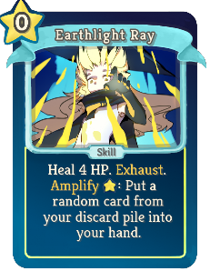 |  | Uncommon | Skill | 0 | Heal 4(6) HP. Exhaust. Amplify [E] : Put a random (not random)card from your discard pile into your hand. |
| Energy Flow |  |  | Uncommon | Power | 1 | Gain 2(3) Charge-up at the end of your turn. |
| Energy Recoil |  |  | Uncommon | Skill | 1 | Gain Block equal to your Charge-up (+ 3). |
| Event Horizon |  |  | Uncommon | Power | 1 | 1(2) time(s) each turn, when you activate an Amplify effect, you can put an Attack from your discard pile into your hand. |
| Fairy Destruction Ray |  |  | Uncommon | Attack | 0 | Deal 5(8) damage to all enemies. Amplify  [E]  [E] : Instant-kill those with 17(22) or less HP. |
| Gas Giant |  |  | Uncommon | Skill | 1 | Gain 14(18) Block. Add 1 Burns to your hand. |
| Machine Gun Spark |  |  | Uncommon | Attack | 1 | Deal 1 damage 6(8) times. Exhaust. |
| Magic Absorber |  |  | Uncommon | Skill | 1 | Gain 8(11) Block. Remove a random debuff from yourself. Exhaust. |
| Magic Chant | 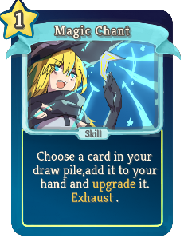 |  | Uncommon | Skill | 1(0) | Choose a card in your draw pile,add it to your hand and upgrade it. Exhaust . |
| Mana Convection |  |  | Uncommon | Skill | 1 | Exhaust up to 2(3) cards,gain  [E]  for each card exhausted. Exhaust . |
| Meteonic Shower |  |  | Uncommon | Attack | X | Exhaust up to X + 1 cards. Deal 3(4) damage to a random enemy 2 times for each card you Exhausted, or 3 times for each Burn Exhausted. |
| Occultation | 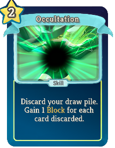 | 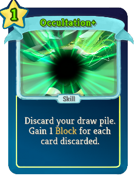 | Uncommon | Skill | 2(1) | Discard your draw pile. Gain 1 Block for each card discarded. |
| One Time Off |  |  | Uncommon | Skill | 1 | Gain 5(7) Block. You can't activate Amplify effects (or consume Charge-up) this turn. Draw 1(2) card(s) next turn. |
| OortCloud |  |  | Uncommon | Power | 1 | Gain 4(5) Plated Armor. Amplify  [E]  : Gain 2(3) more Plated Armor. |
| Open Universe |  |  | Uncommon | Skill | 1 | Shuffle 5 random cards into your draw pile. Each of them has a 20(30) % chance to be Upgraded. Draw 2(3) cards. |
| Orbital |  |  | Uncommon | Skill |  |  Unplayable. When this card is drawn, draw 1 card. If this card is Exhausted, place 1(2) card(s) from your exhaust pile into your hand. |
| Orrerys Sun |  |  | Uncommon | Power | 1 | Whenever Charge-up is consumed, gain 6(9) block . |
| Portable Prop Bag |  |  | Uncommon | Skill | 0 | (Innate.)  Obtain a random relic. Lose the relic when the battle ends. Exhaust. |
| Pulse Magic |  |  | Uncommon | Skill | 0 | Next turn, gain [E] ([E]). Amplify [E] : Amplify effects cost no [E] this turn. |
| Refraction Spark | 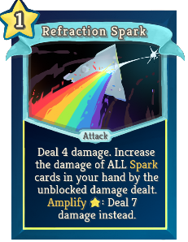 |  | Uncommon | Attack | 1 | Deal 4(5) damage. Increase the damage of ALL Spark cards in your hand by the unblocked damage dealt. Amplify  [E]  : Deal 7(9) damage instead. |
| Robbery |  |  | Uncommon | Attack | 1 | Deal 7(10) damage. Gain gold equal to unblocked damage dealt. Exhaust. Amplify [E] : Double the gold you gain. |
| Shoot The Moon |  |  | Uncommon | Attack | 1 | Remove a random buff from your target if it is not a boss enemy. Deal 8(11) damage. Amplify  [E]  : Remove ALL buffs and deal 13(18) damage instead. |
| Singularity |  |  | Uncommon | Power | 1 | Whenever you play a card that costs 0, increase the damage of a random Attack in your hand by 2(3) . |
| Sprinkle Star Seal |  |  | Uncommon | Skill | 1(0) | Apply 99 Weak. Exhaust. |
| Star Barrage |  |  | Uncommon | Attack | 1 | Deal 7(10) damage 1 time. Every time this card is played, it deals damage 1 additional time for this combat. |
| Starlight Typhoon |  |  | Uncommon | Skill | 1 | Exhaust ALL non-Attack cards in your hand. Add the same number of (upgraded) Sparks to your hand. |
| Super Perseids |  |  | Uncommon | Skill |  | Unplayable. When this card is drawn, gain [E]. If this card is Exhausted, deal 16(24) damage to a random enemy. |
| Absolute Magnitude |  | 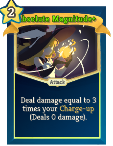 | Rare | Attack | 2 | Deal damage equal to 2 (3) times your Charge-up (Deals 0 damage). |
| Big Crunch |  |  | Rare | Skill | 0 | Exhaust half of the cards in your discard pile and Draw Pile. Gain  [E]  and draw 1 card for every 5(4) cards Exhausted. Exhaust. |
| Binary Stars |  |  | Rare | Skill | 1 | Choose to add (and upgrade) either Black Flare Star or White Dwarf to your hand. Amplify [E] : Add both to your hand instead. |
| Blazing Star |  |  | Rare | Attack | 2 | Deal 16(20) damage. Deals 8(10) additional damage for each Burn in your hand. Amplify  [E]  : Deal double damage.  |
| Casket Of Star |  |  | Rare | Power | 2 | Whenever you gain Block, add a (an Upgraded) Spark to your hand. |
| Collecting Quirk |  |  | Rare | Attack | 2 | Deal 9 damage to a random enemy for every 4(3) Relics you have. |
| Escape Velocity |  |  | Rare | Power | 2(1) | At the start of each turn, draw 2 more cards and add a Burn to your hand. |
| Final Spark |  |  | Rare | Attack | 7 | (Retain.)  Cost 1 less [E] for each card containing "Spark" played this combat. Deal 40 damage to ALL enemies. Reset the cost of this card. |
| Mana Rampage |  | 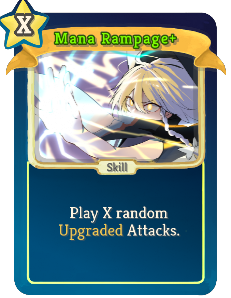 | Rare | Skill | X | Play X random (Upgraded) Attacks. |
| Max Power |  |  | Rare | Skill | 3(2) | Convert your Charge-up stacks into energy. Add 1 Exhaustion to your hand. Your attack damage is doubled this turn. Exhaust. |
| Millisecond Pulsars |  |  | Rare | Power | 2 | (Innate.)  Amplify effects cost no [E] this combat. |
| Satellite Illusion | 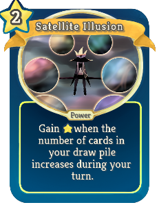 | 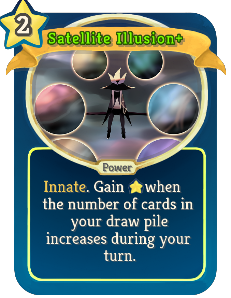 | Rare | Power | 2 | (Innate.) Gain [E] when the number of cards in your draw pile increases during your turn. |
| Stardust Reverie |  |  | Rare | Skill | 0 | Shuffle your hand into your draw pile, then add that many random (Upgraded) cards into (to) your hand. Exhaust. |
| Supernova |  |  | Rare | Power | 2 | No longer take damage from Burn. Whenever you Exhaust a Burn, gain 1(2) Strength. Exhaust your hand at the end of each turn. |
| TreasureHunter |  |  | Rare | Attack | 2 | Deal 12(17) damage. If this kills a non-minion enemy in an Elite or Boss room, at the end of combat, obtain 1 random relic. Exhaust. |
| Ultimate Shortwave |  |  | Rare | Skill | 1 | Gain 1 [E] and 1 Charge-up. Increase the Charge-up gain of this card by 1(2) and energy gain by 1 for this battle. |
| Warming Up |  |  | Rare | Attack | 2 | Deal 1 damage. Add a Rising Sweep, a Spark and a Witch Leyline to your hand (and Upgrade them). |
