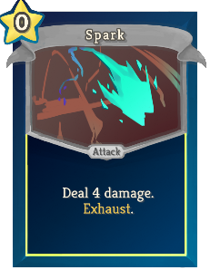
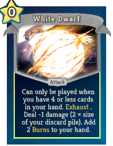

| Name | Image | Upgraded image | Rarity | Type | Cost | Description |
| ---- | ----- | -------------- | ------ | ---- | ---- | ----------- |
| Black Flare Star |  |  | Special | Skill | 0 | Can only be played when you have 4 or more cards in your hand. Exhaust . Discard any number of cards from your hand and gain 4(6) Block for each. |
| Guiding Star |  |  | Special | Skill | 1(0) | Retain .   If the card is in your hand at the start of turn,gain  [E]  . |
| Spark |  |  | Special | Attack | 0 | Deal 4(6) damage. Exhaust. |
| White Dwarf |  |  | Special | Attack | 0 | Can only be played when you have 4 or less cards in your hand. Exhaust. Deal -1 damage (2 ((3) × size of your discard pile). Add 2 Burns to your hand. |
