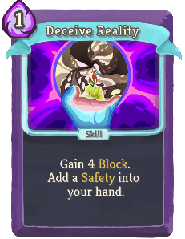
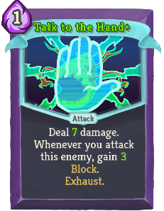

| Name | Image | Upgraded image | Rarity | Type | Cost | Description |
| ---- | ----- | -------------- | ------ | ---- | ---- | ----------- |
| Defend |  |  | Basic | Skill | 1 | Gain 5(8) Block. |
| Eruption |  |  | Basic | Attack | 2(1) | Deal 9 damage. Enter Wrath. |
| Strike |  |  | Basic | Attack | 1 | Deal 6(9) damage. |
| Vigilance |  |  | Basic | Skill | 2 | Gain 8(12) Block. Enter Calm. |
| Bowling Bash |  |  | Common | Attack | 1 | Deal 7(10) damage for each enemy in combat. |
| Consecrate |  |  | Common | Attack | 0 | Deal 5(8) damage to ALL enemies. |
| Crescendo |  |  | Common | Skill | 1(0) | Retain. Enter Wrath. Exhaust. |
| Crush Joints |  |  | Common | Attack | 1 | Deal 8(10) damage. If the last card played this combat was a Skill, apply 1(2) Vulnerable. |
| Cut Through Fate |  |  | Common | Attack | 1 | Deal 7(9) damage. Scry 2(3). Draw 1 card. |
| Empty Body |  |  | Common | Skill | 1 | Gain 7(10) Block. Exit your Stance. |
| Empty Fist |  |  | Common | Attack | 1 | Deal 9(14) damage. Exit your Stance. |
| Evaluate |  |  | Common | Skill | 1 | Gain 6(10) Block. Shuffle an *Insight into your draw pile. |
| Flurry of Blows |  |  | Common | Attack | 0 | Deal 4(6) damage. Whenever you change Stances, return this from the discard pile to your hand. |
| Flying Sleeves |  |  | Common | Attack | 1 | Retain. Deal 4(6) damage twice. |
| Follow-Up |  |  | Common | Attack | 1 | Deal 7(11) damage. If the last card played this combat was an Attack, gain [W]. |
| Halt |  |  | Common | Skill | 0 | Gain 3(4) Block. If you are in Wrath, gain 9(14) additional Block. |
| Just Lucky |  |  | Common | Attack | 0 | Scry 1(2). Gain 2(3) Block. Deal 3(4) damage. |
| Pressure Points |  |  | Common | Skill | 1 | Apply 8(11) *Mark. ALL enemies lose HP equal to their *Mark. |
| Prostrate |  |  | Common | Skill | 0 | Gain 2(3) Mantra. Gain 4 Block. |
| Protect |  |  | Common | Skill | 2 | Retain. Gain 12(16) Block. |
| Sash Whip |  |  | Common | Attack | 1 | Deal 8(10) damage. If the last card played this combat was an Attack, apply 1(2) Weak. |
| Third Eye |  |  | Common | Skill | 1 | Gain 7(9) Block. Scry 3(5). |
| Tranquility |  |  | Common | Skill | 1(0) | Retain. Enter Calm. Exhaust. |
| Battle Hymn |  |  | Uncommon | Power | 1 | (Innate.)  At the start of each turn, add a *Smite into your hand. |
| Carve Reality |  |  | Uncommon | Attack | 1 | Deal 6(10) damage. Add a *Smite into your hand. |
| Collect |  |  | Uncommon | Skill | X | Put a *Miracle+ into your hand at the start of your next X (X+1) turns. Exhaust. |
| Conclude |  |  | Uncommon | Attack | 1 | Deal 12(16) damage to ALL enemies. End your turn. |
| Deceive Reality |  |  | Uncommon | Skill | 1 | Gain 4(7) Block. Add a *Safety into your hand. |
| Empty Mind |  |  | Uncommon | Skill | 1 | Draw 2(3) cards. Exit your Stance. |
| Fasting |  |  | Uncommon | Power | 2 | Gain 3(4) Strength. Gain 3(4) Dexterity. Gain 1 less [W] at the start of each turn. |
| Fear No Evil |  |  | Uncommon | Attack | 1 | Deal 8(11) damage. If the enemy intends to Attack, enter Calm. |
| Foreign Influence |  |  | Uncommon | Skill | 0 | Choose 1 of 3 Attacks of any color to add into your hand. (It costs 0 this turn.)  Exhaust. |
| Foresight |  |  | Uncommon | Power | 1 | At the start of your turn, Scry 3(4). |
| Indignation |  |  | Uncommon | Skill | 1 | If you are in Wrath, apply 3(5) Vulnerable to ALL enemies, otherwise enter Wrath. |
| Inner Peace |  |  | Uncommon | Skill | 1 | If you are in Calm, draw 3(4) cards, otherwise enter Calm. |
| Like Water |  |  | Uncommon | Power | 1 | At the end of your turn, if you are in Calm, gain 5(7) Block. |
| Meditate |  |  | Uncommon | Skill | 1 | Put a (2) card(s) from your discard pile into your hand and Retain it (them). Enter Calm. End your turn. |
| Mental Fortress |  |  | Uncommon | Power | 1 | Whenever you change Stances, gain 4(6) Block. |
| Nirvana |  |  | Uncommon | Power | 1 | Whenever you Scry, gain 3(4) Block. |
| Perseverance |  |  | Uncommon | Skill | 1 | Retain. Gain 5(7) Block. When Retained, increase its Block by 2(3) this combat. |
| Pray |  |  | Uncommon | Skill | 1 | Gain 3(4) Mantra. Shuffle an *Insight into your draw pile. |
| Reach Heaven |  |  | Uncommon | Attack | 2 | Deal 10(15) damage. Shuffle a *Through *Violence into your draw pile. |
| Rushdown |  |  | Uncommon | Power | 1(0) | Whenever you enter Wrath, draw 2 cards. |
| Sanctity |  |  | Uncommon | Skill | 1 | Gain 6(9) Block. If the last card played this combat was a Skill, draw 2 cards. |
| Sands of Time |  |  | Uncommon | Attack | 4 | Retain. Deal 20(26) damage. When Retained, lower its cost by 1 this combat. |
| Signature Move |  |  | Uncommon | Attack | 2 | Can only be played if this is the only Attack in your hand. Deal 30(40) damage. |
| Simmering Fury |  |  | Uncommon | Skill | 1 | At the start of your next turn, enter Wrath and draw 2(3) cards. |
| Study |  |  | Uncommon | Power | 2(1) | At the end of your turn, shuffle an *Insight into your draw pile. |
| Swivel |  |  | Uncommon | Skill | 2 | Gain 8(11) Block. The next Attack you play costs 0. |
| Talk to the Hand |  |  | Uncommon | Attack | 1 | Deal 5(7) damage. Whenever you attack this enemy, gain 2(3) Block. Exhaust. |
| Tantrum |  |  | Uncommon | Attack | 1 | Deal 3 damage 3(4) times. Enter Wrath. Shuffle this card into your draw pile. |
| Wallop |  |  | Uncommon | Attack | 2 | Deal 9(12) damage. Gain Block equal to unblocked damage dealt. |
| Wave of the Hand |  |  | Uncommon | Skill | 1 | Whenever you gain Block this turn, apply 1(2) Weak to ALL enemies. |
| Weave |  |  | Uncommon | Attack | 0 | Deal 4(6) damage. Whenever you Scry, return this from the discard pile to your Hand. |
| Wheel Kick |  |  | Uncommon | Attack | 2 | Deal 15(20) damage. Draw 2 cards. |
| Windmill Strike |  |  | Uncommon | Attack | 2 | Retain. Deal 7(10) damage. When Retained, increase its damage by 4(5) this combat. |
| Worship |  |  | Uncommon | Skill | 2 | (Retain.)  Gain 5 Mantra. |
| Wreath of Flame |  |  | Uncommon | Skill | 1 | Your next Attack deals 5(8) additional damage. |
| Alpha |  |  | Rare | Skill | 1 | (Innate.)  Shuffle a *Beta into your draw pile. Exhaust. |
| Blasphemy |  |  | Rare | Skill | 1 | (Retain.)  Enter Divinity. Die next turn. Exhaust. |
| Brilliance |  |  | Rare | Attack | 1 | Deal 12(16) damage. Deals additional damage equal to Mantra gained this combat. |
| Conjure Blade |  |  | Rare | Skill | X | Shuffle an *Expunger (with X+1) into your draw pile. Exhaust. |
| Deus Ex Machina |  |  | Rare | Skill |  | Unplayable. When you draw this card, add 2(3) *Miracles to your hand and Exhaust. |
| Deva Form |  |  | Rare | Power | 3 | Ethereal. (not Ethereal.) At the start of your turn, gain [W] and increase this gain by 1. |
| Devotion |  |  | Rare | Power | 1 | At the start of your turn, gain 2(3) Mantra. |
| Establishment |  |  | Rare | Power | 1 | (Innate.)  Whenever a card is Retained, reduce its cost by 1 this combat. |
| Judgment |  |  | Rare | Skill | 1 | If the enemy has 30(40) or less HP, set their HP to 0. |
| Lesson Learned |  |  | Rare | Attack | 2 | Deal 10(13) damage. If Fatal, Upgrade a random card in your deck. Exhaust. |
| Master Reality |  |  | Rare | Power | 1(0) | Whenever a card is created during combat, Upgrade it. |
| Omniscience |  |  | Rare | Skill | 4(3) | Choose a card in your draw pile. Play the chosen card twice and exhaust it. Exhaust. |
| Ragnarok |  |  | Rare | Attack | 3 | Deal 5(6) damage to a random enemy 5(6) times. |
| Scrawl |  |  | Rare | Skill | 1(0) | Draw cards until your hand is full. Exhaust. |
| Spirit Shield |  |  | Rare | Skill | 2 | Gain 3(4) Block for each card in your hand. |
| Vault |  |  | Rare | Skill | 3(2) | Take an extra turn after this one. End your turn. Exhaust. |
| Wish |  |  | Rare | Skill | 3 | Choose one: Gain 6(8) Plated Armor, 3(4) Strength, or 25(30) Gold. Exhaust. |
