| Name | Image | Upgraded image | Rarity | Type | Cost | Description |
| ---- | ----- | -------------- | ------ | ---- | ---- | ----------- |
| Clean up Workshop | 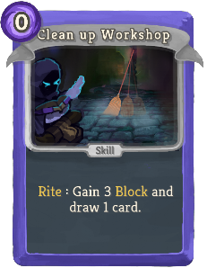 |  | Basic | Skill | 0 | Rite : Gain 3(4) Block and draw 1(2) card(s). |
| Cursed Wand |  |  | Basic | Attack | 1 | Gain 5(7) Block. Deal 7(9) damage. Add a *Dregs card into your hand. |
| Defend |  |  | Basic | Skill | 1 | Gain 5(8) Block. |
| Strike |  |  | Basic | Attack | 1 | Deal 6(9) damage. |
| Circle of Corruption | 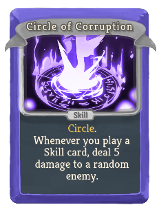 |  | Common | Skill |  | Circle. Whenever you play a Skill card, deal 5(8) damage to a random enemy. |
| Circle of Flame |  |  | Common | Skill |  | Circle. Whenever you play an Attack card, deal 2(4) damage to ALL enemies. |
| Cursed Amulet |  |  | Common | Skill | 1 | Gain 11(14) Block. Draw 1 card. Shuffle a random Curse card into your draw pile. |
| Cursed Blade |  |  | Common | Attack | 1 | Deal 9(12) damage to ALL enemies. Add a *Dregs card into your hand. |
| Cursed Mace |  |  | Common | Attack | 2 | Deal 10(12) damage. Apply 2(3) Vulnerable. Add a *Dregs card into your hand. |
| Cursed Shiv |  |  | Common | Attack | 0 | Deal 6(8) damage. Add a *Dregs card into your hand. |
| Flesh from Bone | 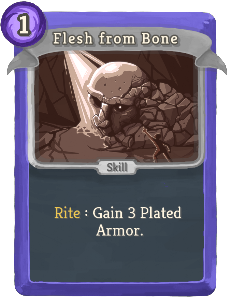 |  | Common | Skill | 1 | Rite : Gain 3(4) Plated Armor. |
| Obscuration | 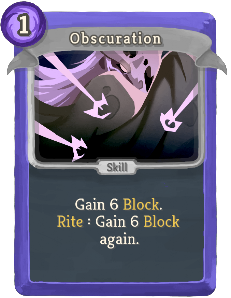 |  | Common | Skill | 1 | Gain 6(8) Block. Rite : Gain 6(8) Block again. |
| Rapid Movement |  |  | Common | Skill | 1 | Gain 7(10) Block. Rite : Draw 2 cards. |
| Raving Staff |  |  | Common | Attack | X | Deal 8(11) damage to a random enemy X times. |
| Smoke Screen |  |  | Common | Skill | 1 | Gain 5(7) Block. Rite : Apply 2(3) Weak to ALL enemies. |
| Spiteful Strike |  | 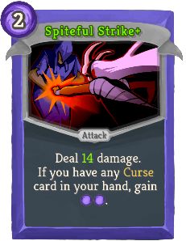 | Common | Attack | 2 | Deal 10(14) damage. If you have any Curse card in your hand, gain [E] [E]. |
| Stigma |  |  | Common | Attack | 1 | Deal 7(9) damage. Apply 3(4) Bleed. |
| Stretching |  |  | Common | Skill | 0 | Gain 2(4) Dexterity. At the end of this turn, lose 2(4) Dexterity. |
| Surprise Attack |  |  | Common | Attack | 0 | Innate. Deal 5(8) damage. Draw 1 card. Exhaust. |
| Tactical Strike |  | 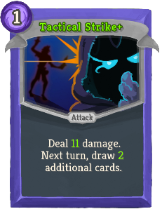 | Common | Attack | 1 | Deal 9(11) damage. Next turn, draw 1(2) additional card(s). |
| Torture |  |  | Common | Skill | 1(0) | Apply 5 Bleed. |
| Vital Strike |  |  | Common | Attack | 1 | Deal 8(11) damage. If the enemy has Bleed, double the damage. |
| Wear Cloak | 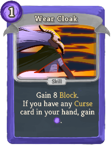 |  | Common | Skill | 1 | Gain 8(11) Block. If you have any Curse card in your hand, gain [E]. |
| Wield |  |  | Common | Attack | 1 | Deal 7(10) damage. Draw cards equal to the number of Unplayable cards in your hand. |
| Abyss Shockwave |  | 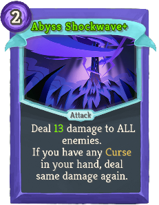 | Uncommon | Attack | 2 | Deal 10(13) damage to ALL enemies. If you have any Curse in your hand, deal same damage again. |
| Ashes to Ashes |  |  | Uncommon | Skill | 1 | Rite : Draw 4(5) cards. |
| Blessing in Disguise |  |  | Uncommon | Skill | 1 | Exhaust all Curse cards in your hand. Gain 8(10) Block for each card Exhausted. |
| Blood Barrier |  |  | Uncommon | Skill | 2(1) | Rite : Gain Block equal to your max HP minus your current HP. Exhaust. |
| Circle of Amplification |  |  | Uncommon | Skill |  | Circle. Whenever you play a Power card, (gain [E] and) draw 1 card. Ethereal. |
| Circle of Blood |  |  | Uncommon | Skill |  | Circle. Whenever you play an Attack card, heal 2(4) HP. Ethereal. |
| Circle of Focus |  | 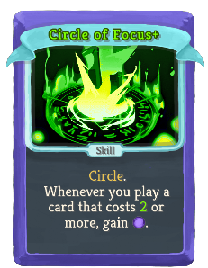 | Uncommon | Skill |  | Circle. Whenever you play a card that costs 3(2) or more, gain [E]. |
| Circle of Windfury |  |  | Uncommon | Skill |  | Circle. Whenever you play a cost 0 card, draw 1 card. Ethereal. (not Ethereal.) |
| Cursed Armor |  |  | Uncommon | Skill | 2 | Gain 20(25) Block. Shuffle 2 random Curse cards into your draw pile. |
| Cursed Boomerang | 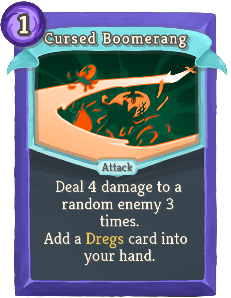 |  | Uncommon | Attack | 1 | Deal 4 damage to a random enemy 3(4) times. Add a *Dregs card into your hand. |
| Cursed Spellbook |  |  | Uncommon | Skill | 0 | Draw 3(4) cards. Shuffle a random Curse card into your draw pile. |
| Cursed Staff | 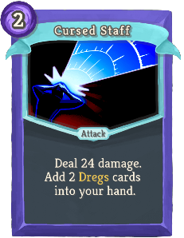 |  | Uncommon | Attack | 2 | Deal 24(30) damage. Add 2 *Dregs cards into your hand. |
| Double Shield |  |  | Uncommon | Skill | 2 | Gain 10(14) Block. Rite : Next turn, gain 10(14) Block. |
| Empower Circles |  | 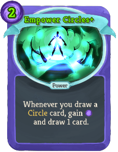 | Uncommon | Power | 3(2) | Whenever you draw a Circle card, gain [E] and draw 1 card. |
| Evocation | 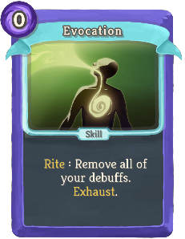 |  | Uncommon | Skill | 0 | Rite : Remove all of your debuffs. (If there is no debuff, gain 1 Artifact.) Exhaust. |
| Fury Strike |  |  | Uncommon | Attack | 2 | Deal 14(18) damage. Reduce the cost of all Strike cards in your hand to 0 this turn. |
| Grudge |  |  | Uncommon | Skill | 1(0) | Add a random Rite card into your hand. It costs 0 this turn. Exhaust. |
| Hell's Gate Open |  | 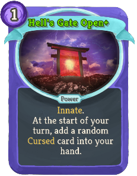 | Uncommon | Power | 1 | (Innate.)  At the start of your turn, add a random Cursed card into your hand. |
| Hellfire Breathing |  |  | Uncommon | Power | 1(0) | Whenever you draw a Curse card, deal 4 damage to ALL enemies. |
| Hemoplague |  | 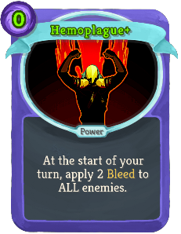 | Uncommon | Power | 1(0) | At the start of your turn, apply 2 Bleed to ALL enemies. |
| Lucky Charm | 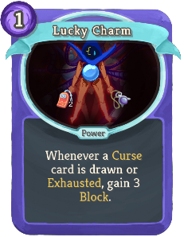 |  | Uncommon | Power | 1 | Whenever a Curse card is drawn or Exhausted, gain 3(4) Block. |
| Mana Bullet |  |  | Uncommon | Attack | 1 | Deal 7(8) damage for each Curse (Unplayable) card in your hand. |
| Mangle | 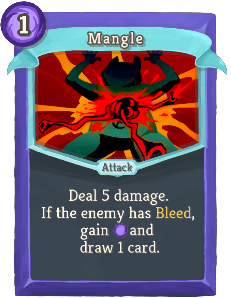 |  | Uncommon | Attack | 1 | Deal 5(7) damage. If the enemy has Bleed, gain [E] and draw 1 card. |
| Prepare Rite |  |  | Uncommon | Skill | 0 | Exhaust any number of non-Curse cards, then add that many *Dregs cards into your hand. Exhaust. (not Exhaust.) |
| Released Knowledge |  |  | Uncommon | Skill | 0 | Rite : Add a random Circle card into your hand. Exhaust. (not Exhaust.) |
| Released Strength |  |  | Uncommon | Skill | 1 | Rite : Gain 3(4) Strength. Ethereal. |
| Salt upon Wound | 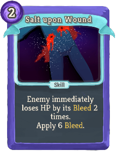 | 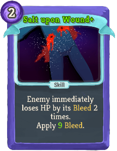 | Uncommon | Skill | 2 | Enemy immediately loses HP by its Bleed 2 times. Apply 6(9) Bleed. |
| Soul Crush |  |  | Uncommon | Attack | 2 | Exhaust all Curse cards in your hand. Deal 18(22) damage. |
| Soul Reap |  |  | Uncommon | Attack | 1 | Deal 5(7) damage. Heal HP equal to unblocked damage. Exhaust. |
| Spiteful Plan |  |  | Uncommon | Power | 1 | Whenever you draw a Curse card, draw 1(2) card(s). |
| Spiteful Pray | 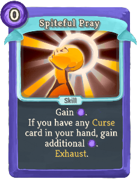 |  | Uncommon | Skill | 0 | Gain [E] ([E]). If you have any Curse card in your hand, gain additional [E]. Exhaust. |
| Spread Plague |  |  | Uncommon | Skill | 2 | Apply 4(7) Bleed and 3 Vulnerable to ALL enemies. Exhaust. |
| Sting Eye |  |  | Uncommon | Attack | 0 | Deal 3(4) damage. Apply 1(2) Weak. Apply 1(2) Bleed. |
| Troublous Minions | 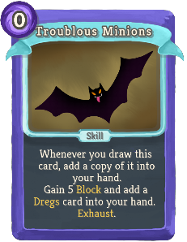 |  | Uncommon | Skill | 0 | Whenever you draw this card, add a copy of it into your hand. Gain 5(7) Block and add a *Dregs card into your hand. Exhaust. |
| Anti-Aging |  |  | Rare | Skill | 2 | Gain 5(7) Block. Rite : Raise your max HP by 2(3). Exhaust. |
| Circle of Abyss |  |  | Rare | Skill |  | Circle. Whenever you play a card, gain 2(3) Block. If this card is Exhausted, (NL) gain [E] ([E]). |
| Collect Tribute |  |  | Rare | Power | 0 | (Innate.)  At the start of your turn, gain [E] and add a random Curse card into your hand. |
| Cursed Relics |  | 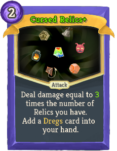 | Rare | Attack | 2 | Deal damage equal to 2(3) times the number of Relics you have. Add a *Dregs card into your hand. |
| Dark Barrier | 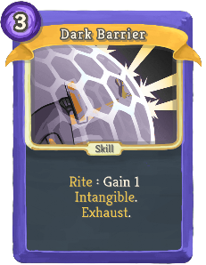 |  | Rare | Skill | 3 | Rite : Gain 1(2) Intangible. Exhaust. |
| Demon Sword |  |  | Rare | Attack | 1 | Deal 11(15) damage. Exhaust all Curse cards in your hand and gain 1 Strength for each Exhausted card. |
| Demonic Pact |  | 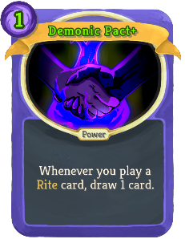 | Rare | Power | 2(1) | Whenever you play a Rite card, draw 1 card. |
| Forbidden Alchemy |  |  | Rare | Skill | 3(2) | Rite : Obtain an Entropic Brew potion. Exhaust. |
| Mana Circulation |  |  | Rare | Power | 5 | Whenever a Curse card is Exhausted, gain [E]. Ethereal. (not Ethereal.) |
| Neow's Might |  |  | Rare | Skill | 1(0) | Draw 2 cards. Reduce the cost of all cards in your hand by 1 this turn. Exhaust. |
| Neurasthenia |  | 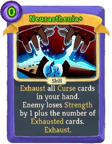 | Rare | Skill | 1(0) | Exhaust all Curse cards in your hand. Enemy loses Strength by 1 plus the number of Exhausted cards. Exhaust. |
| Out for Blood |  |  | Rare | Power | 2 | Whenever an Attack deals unblocked damage, apply 1(2) Bleed. |
| Parallel World |  |  | Rare | Skill | 2(1) | Copy all cards in your hand and Shuffle them into your draw pile. Exhaust. |
| Shock and Awe |  |  | Rare | Attack | 3 | Deal 12(14) damage 3 times. Shuffle 2 random Curse cards into your draw pile. |
| Stunning Strike |  |  | Rare | Attack | 3 | Deal 20(28) damage. If the enemy intends to attack, apply 1 Stun. Exhaust. |
| Ultimate Pain |  |  | Rare | Skill | X | ALL enemies immediately loses HP by its Bleed X (X+1) times. |
| Void Form |  | 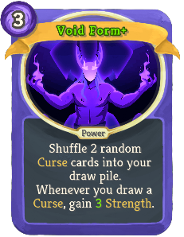 | Rare | Power | 3 | Shuffle 2 random Curse cards into your draw pile. Whenever you draw a Curse, gain 2(3) Strength. |
