| Name | Image | Upgraded image | Rarity | Type | Cost | Description |
| ---- | ----- | -------------- | ------ | ---- | ---- | ----------- |
| Corporeate |  |  | Basic | Skill | 1 | thevacant:Mill 5(8). Gain Block for each card thevacant:Milled. thevacant:Return 1 card. |
| Defend |  |  | Basic | Skill | 1 | Gain 5(8) Block. |
| Soul Bash |  |  | Basic | Attack | 0 | thevacant:Ricochet. Deal 3(4) damage. Gain 3(4) Vigor. |
| Strike |  | 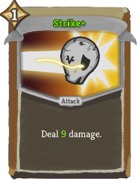 | Basic | Attack | 1 | Deal 6(9) damage. |
| Battle Scars |  |  | Common | Skill | 1 | Gain 4 ([#7FFF00]6[]) Vigor. thevacant:Hollow: Gain 2(3) Strength. |
| Brass Magnet |  | 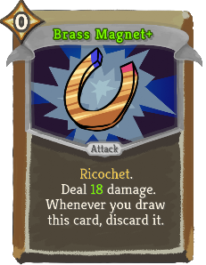 | Common | Attack | 0 | thevacant:Ricochet. Deal 14(18) damage. Whenever you draw this card, discard it. |
| Cower |  | 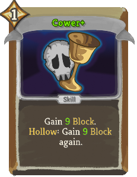 | Common | Skill | 1 | Gain 7(9) Block. thevacant:Hollow: Gain 7(9) Block again. |
| Dig | 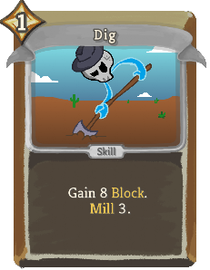 |  | Common | Skill | 1 | Gain 8(10) Block. thevacant:Mill 3(5). |
| Doomed |  |  | Common | Attack | 1 | Deal 14(18) damage. Gain 2 thevacant:Doom this turn. |
| Eye Poke |  |  | Common | Attack | 1(0) | Deal 2 damage 2 times. Apply 2 Weak. |
| Fling |  |  | Common | Attack | 1 | Deal 9(13) damage. thevacant:Mill 4. |
| Frantic Blow |  |  | Common | Attack | 2 | Deal 14(17) damage. thevacant:Hollow: Deal 14(17) damage again. |
| Grave Wave |  |  | Common | Attack | 1 | Deal 8(12) damage. thevacant:Hollow: Apply 2 Weak and 2 Vulnerable. |
| Jab |  |  | Common | Attack | 0 | thevacant:Ricochet. Deal 5(7) damage. Shuffle this card into your draw pile. |
| Partake |  |  | Common | Skill | 0 | Gain 8(10) Block. Lose 4 thevacant:Temperance. |
| Pickaxe |  |  | Common | Attack | 1 | Deal 4(6) damage twice. thevacant:Chip your next thevacant:Gem. |
| Ruby Rage |  |  | Common | Skill | 1 | thevacant:Mine 2 size 2(3) thevacant:Rubies. |
| Sapphire Strike |  |  | Common | Attack | 1 | Deal 6(8) damage. thevacant:Mine a size 3(4) thevacant:Sapphire. |
| Shrieking Blast |  | 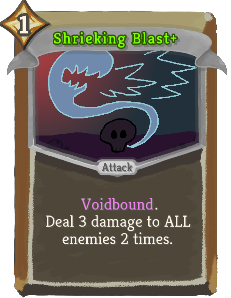 | Common | Attack | 1 | Deal 3 damage to ALL enemies 2 times. |
| Thoughtseize |  |  | Common | Attack | 1 | Deal 10(12) damage. thevacant:Return 1(2) card(s). |
| Treasure | 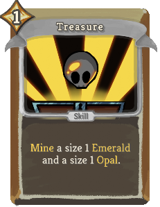 |  | Common | Skill | 1(0) | thevacant:Mine a size 1 thevacant:Emerald and a size 1 thevacant:Opal. |
| Vlaze |  | 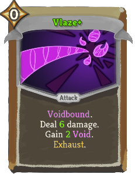 | Common | Attack | 0 | Deal 4(6) damage. Gain 1(2) [#ee82ee]Void[]. Exhaust. |
| Acceptance |  |  | Uncommon | Power | 2 | Gain 3(5) Artifact. |
| Aw Man |  |  | Uncommon | Skill | 0 | Gain 2(1) Frail. thevacant:Chip ALL your thevacant:Gems. |
| Back in the Mine |  |  | Uncommon | Attack | 2 | Deal 12(17) damage to ALL enemies. thevacant:Mine a random size 1 thevacant:Gem for each enemy hit. |
| Burden Break |  |  | Uncommon | Power | 1 | Whenever you take damage or gain a debuff, gain 3(4) Vigor. |
| Cleanse Soul |  |  | Uncommon | Power | 0 | (Innate.)  Gain 4(5) thevacant:Temperance. Whenever you thevacant:Mill a Status or Curse, Exhaust it. |
| Cracked Reflection |  |  | Uncommon | Power | 2 | Whenever you thevacant:Mine a thevacant:Gem, thevacant:Chip it (1(2) times). |
| Cursed Blast |  |  | Uncommon | Attack | 1 | thevacant:Unnate. Deal 10 damage to ALL enemies. Gain 2 [#ee82ee]Void[]. |
| Desperation |  |  | Uncommon | Skill | 1(0) | Choose a card. Add a copy to your hand. thevacant:Hollow: It costs 0 this turn. |
| Embrace Darkness |  | 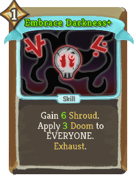 | Uncommon | Skill | 1 | Gain 4(6) thevacant:Shroud. Apply 2 ([#7FFF00]3[]) thevacant:Doom to EVERYONE. Exhaust. |
| Emerald Splash |  |  | Uncommon | Attack | 0 | Deal 4(7) damage to ALL enemies. thevacant:Mine a size 2 thevacant:Emerald. |
| Expand |  | 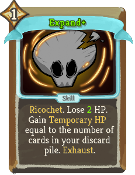 | Uncommon | Skill | 1 | (thevacant:Ricochet.) Lose 4(2) HP. Gain Temporary_HP equal to the number of cards in your discard pile. Exhaust. |
| Gloom |  |  | Uncommon | Power | 2 | Gain 4(6) thevacant:Shroud. |
| Hex |  |  | Uncommon | Skill | 1 | Apply 3(4) thevacant:Doom. Exhaust. |
| Immaterialize |  | 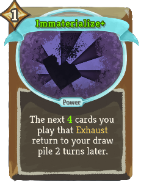 | Uncommon | Power | 1 | The next 3(4) cards you play that Exhaust return to your draw pile 2 turns later. |
| Into the Abyss |  |  | Uncommon | Power | 2 | Next turn, gain 2(3) thevacant:Doom. At the start of your turn, apply 2(3) thevacant:Doom to ALL enemies. |
| Lash Out |  |  | Uncommon | Attack | 2(1) | Deal damage equal to your missing HP. Exhaust. |
| Onyx Blaster |  |  | Uncommon | Attack | 1 | Deal 8(10) damage. thevacant:Mine a size 2(3) thevacant:Onyx. |
| Opal Fracture | 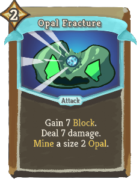 |  | Uncommon | Attack | 2 | Gain 7(9) Block. Deal 7(9) damage. thevacant:Mine a size 2(3) thevacant:Opal. |
| Polish |  |  | Uncommon | Skill | 1 | Gain 8 Block. Increase the size of ALL of your thevacant:Gems by 1. Exhaust. (not Exhaust.) |
| Reach Through |  |  | Uncommon | Power | 1(0) | At the end of your turn, increase the size of your first 2 thevacant:Gems. Gain 2 thevacant:Antifact. |
| Reaper Blast |  |  | Uncommon | Skill | 0 | Apply 2(3) thevacant:Reap, 2(3) Vulnerable, and 2(3) Weak to EVERYONE. Exhaust. |
| Reaper Strike | 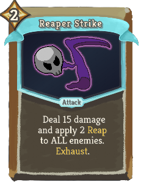 |  | Uncommon | Attack | 2 | Deal 15(20) damage and apply 2(3) thevacant:Reap to ALL enemies. Exhaust. |
| Recover |  |  | Uncommon | Power | 1 | At the end of battle, if you are thevacant:Hollow, heal 10(14) HP. |
| Shatter Amethyst |  |  | Uncommon | Skill | 1 | thevacant:Ricochet. thevacant:Mine a size 5(7) thevacant:Amethyst and thevacant:Chip it (twice). |
| Sneeze |  |  | Uncommon | Skill | 0 | (Innate.) Retain. thevacant:Mill 5(8). When Retained, increase this card's thevacant:Mill by 2. Exhaust. |
| Soul Barrage |  |  | Uncommon | Attack | 2 | Deal 4 damage 3(4) times. Can be upgraded any number of times. |
| Spelunk |  |  | Uncommon | Skill | 2 | Gain 10(14) Block. Choose a thevacant:Gem to thevacant:Mine out of 3(4). |
| Spinshield |  |  | Uncommon | Skill | 2 | Gain 5(7) Block 3 times. |
| Surprise Attack |  |  | Uncommon | Attack | 0 | thevacant:Unnate. thevacant:Ricochet. Deal 14(18) damage. Exhaust. |
| Threaten |  | 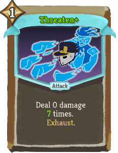 | Uncommon | Attack | 1 | Deal 0 damage 5(7) times. Exhaust. |
| Topaz Frenzy |  |  | Uncommon | Attack | 2 | Deal 3(5) damage 3 times. thevacant:Mine a size 2(3) thevacant:Topaz. Exhaust. |
| Unearth | 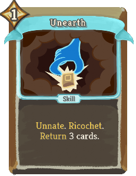 | 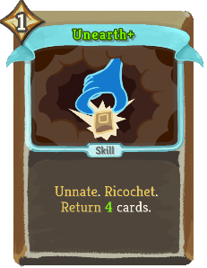 | Uncommon | Skill | 1 | thevacant:Unnate. thevacant:Ricochet. thevacant:Return 3(4) cards. |
| Void Embrace |  |  | Uncommon | Power | 1 | thevacant:Unnate (Innate). Whenever a card you play Exhausts, gain 1 [#ee82ee]Void[]. |
| Dark Strike |  |  | Rare | Attack | 4 | Deal 6 damage 6 times. Apply 6 thevacant:Doom. Exhaust. (not Exhaust.) |
| Diamond Is Unbreakable |  |  | Rare | Skill | X | thevacant:Mine X (X+1) size 1 thevacant:Diamonds. Exhaust. |
| Dimension Tear |  |  | Rare | Attack | 2 | Deal 6(8) damage thrice. Add your Exhaust pile to your hand. Exhaust. |
| Empty Shield |  |  | Rare | Skill | 2(1) | (thevacant:Ricochet.)  Gain Block equal to your missing HP. Exhaust. |
| Essence Of Bismuth |  |  | Rare | Skill | 1 | thevacant:Unnate. Double debuffs on ALL enemies. Exhaust. |
| Exorcise |  |  | Rare | Skill | 1 | Remove all your Debuffs (and apply them to ALL enemies). Exhaust. |
| Forge Soul |  | 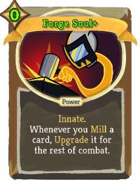 | Rare | Power | 1(0) | Innate. Whenever you thevacant:Mill a card, Upgrade it for the rest of combat. |
| From Nothing |  | 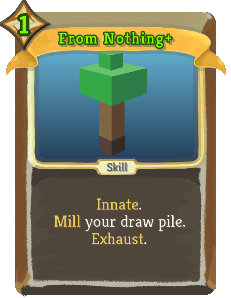 | Rare | Skill | 2(1) | Innate. thevacant:Mill your draw pile. Exhaust. |
| Gilded Pickaxe |  |  | Rare | Attack | 1 | Deal 6(8) damage twice. thevacant:Chip ALL your thevacant:Gems. |
| Memoria |  |  | Rare | Skill | 1 | thevacant:Ricochet. The next (2) time(s) you play a card that Exhausts this turn, play it twice. |
| Rejection |  |  | Rare | Power | 2 | Gain 5(7) Strength, 2 Frail, and 2 thevacant:Antifact. |
| Requiem |  |  | Rare | Power | 3(2) | Whenever you gain a buff or a debuff, double it. |
| Runic Thoughts |  | 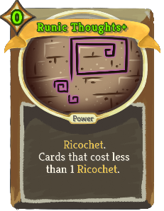 | Rare | Power | 1(0) | (thevacant:Ricochet.)  Cards that cost less than 1 thevacant:Ricochet. |
| Showdown |  |  | Rare | Attack | 2 | Deal 16(22) damage to ALL enemies. Play your next attack twice. Apply 4 thevacant:Doom to EVERYONE. |
| Steal Soul |  |  | Rare | Attack | 2 | Deal 20(25) damage. Remove (Steal) Artifact and Strength. Exhaust. |
| The Anvil |  | 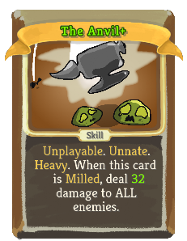 | Rare | Skill |  | Unplayable. thevacant:Unnate. thevacant:Heavy. When this card is thevacant:Milled, deal 24(32) damage to ALL enemies. |
| Time Skip |  |  | Rare | Skill | 3 | (Draw 2 cards.)  All cards in your hand cost 0 and Exhaust. Exhaust. |
| Void Form |  |  | Rare | Power | 3 | Gain 6(8) [#ee82ee]Void[]. At the start of your turn, thevacant:Mill 6(8). |
| Voidstone |  |  | Rare | Skill | 1 | Gain 6 Block twice. Choose a (ALL) card(s) to (in your hand) become [#ee82ee]Voidbound[]. Exhaust. |
