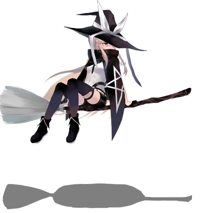
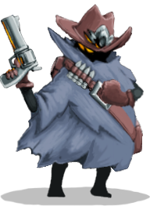
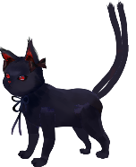
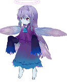

| Image | Name |
| ----- | ---- |
|  | The Ordinary Magician |
|  | the Defect |
|  | the Hermit |
|  | the Ironchad |
|  | the Silent |
|  | the Vacant |
|  | the Watcher |
|  | Acid Slime (L) |
|  | Acid Slime (M) |
|  | Acid Slime (S) |
|  | Apology Slime |
|  | Awakened One |
|  | Bear |
|  | Book of Stabbing |
|  | Bronze Automaton |
|  | Byrd |
|  | Byrd (Grounded) |
|  | Centurion |
|  | Chosen |
|  | Corrupt Heart |
|  | Cultist |
|  | Dagger |
|  | Darkling |
|  | Deca |
|  | Donu |
|  | Exploder |
|  | Fat Gremlin |
|  | Fungi Beast |
|  | Giant Head |
|  | Gremlin Leader |
|  | Gremlin Nob |
|  | Gremlin Wizard |
|  | Hexaghost |
|  | Jaw Worm |
|  | Lagavulin |
|  | Lagavulin (Awake) |
|  | Looter |
|  | Louse |
|  | Louse |
|  | Mugger |
|  | Mystic |
|  | Nemesis |
|  | Orb Walker |
|  | Orin |
|  | Pointy |
|  | Reptomancer |
|  | Repulsor |
|  | Romeo |
|  | Sentry |
|  | Shelled Parasite |
|  | Shield Gremlin |
|  | Slaver |
|  | Slaver |
|  | Slime Boss |
|  | Snake Plant |
|  | Sneaky Gremlin |
|  | Snecko |
|  | Spheric Guardian |
|  | Spike Slime (M) |
|  | Spike Slime (S) |
|  | Spiker |
|  | Spire Growth |
|  | Spire Shield |
|  | Spire Spear |
|  | Taskmaster |
|  | The Champ |
|  | The Collector |
|  | The Guardian |
|  | The Maw |
|  | Time Eater |
|  | Transient |
|  | Writhing Mass |
|  | Zombie Fairy |
