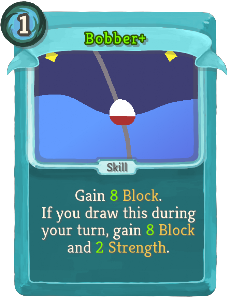

| Name | Image | Upgraded image | Rarity | Type | Cost | Description |
| ---- | ----- | -------------- | ------ | ---- | ---- | ----------- |
| Beast Slayer |  |  | Special | Attack | 1 | Deal 12(15) damage. In Elite combats, deal !fishing:sd! damage instead. |
| Boot |  |  | Special | Attack | 0 | Deal 2 damage to ALL enemies. Draw !fishing:m3! card(s). Exhaust. |
| Cheat |  |  | Special | Attack | 1 | Remove the enemy's Block. Deal 9(12) damage. Add a *Steal into your hand. Exhaust. |
| Crystalline Confluence |  |  | Special | Skill | X | Shuffle X (X+1) fishing:Foil *Star *Shards into your draw pile. Exhaust. |
| Eel |  |  | Special | Skill | 0 | {@@}Gain {1|1=[E]|2=[E] [E]|3=[E] [E] [E]|4=[E] [E] [E] [E]|>4=1 [E]}. Draw !fishing:m3! card(s). Exhaust. |
| Flag |  |  | Special | Skill | 0 | Retain. Gain 6(9) Block. Exhaust. |
| Flight |  |  | Special | Skill | 1 | Ethereal. Gain 10(14) Block. Exhaust. |
| Guppy |  |  | Special | Skill | 0 | Gain 3 Block. Draw !fishing:m3! card(s). Exhaust. |
| Hammerhead |  |  | Special | Skill | 0 | Gain 1 Strength. Draw !fishing:m3! card(s). Exhaust. |
| Hello There! |  |  | Special | Skill | 0 | Innate. Apply 1(2) Weak. Apply 1(2) Vulnerable. Draw 1 card. Exhaust. |
| Hindsight |  |  | Special | Skill | 1 | Next turn, gain 4(6) Block. Return 1 card from your discard pile to your hand. |
| Maw |  |  | Special | Attack | 0 | Deal 3 damage twice. Draw !fishing:m3! card(s). Exhaust. |
| Octopus |  |  | Special | Skill | 0 | {@@}Draw 1 card{1|>1=s}. Draw !fishing:m3! card(s). Exhaust. |
| Pinball |  |  | Special | Attack | 1 | Deal 2(3) damage to a random enemy 4 times. Exhaust. |
| Piranha |  |  | Special | Attack | 0 | Deal 4 damage. Draw !fishing:m3! card(s). Exhaust. |
| Power Pellet |  |  | Special | Skill | 0 | *Waka *Wakas deal 6(9) additional damage. Exhaust. |
| Qwilfish |  |  | Special | Skill | 0 | Apply 4 Poison. Draw !fishing:m3! card(s). Exhaust. |
| Sea Monster |  |  | Special | Skill | 0 | Add 2 fishing:Fish into your hand. Draw !fishing:m3! card(s). Exhaust. |
| Shark |  |  | Special | Attack | 0 | Deal 3 damage. Apply 1 Vulnerable. Draw !fishing:m3! card(s). Exhaust. |
| Spin Attack |  |  | Special | Attack | 1 | Deal 12(16) damage to ALL enemies. Discard 1 card. |
| Star Shard |  |  | Special | Attack | 0 | Gain 3(4) Block. Deal 3(4) damage. Draw 1 card. |
| Starfish |  |  | Special | Attack | 0 | Deal 3 damage. Apply 1 Weak. Draw !fishing:m3! card(s). Exhaust. |
| Steal |  |  | Special | Skill | 1 | If the enemy has positive Strength, steal up to 2(3) of it. Exhaust. |
| Swordfish |  |  | Special | Attack | 0 | Gain 3 Block. Deal 4 damage. Draw !fishing:m3! card(s). Exhaust. |
| The Eternity Gem |  |  | Special | Attack | 1 | Deal 11(12) damage to a random enemy 11(12) times. Exhaust. |
| The Gem Search |  |  | Special | Power | 1(0) | fishing:Quest: End your turn with an empty hand. *Reward: Shuffle *The *Eternity *Gem into your draw pile. |
| The Key Finisher |  |  | Special | Attack | 2 | Deal 11(13) damage to ALL enemies twice. Complete your fishing:Quests. |
| The Whale |  |  | Special | Skill | 0 | Enemy loses 20 HP. Draw !fishing:m3! card(s). Exhaust. |
| Za Hando |  |  | Special | Attack | 1 | Deal 13(17) damage. Exhaust the middle card(s) of your hand. |
| Stone |  |  | Curse | Curse |  | Unplayable. If this card is Exhausted, deal 9 damage to a random enemy. |
| Cast Line |  |  | Basic | Attack | 0 | Deal 4 damage. Shuffle 1(2) fishing:Fish into your draw pile. |
| Defend |  |  | Basic | Skill | 1 | Gain 5(8) Block. |
| Strike |  |  | Basic | Attack | 1 | Deal 6(9) damage. |
| Bag of Defends |  |  | Common | Skill | X | Gain 6(8) Block X times. When you remove a (Stuffed with) Defend(s) from your deck, Upgrade this (not from your deck, Upgrade this). |
| Baited |  |  | Common | Attack | 2 | Deal 14(20) damage. If the enemy intends to attack, add 2 fishing:Fish into your hand. |
| Cardboard Bullets |  |  | Common | Attack | 0 | Deal 9(12) damage. Deals 2 less damage for each other card in your hand. |
| Double Up |  |  | Common | Attack | 1 | Deal 4(6) damage twice. Startup: ALL enemies lose 4(6) HP. |
| Future Proofing |  |  | Common | Attack | 1 | Deal 7(9) damage to ALL enemies. Upgrade 1(2) random card(s) in your draw pile for the rest of combat. |
| Hunker Down |  |  | Common | Skill | 0 | Gain 1(3) Block. If you have played less than 3 cards this turn, gain [E]. |
| Maybe Later |  |  | Common | Attack | 1 | Deal 6(8) damage. Put a card from your hand on top of your draw pile. If you do, gain 6(8) Block. |
| Mop Up |  |  | Common | Attack | 1 | Deal 8(11) damage. Exhaust a card. If it's a Status or Curse card, draw 1 card. |
| Nostalgic Strike |  |  | Common | Attack | 1 | Deal 9(12) damage. Put a random card from your discard pile into your hand. |
| Oblivious |  |  | Common | Skill | 1 | Gain 6(9) Block. Add 1 fishing:Fish into your hand. |
| Perfect Pull |  |  | Common | Attack | 1 | Deal 7(10) damage. Draw 1 card. If you drew a fishing:Foil card this way, deal 7(10) damage again. |
| Plant Flag |  |  | Common | Skill | 1 | Gain 4(7) Block. Put a fishing:Foil *Flag on top of your draw pile. |
| Rod Slam |  |  | Common | Attack | 1 | Deal 12(16) damage. Next turn, draw 1 less card. |
| Set Sail |  |  | Common | Skill | 0 | Draw 1 card. Discard 1 card. Gain 2(4) Vigor. |
| Shiny Shots |  |  | Common | Attack | 2 | Deal 5(6) damage 3 times. Gain 2(3) Block for each fishing:Foil card in your hand. |
| That's All, Folks! |  |  | Common | Attack | 1 | Deal 10(13) damage. fishing:Solo: Play the top card of your draw pile. |
| Thorny Personality |  |  | Common | Skill | 1 | Gain 8(11) Block. Gain 1 Thorns. fishing:Voyaged: Gain !fishing:m2! more Thorns. |
| Wander |  |  | Common | Attack | 1 | Deal 8(11) damage. Choose a card from your draw pile to put on top. |
| All Out |  |  | Uncommon | Power | 1 | Discard 1 card. At the end of your turn, if your hand is empty, deal 7(9) damage to ALL enemies. |
| Aqua Orb |  |  | Uncommon | Skill | 2 | Apply 1(2) Weak to ALL enemies. Gain 11(12) Block. If your discard pile is empty, gain 1 Artifact. |
| Bobber |  |  | Uncommon | Skill | 1 | Gain 7(8) Block. If you draw this during your turn, gain !fishing:m2! Block and 1(2) Strength. |
| Box of Havoc |  |  | Uncommon | Skill | 1 | Apply !fishing:m2! Poison to ALL enemies. fishing:Solo: Apply 3 Weak and Vulnerable to ALL enemies. |
| Cannoneer |  |  | Uncommon | Attack | X | Deal 8(11) damage to a random enemy X times. |
| Catch of the Day |  |  | Uncommon | Power | 1 | (Innate.)  At the end of your turn, put a fishing:Fish on top of your draw pile. |
| Decked Out |  |  | Uncommon | Skill | 1 | Add 2(3) *Shivs and a fishing:Foil *Smite into your hand. If you're on Steam Deck, Upgrade them. |
| Fasting-B |  |  | Uncommon | Power | 1 | Gain 4(5) Thorns. Gain 4(5) *Plated *Armor. At the start of your turn, discard 1 card. |
| First Class |  |  | Uncommon | Power | 1 | (Innate.)  At the start of your turn, add a fishing:Foil *Flight into your hand. |
| Flaming Flip |  |  | Uncommon | Skill | 1 | Gain 5(8) Block. Exhaust 1 card. Draw 1 card. |
| Free Drinks |  |  | Uncommon | Skill | 2 | ALL enemies lose 2(3) Strength. Exhaust. When you obtain this, obtain a random Potion. |
| Garlic Clove |  |  | Uncommon | Skill | 1 | Remove your Weak, Vulnerable, and Frail. If you're not a Vampire, heal 4(6) HP. Exhaust. |
| Glitter Glue |  |  | Uncommon | Attack | 1 | Deal 6(10) damage. Apply 2 Weak. When you obtain this, make it and a random card in your deck fishing:Foil. |
| Hook |  |  | Uncommon | Attack | 1 | Deal 8(9) damage. Deals 4(5) additional damage for each Colorless card played this turn. |
| Lie |  |  | Uncommon | Skill | 1 | ALL enemies lose 4(6) Strength this turn. Add a *Cheat into your hand. Exhaust. |
| Mint Condition |  |  | Uncommon | Power | 1 | fishing:Foil cards deal 3(4) more damage and grant 3(4) more Block. |
| Preclude |  |  | Uncommon | Attack | 1 | Opener. Deal 15(20) damage. Discard 1 card. Reset all *Time *Warp. |
| Pyramid Climb |  |  | Uncommon | Skill | 1 | Gain 13(17) Block. Put a *Stone on top of your draw pile. |
| Reserves |  |  | Uncommon | Power | 1(0) | After you play an X-cost card, gain [E]. |
| Ridiculous Fishing |  |  | Uncommon | Power | 1 | Whenever you play a fishing:Fish, deal 3(5) damage to a random enemy. |
| Ring the Bell |  |  | Uncommon | Skill | 1 | (Ethereal.)  ALL enemies lose 13 HP. Put a *Curse *of *the *Bell on top of your draw pile. |
| Setdown |  |  | Uncommon | Skill | 1 | (Retain.)  Put a card from your discard pile on top of your draw pile. It costs 0 until played. |
| Shimmering Shield |  |  | Uncommon | Skill | 1 | Gain 6(9) Block. Whenever you play a fishing:Foil card this turn, add a *Shiv into your hand. |
| Ship Ram |  |  | Uncommon | Attack | 2 | Deal 18(22) damage. fishing:Voyaged: Deal !fishing:sd! damage instead. |
| Shopping Strike |  |  | Uncommon | Attack | 1 | Deal 8(9) damage. Apply 1(2) Vulnerable. When you purchase a *Relic, Upgrade this. (Thanks for shopping!) |
| Sole Searching |  |  | Uncommon | Skill | 0 | Scry 2(3). fishing:Solo: Gain 2(3) Strength. |
| Splash |  |  | Uncommon | Attack | 2 | Gain 13(16) Block. Deal 13(16) damage. This card's damage and Block are reduced by 2 for each other card in your hand. |
| Standoff |  |  | Uncommon | Skill | 1 | Gain 7(8) Block. Increase this card's Block by 3(4) this combat. |
| The Fish-O-Pedia |  |  | Uncommon | Skill | 1 | Draw 2(3) cards. fishing:Quest: Play 4 different kinds of fishing:Fish. *Reward: Gain 2 Strength. |
| The Lucky Pack |  |  | Uncommon | Attack | 1 | Deal 9(13) damage. fishing:Quest: Play 3 fishing:Foil cards in a turn. *Reward: Gain 3 *Plated *Armor. |
| The Storm |  |  | Uncommon | Skill | 1 | Next turn, gain [E] [E] ([E]). fishing:Quest: Spend 6 Energy in a turn. *Reward: A random enemy loses 17 HP. |
| Treasure Chest |  |  | Uncommon | Skill | 1 | Add 1 fishing:Fish into your hand. Startup: Gain 12(16) *Gold. |
| Waka Waka |  |  | Uncommon | Attack | 1 | (Retain.)  Deal 8(9) damage. Startup: Shuffle 2 *Power *Pellets into your draw pile. |
| Whaling |  |  | Uncommon | Power | 0 | Gain 1 Strength. If you have over 200 *Gold, spend 15(8) to gain an extra 1 Strength. |
| Wizardry |  |  | Uncommon | Skill | 1 | Gain 4(6) Vigor. Whenever you draw this card, put a fishing:Foil *Pinball on top of your draw pile. |
| Angler Form |  |  | Rare | Power | 3 | Retain. The first 3(4) times you play a card each turn, draw 1 card. |
| Caffeinated |  |  | Rare | Power | 1 | fishing:Unnate. (not fishing:Unnate.) At the start of your turn, gain [E]. |
| Chocolate Chip Cookie |  |  | Rare | Skill | 1 | Heal 5(6) HP. Gain !fishing:m2! Dexterity. Upgrade all cards in your hand for the rest of combat. Exhaust. |
| Collector |  |  | Rare | Power | 2 | At the end of your turn, if you played 2 or more fishing:Foil cards, gain 2(3) Strength. |
| Confetti Cannon |  |  | Rare | Attack | 1 | Deal 9(12) damage to a random enemy. Draw 1 card. If you drew a fishing:Foil card this way, repeat this. |
| Finishing Touches |  |  | Rare | Power | 2(1) | Discard 2 cards. When you play a card, if it's the only card in your hand, play it twice. |
| Fishbones |  |  | Rare | Attack | 2 | Deal 18 damage. Deals 1(2) additional damage for each card in your exhaust pile. |
| Gone Fishing |  |  | Rare | Skill | 3 | Gain 1 Intangible. Put 3(5) fishing:Fish on top of your draw pile. Exhaust. |
| It Was THIIIIIIIS Big! |  |  | Rare | Skill | 2(1) | Add 1 fishing:Fish into your hand. Double the effects of ALL current fishing:Fish. Exhaust. |
| Rated X |  |  | Rare | Attack | X | Deal 7(8) damage. X >= 1: Gain 7(8) Block. X >= 2: Apply 2(3) Vulnerable. X >= 4: Gain X (X+1) Strength. |
| Rod of Hope |  |  | Rare | Attack | 1 | Deal 12(18) damage. fishing:Voyaged: Gain [E] and draw 1 card. |
| The Backpack |  |  | Rare | Skill | 0 | Innate. Retain. Put a fishing:Foil card from your draw pile into your hand. Exhaust. (not Exhaust.) |
| The Final Card |  |  | Rare | Attack | 1 | fishing:Solo: Deal 22(28) damage to ALL enemies. If this card ends the combat, Upgrade it (Thanks for playing). |
| The Harpoon |  |  | Rare | Attack | 3 | Deal 28(36) damage. Startup fishing:Quest: Kill an enemy. *Reward: Add *The *Whale into your hand. |
| The Prismatic Portal |  |  | Rare | Power | 1(0) | fishing:Quest: Play a Common, Uncommon, and Rare card in a turn. *Reward: Shuffle *The *Gem *Search into your draw pile. |
| Vexing Deal |  |  | Rare | Power | 1(0) | At the start of your turn, draw 1 card and Exhaust 1 card. If it's Ascension 10 or higher, gain 1 Strength. |
