| Name | Image | Upgraded image | Rarity | Type | Cost | Description |
| ---- | ----- | -------------- | ------ | ---- | ---- | ----------- |
| Bash |  | 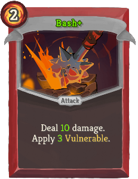 | Basic | Attack | 2 | Deal 8(10) damage. Apply 2(3) Vulnerable. |
| Defend |  |  | Basic | Skill | 1 | Gain 5(8) Block. |
| Strike |  |  | Basic | Attack | 1 | Deal 6(9) damage. |
| Anger |  |  | Common | Attack | 0 | Deal 6(8) damage. Add a copy of this card into your discard pile. |
| Armaments |  |  | Common | Skill | 1 | Gain 5 Block. Upgrade a (all) card(s) in your hand for the rest of combat. |
| Body Slam | 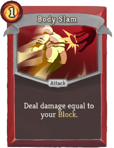 |  | Common | Attack | 1(0) | Deal damage equal to your Block. |
| Clash |  |  | Common | Attack | 0 | Can only be played if every card in your hand is an Attack. Deal 14(18) damage. |
| Cleave |  |  | Common | Attack | 1 | Deal 8(11) damage to ALL enemies. |
| Clothesline |  |  | Common | Attack | 2 | Deal 12(14) damage. Apply 2(3) Weak. |
| Flex |  |  | Common | Skill | 0 | Gain 2(4) Strength. At the end of this turn, lose 2(4) Strength. |
| Havoc |  |  | Common | Skill | 1(0) | Play the top card of your draw pile and Exhaust it. |
| Headbutt |  |  | Common | Attack | 1 | Deal 9(12) damage. Put a card from your discard pile on top of your draw pile. |
| Heavy Blade |  |  | Common | Attack | 2 | Deal 14 damage. Strength affects this card 3(5) times. |
| Iron Wave |  |  | Common | Attack | 1 | Gain 5(7) Block. Deal 5(7) damage. |
| Perfected Strike | 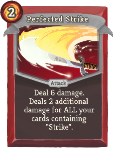 |  | Common | Attack | 2 | Deal 6 damage. Deals 2(3) additional damage for ALL your cards containing "Strike". |
| Pommel Strike |  |  | Common | Attack | 1 | Deal 9(10) damage. Draw 1(2) card(s). |
| Shrug It Off |  |  | Common | Skill | 1 | Gain 8(11) Block. Draw 1 card. |
| Sword Boomerang |  |  | Common | Attack | 1 | Deal 3 damage to a random enemy 3(4) times. |
| Thunderclap |  |  | Common | Attack | 1 | Deal 4(7) damage and apply 1 Vulnerable to ALL enemies. |
| True Grit |  |  | Common | Skill | 1 | Gain 7(9) Block. Exhaust 1 card at random (not at random). |
| Twin Strike |  |  | Common | Attack | 1 | Deal 5(7) damage twice. |
| Warcry |  |  | Common | Skill | 0 | Draw 1(2) card(s). Put a card from your hand onto the top of your draw pile. Exhaust. |
| Wild Strike |  |  | Common | Attack | 1 | Deal 12(17) damage. Shuffle a *Wound into your draw pile. |
| Battle Trance |  |  | Uncommon | Skill | 0 | Draw 3(4) cards. You cannot draw additional cards this turn. |
| Blood for Blood |  |  | Uncommon | Attack | 4(3) | Costs 1 less [R] for each time you lose HP this combat. Deal 18(22) damage. |
| Bloodletting | 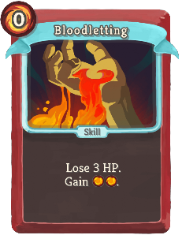 |  | Uncommon | Skill | 0 | Lose 3 HP. Gain [R] [R] ([R]). |
| Burning Pact |  |  | Uncommon | Skill | 1 | Exhaust 1 card. Draw 2(3) cards. |
| Carnage |  |  | Uncommon | Attack | 2 | Ethereal. Deal 20(28) damage. |
| Combust |  |  | Uncommon | Power | 1 | At the end of your turn, lose 1 HP and deal 5(7) damage to ALL enemies. |
| Dark Embrace |  |  | Uncommon | Power | 2(1) | Whenever a card is Exhausted, draw 1 card. |
| Disarm |  |  | Uncommon | Skill | 1 | Enemy loses 2(3) Strength. Exhaust. |
| Dropkick |  |  | Uncommon | Attack | 1 | Deal 5(8) damage. If the enemy has Vulnerable, gain [R] and draw 1 card. |
| Dual Wield |  | 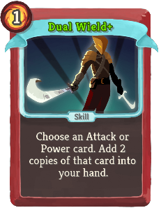 | Uncommon | Skill | 1 | Choose an Attack or Power card. Add a copy (2 copies) of that card into your hand. |
| Entrench |  |  | Uncommon | Skill | 2(1) | Double your Block. |
| Evolve | 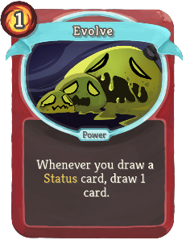 |  | Uncommon | Power | 1 | Whenever you draw a Status card, draw 1(2) card(s). |
| Feel No Pain |  |  | Uncommon | Power | 1 | Whenever a card is Exhausted, gain 3(4) Block. |
| Fire Breathing |  |  | Uncommon | Power | 1 | Whenever you draw a Status or Curse card, deal 6(10) damage to ALL enemies. |
| Flame Barrier |  |  | Uncommon | Skill | 2 | Gain 12(16) Block. Whenever you are attacked this turn, deal 4(6) damage back. |
| Ghostly Armor |  |  | Uncommon | Skill | 1 | Ethereal. Gain 10(13) Block. |
| Hemokinesis |  |  | Uncommon | Attack | 1 | Lose 2 HP. Deal 15(20) damage. |
| Infernal Blade |  |  | Uncommon | Skill | 1(0) | Add a random Attack into your hand. It costs 0 this turn. Exhaust. |
| Inflame |  |  | Uncommon | Power | 1 | Gain 2(3) Strength. |
| Intimidate |  |  | Uncommon | Skill | 0 | Apply 1(2) Weak to ALL enemies. Exhaust. |
| Metallicize |  |  | Uncommon | Power | 1 | At the end of your turn, gain 3(4) Block. |
| Power Through |  | 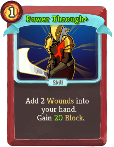 | Uncommon | Skill | 1 | Add 2 *Wounds into your hand. Gain 15(20) Block. |
| Pummel |  |  | Uncommon | Attack | 1 | Deal 2 damage 4(5) times. Exhaust. |
| Rage |  |  | Uncommon | Skill | 0 | Whenever you play an Attack this turn, gain 3(5) Block. |
| Rampage |  |  | Uncommon | Attack | 1 | Deal 8 damage. Increase this card's damage by 5(8) this combat. |
| Reckless Charge |  |  | Uncommon | Attack | 0 | Deal 7(10) damage. Shuffle a *Dazed into your draw pile. |
| Rupture |  |  | Uncommon | Power | 1 | Whenever you lose HP from a card, gain 1(2) Strength. |
| Searing Blow |  |  | Uncommon | Attack | 2 | Deal 12(16) damage. Can be Upgraded any number of times. |
| Second Wind |  | 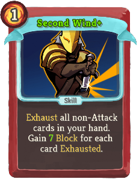 | Uncommon | Skill | 1 | Exhaust all non-Attack cards in your hand. Gain 5(7) Block for each card Exhausted. |
| Seeing Red |  |  | Uncommon | Skill | 1(0) | Gain [R] [R]. Exhaust. |
| Sentinel | 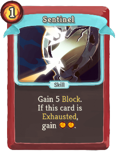 | 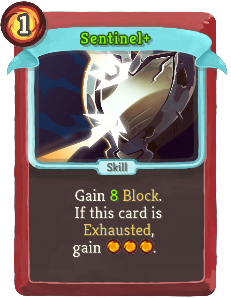 | Uncommon | Skill | 1 | Gain 5(8) Block. If this card is Exhausted, gain [R] [R] ([R]). |
| Sever Soul |  | 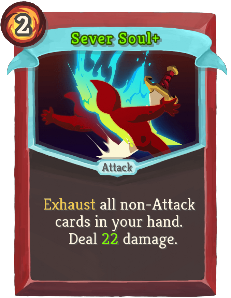 | Uncommon | Attack | 2 | Exhaust all non-Attack cards in your hand. Deal 16(22) damage. |
| Shockwave |  |  | Uncommon | Skill | 2 | Apply 3(5) Weak and Vulnerable to ALL enemies. Exhaust. |
| Spot Weakness |  |  | Uncommon | Skill | 1 | If the enemy intends to attack, gain 3(4) Strength. |
| Uppercut | 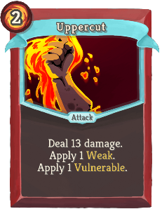 |  | Uncommon | Attack | 2 | Deal 13 damage. Apply 1(2) Weak. Apply 1(2) Vulnerable. |
| Whirlwind |  | 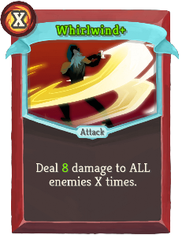 | Uncommon | Attack | X | Deal 5(8) damage to ALL enemies X times. |
| Barricade |  |  | Rare | Power | 3(2) | Block is not removed at the start of your turn. |
| Berserk |  | 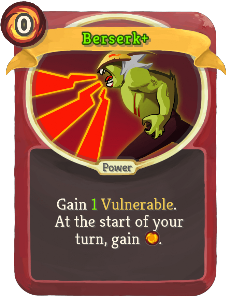 | Rare | Power | 0 | Gain 2(1) Vulnerable. At the start of your turn, gain [R]. |
| Bludgeon |  |  | Rare | Attack | 3 | Deal 32(42) damage. |
| Brutality |  |  | Rare | Power | 0 | (Innate.)  At the start of your turn, lose 1 HP and draw 1 card. |
| Corruption |  |  | Rare | Power | 3(2) | Skills cost 0. Whenever you play a Skill, Exhaust it. |
| Demon Form |  |  | Rare | Power | 3 | At the start of your turn, gain 2(3) Strength. |
| Double Tap |  |  | Rare | Skill | 1 | This turn, your next (1(2)) Attack(s) is (are) played twice. |
| Exhume |  |  | Rare | Skill | 1(0) | Put a card from your exhaust pile into your hand. Exhaust. |
| Feed |  |  | Rare | Attack | 1 | Deal 10(12) damage. If Fatal, raise your Max HP by 3(4). Exhaust. |
| Fiend Fire |  |  | Rare | Attack | 2 | Exhaust your hand. Deal 7(10) damage for each card Exhausted. Exhaust. |
| Immolate |  |  | Rare | Attack | 2 | Deal 21(28) damage to ALL enemies. Add a *Burn into your discard pile. |
| Impervious | 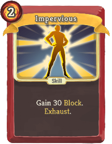 |  | Rare | Skill | 2 | Gain 30(40) Block. Exhaust. |
| Juggernaut |  |  | Rare | Power | 2 | Whenever you gain Block, deal 5(7) damage to a random enemy. |
| Limit Break |  |  | Rare | Skill | 1 | Double your Strength. Exhaust. (not Exhaust.) |
| Offering |  |  | Rare | Skill | 0 | Lose 6 HP. Gain [R] [R]. Draw 3(5) cards. Exhaust. |
| Reaper |  |  | Rare | Attack | 2 | Deal 4(5) damage to ALL enemies. Heal HP equal to unblocked damage. Exhaust. |
| Defend |  |  | Basic | Skill | 1 | Gain 5(8) Block. |
| Neutralize |  |  | Basic | Attack | 0 | Deal 3(4) damage. Apply 1(2) Weak. |
| Strike |  |  | Basic | Attack | 1 | Deal 6(9) damage. |
| Survivor |  |  | Basic | Skill | 1 | Gain 8(11) Block. Discard 1 card. |
| Acrobatics | 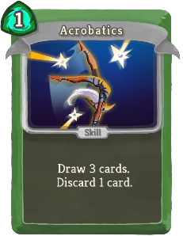 |  | Common | Skill | 1 | Draw 3(4) cards. Discard 1 card. |
| Backflip |  |  | Common | Skill | 1 | Gain 5(8) Block. Draw 2 cards. |
| Bane |  |  | Common | Attack | 1 | Deal 7(10) damage. If the enemy has Poison, deal 7(10) damage again. |
| Blade Dance |  |  | Common | Skill | 1 | Add 3(4) *Shivs into your hand. |
| Cloak and Dagger |  |  | Common | Skill | 1 | Gain 6 Block. Add 1(2) *Shiv(s) into your hand. |
| Dagger Spray | 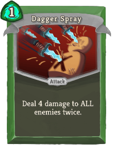 |  | Common | Attack | 1 | Deal 4(6) damage to ALL enemies twice. |
| Dagger Throw |  |  | Common | Attack | 1 | Deal 9(12) damage. Draw 1 card. Discard 1 card. |
| Deadly Poison |  |  | Common | Skill | 1 | Apply 5(7) Poison. |
| Deflect |  | 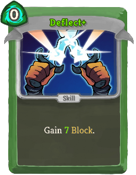 | Common | Skill | 0 | Gain 4(7) Block. |
| Dodge and Roll |  |  | Common | Skill | 1 | Gain 4(6) Block. Next turn, gain 4(6) Block. |
| Flying Knee |  |  | Common | Attack | 1 | Deal 8(11) damage. Next turn, gain [G]. |
| Outmaneuver |  |  | Common | Skill | 1 | Next turn, gain [G] [G] ([G]). |
| Piercing Wail | 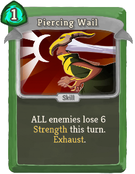 |  | Common | Skill | 1 | ALL enemies lose 6(8) Strength this turn. Exhaust. |
| Poisoned Stab |  |  | Common | Attack | 1 | Deal 6(8) damage. Apply 3(4) Poison. |
| Prepared |  |  | Common | Skill | 0 | Draw 1(2) card(s). Discard 1(2) card(s). |
| Quick Slash |  |  | Common | Attack | 1 | Deal 8(12) damage. Draw 1 card. |
| Slice |  |  | Common | Attack | 0 | Deal 6(9) damage. |
| Sneaky Strike |  |  | Common | Attack | 2 | Deal 12(16) damage. If you have discarded a card this turn, gain [G] [G]. |
| Sucker Punch |  |  | Common | Attack | 1 | Deal 7(9) damage. Apply 1(2) Weak. |
| Accuracy | 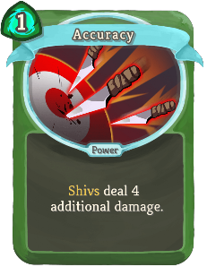 |  | Uncommon | Power | 1 | *Shivs deal 4(6) additional damage. |
| All-Out Attack |  |  | Uncommon | Attack | 1 | Deal 10(14) damage to ALL enemies. Discard 1 card at random. |
| Backstab |  |  | Uncommon | Attack | 0 | Innate. Deal 11(15) damage. Exhaust. |
| Blur |  | 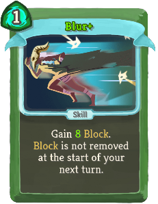 | Uncommon | Skill | 1 | Gain 5(8) Block. Block is not removed at the start of your next turn. |
| Bouncing Flask |  | 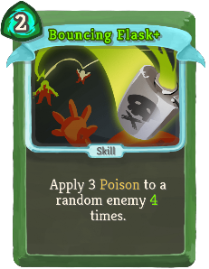 | Uncommon | Skill | 2 | Apply 3 Poison to a random enemy 3(4) times. |
| Calculated Gamble |  |  | Uncommon | Skill | 0 | Discard your hand, then draw that many cards. Exhaust. (not Exhaust.) |
| Caltrops | 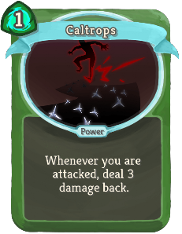 |  | Uncommon | Power | 1 | Whenever you are attacked, deal 3(5) damage back. |
| Catalyst |  |  | Uncommon | Skill | 1 | Double (Triple) the enemy's Poison. Exhaust. |
| Choke |  |  | Uncommon | Attack | 2 | Deal 12 damage. Whenever you play a card this turn, the enemy loses 3(5) HP. |
| Concentrate |  |  | Uncommon | Skill | 0 | Discard 3(2) cards. Gain [G] [G]. |
| Crippling Cloud |  |  | Uncommon | Skill | 2 | Apply 4(7) Poison and 2 Weak to ALL enemies. Exhaust. |
| Dash |  |  | Uncommon | Attack | 2 | Gain 10(13) Block. Deal 10(13) damage. |
| Distraction |  |  | Uncommon | Skill | 1(0) | Add a random Skill into your hand. It costs 0 this turn. Exhaust. |
| Endless Agony |  |  | Uncommon | Attack | 0 | Deal 4(6) damage. Whenever you draw this card, add a copy of it into your hand. Exhaust. |
| Escape Plan |  |  | Uncommon | Skill | 0 | Draw 1 card. If you draw a Skill, gain 3(5) Block. |
| Eviscerate | 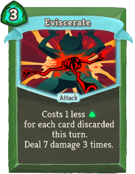 | 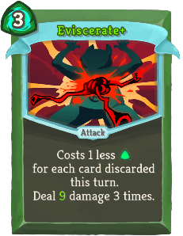 | Uncommon | Attack | 3 | Costs 1 less [G] for each card discarded this turn. Deal 7(9) damage 3 times. |
| Expertise |  |  | Uncommon | Skill | 1 | Draw cards until you have 6(7) in your hand. |
| Finisher | 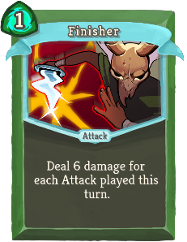 |  | Uncommon | Attack | 1 | Deal 6(8) damage for each Attack played this turn. |
| Flechettes |  |  | Uncommon | Attack | 1 | Deal 4(6) damage for each Skill in your hand. |
| Footwork |  |  | Uncommon | Power | 1 | Gain 2(3) Dexterity. |
| Heel Hook |  |  | Uncommon | Attack | 1 | Deal 5(8) damage. If the enemy has Weak, gain [G] and draw 1 card. |
| Infinite Blades |  |  | Uncommon | Power | 1 | (Innate.)  At the start of your turn, add a *Shiv into your hand. |
| Leg Sweep |  |  | Uncommon | Skill | 2 | Apply 2(3) Weak. Gain 11(14) Block. |
| Masterful Stab |  |  | Uncommon | Attack | 0 | Costs 1 additional [G] for each time you lose HP this combat. Deal 12(16) damage. |
| Noxious Fumes | 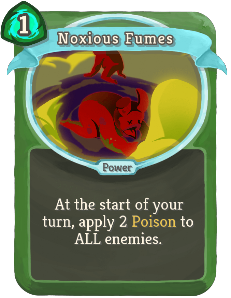 |  | Uncommon | Power | 1 | At the start of your turn, apply 2(3) Poison to ALL enemies. |
| Predator |  |  | Uncommon | Attack | 2 | Deal 15(20) damage. Next turn, draw 2 additional cards. |
| Reflex |  |  | Uncommon | Skill |  | Unplayable. If this card is discarded from your hand, draw 2(3) cards. |
| Riddle with Holes | 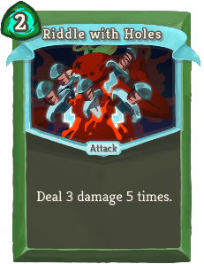 |  | Uncommon | Attack | 2 | Deal 3(4) damage 5 times. |
| Setup |  |  | Uncommon | Skill | 1(0) | Put a card from your hand on top of your draw pile. It costs 0 until played. |
| Skewer |  |  | Uncommon | Attack | X | Deal 7(10) damage X times. |
| Tactician |  |  | Uncommon | Skill |  | Unplayable. If this card is discarded from your hand, gain [G] ([G]). |
| Terror |  |  | Uncommon | Skill | 1(0) | Apply 99 Vulnerable. Exhaust. |
| Well-Laid Plans |  |  | Uncommon | Power | 1 | At the end of your turn, Retain up to 1(2) card(s). |
| A Thousand Cuts | 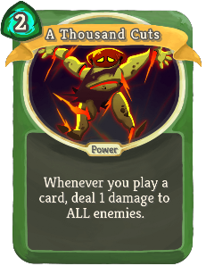 |  | Rare | Power | 2 | Whenever you play a card, deal 1(2) damage to ALL enemies. |
| Adrenaline |  |  | Rare | Skill | 0 | Gain [G] ([G]). Draw 2 cards. Exhaust. |
| After Image |  |  | Rare | Power | 1 | (Innate.)  Whenever you play a card, gain 1 Block. |
| Alchemize |  |  | Rare | Skill | 1(0) | Obtain a random potion. Exhaust. |
| Bullet Time |  |  | Rare | Skill | 3(2) | You cannot draw additional cards this turn. Reduce the cost of all cards in your hand to 0 this turn. |
| Burst |  |  | Rare | Skill | 1 | This turn, your next (1(2)) Skill(s) is (are) played twice. |
| Corpse Explosion |  |  | Rare | Skill | 2 | Apply 6(9) Poison. When the enemy dies, deal damage equal to its Max HP to ALL enemies. |
| Die Die Die | 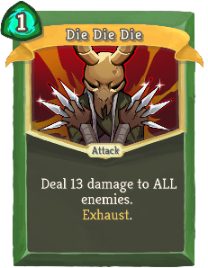 |  | Rare | Attack | 1 | Deal 13(17) damage to ALL enemies. Exhaust. |
| Doppelganger | 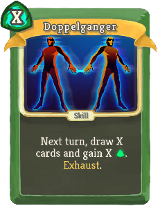 |  | Rare | Skill | X | Next turn, draw X (X+1) cards and gain X (X+1) [G]. Exhaust. |
| Envenom |  | 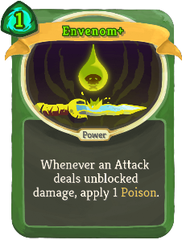 | Rare | Power | 2(1) | Whenever an Attack deals unblocked damage, apply 1 Poison. |
| Glass Knife |  |  | Rare | Attack | 1 | Deal 8(12) damage twice. Decrease the damage of this card by 2 this combat. |
| Grand Finale | 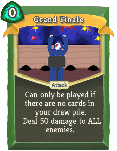 |  | Rare | Attack | 0 | Can only be played if there are no cards in your draw pile. Deal 50(60) damage to ALL enemies. |
| Malaise |  |  | Rare | Skill | X | Enemy loses X (X+1) Strength. Apply X (X+1) Weak. Exhaust. |
| Nightmare |  |  | Rare | Skill | 3(2) | Choose a card. Next turn, add 3 copies of that card into your hand. Exhaust. |
| Phantasmal Killer |  |  | Rare | Skill | 1(0) | Next turn, your Attacks deal double damage. |
| Storm of Steel |  |  | Rare | Skill | 1 | Discard your hand. Add 1 *Shiv (*Shiv+) into your hand for each card discarded. |
| Tools of the Trade |  |  | Rare | Power | 1(0) | At the start of your turn, draw 1 card and discard 1 card. |
| Unload |  | 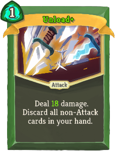 | Rare | Attack | 1 | Deal 14(18) damage. Discard all non-Attack cards in your hand. |
| Wraith Form |  |  | Rare | Power | 3 | Gain 2(3) Intangible. At the end of your turn, lose 1 Dexterity. |
| Defend |  |  | Basic | Skill | 1 | Gain 5(8) Block. |
| Dualcast |  | 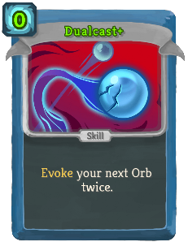 | Basic | Skill | 1(0) | Evoke your next Orb twice. |
| Strike |  |  | Basic | Attack | 1 | Deal 6(9) damage. |
| Zap |  |  | Basic | Skill | 1(0) | Channel 1 Lightning. |
| Ball Lightning |  | 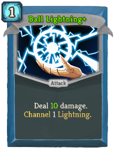 | Common | Attack | 1 | Deal 7(10) damage. Channel 1 Lightning. |
| Barrage |  |  | Common | Attack | 1 | Deal 4(6) damage for each Channeled Orb. |
| Beam Cell |  |  | Common | Attack | 0 | Deal 3(4) damage. Apply 1(2) Vulnerable. |
| Charge Battery |  |  | Common | Skill | 1 | Gain 7(10) Block. Next turn, gain [B]. |
| Claw |  |  | Common | Attack | 0 | Deal 3(5) damage. Increase the damage of ALL Claw cards by 2 this combat. |
| Cold Snap |  |  | Common | Attack | 1 | Deal 6(9) damage. Channel 1 Frost. |
| Compile Driver |  |  | Common | Attack | 1 | Deal 7(10) damage. Draw 1 card for each unique Orb you have. |
| Coolheaded |  |  | Common | Skill | 1 | Channel 1 Frost. Draw 1(2) card(s). |
| Go for the Eyes |  |  | Common | Attack | 0 | Deal 3(4) damage. If the enemy intends to attack, apply 1(2) Weak. |
| Hologram |  |  | Common | Skill | 1 | Gain 3(5) Block. Put a card from your discard pile into your hand. Exhaust. (not Exhaust.) |
| Leap | 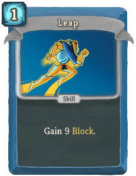 |  | Common | Skill | 1 | Gain 9(12) Block. |
| Rebound |  |  | Common | Attack | 1 | Deal 9(12) damage. Put the next card you play this turn on top of your draw pile. |
| Recursion |  |  | Common | Skill | 1(0) | Evoke your next Orb. Channel the Orb that was just Evoked. |
| Stack |  |  | Common | Skill | 1 | Gain Block equal to the number of cards in your discard pile (+3). |
| Steam Barrier |  | 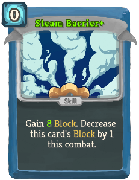 | Common | Skill | 0 | Gain 6(8) Block. Decrease this card's Block by 1 this combat. |
| Streamline |  |  | Common | Attack | 2 | Deal 15(20) damage. Reduce this card's cost by 1 this combat. |
| Sweeping Beam |  |  | Common | Attack | 1 | Deal 6(9) damage to ALL enemies. Draw 1 card. |
| TURBO |  |  | Common | Skill | 0 | Gain [B] [B] ([B]). Add a *Void into your discard pile. |
| Aggregate | 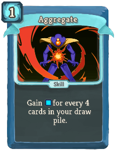 |  | Uncommon | Skill | 1 | Gain [B] for every 4(3) cards in your draw pile. |
| Auto-Shields |  | 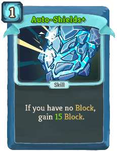 | Uncommon | Skill | 1 | If you have no Block, gain 11(15) Block. |
| Blizzard |  |  | Uncommon | Attack | 1 | Deal damage equal to 2(3) times the number of Frost Channeled this combat to ALL enemies. |
| Boot Sequence | 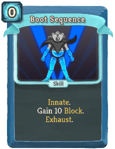 |  | Uncommon | Skill | 0 | Innate. Gain 10(13) Block. Exhaust. |
| Bullseye | 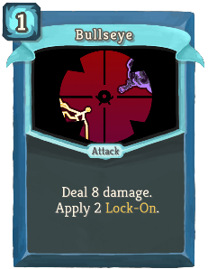 | 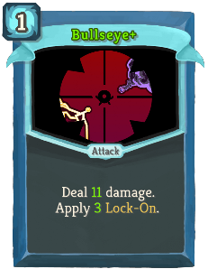 | Uncommon | Attack | 1 | Deal 8(11) damage. Apply 2(3) Lock-On. |
| Capacitor |  |  | Uncommon | Power | 1 | Gain 2(3) Orb slots. |
| Chaos |  |  | Uncommon | Skill | 1 | Channel 1(2) random Orb(s). |
| Chill |  |  | Uncommon | Skill | 0 | (Innate.)  Channel 1 Frost for each enemy in combat. Exhaust. |
| Consume |  |  | Uncommon | Skill | 2 | Gain 2(3) Focus. Lose 1 Orb slot. |
| Darkness |  |  | Uncommon | Skill | 1 | Channel 1 Dark.  (Trigger the passive ability of all Dark orbs.) |
| Defragment |  |  | Uncommon | Power | 1 | Gain 1(2) Focus. |
| Doom and Gloom |  | 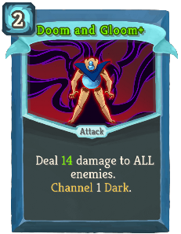 | Uncommon | Attack | 2 | Deal 10(14) damage to ALL enemies. Channel 1 Dark. |
| Double Energy | 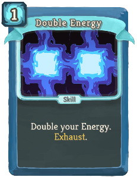 |  | Uncommon | Skill | 1(0) | Double your Energy. Exhaust. |
| Equilibrium |  |  | Uncommon | Skill | 2 | Gain 13(16) Block. Retain your hand this turn. |
| FTL |  |  | Uncommon | Attack | 0 | Deal 5(6) damage. If you have played less than 3(4) cards this turn, draw 1 card. |
| Force Field |  |  | Uncommon | Skill | 4 | Costs 1 less [B] for each Power card played this combat. Gain 12(16) Block. |
| Fusion |  |  | Uncommon | Skill | 2(1) | Channel 1 Plasma. |
| Genetic Algorithm |  |  | Uncommon | Skill | 1 | Gain 1 Block. Permanently increase this card's Block by 2(3). Exhaust. |
| Glacier |  |  | Uncommon | Skill | 2 | Gain 7(10) Block. Channel 2 Frost. |
| Heatsinks |  |  | Uncommon | Power | 1 | Whenever you play a Power card, draw 1(2) card(s). |
| Hello World |  |  | Uncommon | Power | 1 | (Innate.)  At the start of your turn, add a random Common card into your hand. |
| Loop |  |  | Uncommon | Power | 1 | At the start of your turn, trigger the passive ability of your next Orb (1(2) times). |
| Melter |  |  | Uncommon | Attack | 1 | Remove all Block from the enemy. Deal 10(14) damage. |
| Overclock |  |  | Uncommon | Skill | 0 | Draw 2(3) cards. Add a *Burn into your discard pile. |
| Recycle |  |  | Uncommon | Skill | 1(0) | Exhaust a card. Gain [B] equal to its cost. |
| Reinforced Body | 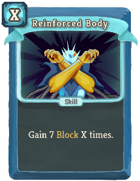 |  | Uncommon | Skill | X | Gain 7(9) Block X times. |
| Reprogram | 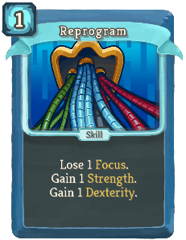 |  | Uncommon | Skill | 1 | Lose 1(2) Focus. Gain 1(2) Strength. Gain 1(2) Dexterity. |
| Rip and Tear | 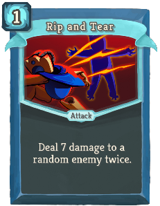 |  | Uncommon | Attack | 1 | Deal 7(9) damage to a random enemy twice. |
| Scrape |  |  | Uncommon | Attack | 1 | Deal 7(10) damage. Draw 4(5) cards. Discard all cards drawn this way that do not cost 0. |
| Self Repair |  |  | Uncommon | Power | 1 | At the end of combat, heal 7(10) HP. |
| Skim | 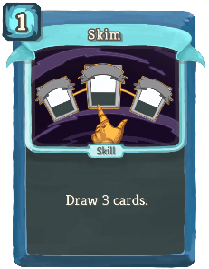 |  | Uncommon | Skill | 1 | Draw 3(4) cards. |
| Static Discharge | 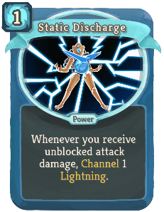 |  | Uncommon | Power | 1 | Whenever you receive unblocked attack damage, Channel 1(2) Lightning. |
| Storm |  |  | Uncommon | Power | 1 | (Innate.)  Whenever you play a Power card, Channel 1 Lightning. |
| Sunder |  |  | Uncommon | Attack | 3 | Deal 24(32) damage. If this kills an enemy, gain [B] [B] [B]. |
| Tempest |  |  | Uncommon | Skill | X | Channel X (X+1) Lightning. Exhaust. |
| White Noise |  |  | Uncommon | Skill | 1(0) | Add a random Power card into your hand. It costs 0 this turn. Exhaust. |
| All for One |  |  | Rare | Attack | 2 | Deal 10(14) damage. Put all cost 0 cards from your discard pile into your hand. |
| Amplify |  |  | Rare | Skill | 1 | This turn, your next (1(2)) Power card(s) is (are) played twice. |
| Biased Cognition |  |  | Rare | Power | 1 | Gain 4(5) Focus. At the start of your turn, lose 1 Focus. |
| Buffer |  |  | Rare | Power | 2 | Prevent the next (1(2)) time(s) you would lose HP. |
| Core Surge |  |  | Rare | Attack | 1 | Deal 11(15) damage. Gain 1 Artifact. Exhaust. |
| Creative AI |  |  | Rare | Power | 3(2) | At the start of your turn, add a random Power card into your hand. |
| Echo Form |  |  | Rare | Power | 3 | Ethereal. (not Ethereal.) The first card you play each turn is played twice. |
| Electrodynamics |  |  | Rare | Power | 2 | Lightning now hits ALL enemies. Channel 2(3) Lightning. |
| Fission |  |  | Rare | Skill | 0 | Remove (Evoke) all your Orbs. Gain [B] and draw 1 card for each Orb removed (Evoked). Exhaust. |
| Hyperbeam |  |  | Rare | Attack | 2 | Deal 26(34) damage to ALL enemies. Lose 3 Focus. |
| Machine Learning |  |  | Rare | Power | 1 | (Innate.)  At the start of your turn, draw 1 additional card. |
| Meteor Strike |  |  | Rare | Attack | 5 | Deal 24(30) damage. Channel 3 Plasma. |
| Multi-Cast |  |  | Rare | Skill | X | Evoke your next Orb X (X+1) times. |
| Rainbow |  |  | Rare | Skill | 2 | Channel 1 Lightning. Channel 1 Frost. Channel 1 Dark. Exhaust. (not Exhaust.) |
| Reboot |  |  | Rare | Skill | 0 | Shuffle ALL your cards into your draw pile. Draw 4(6) cards. Exhaust. |
| Seek |  |  | Rare | Skill | 0 | Put 1(2) card(s) from your draw pile into your hand. Exhaust. |
| Thunder Strike |  |  | Rare | Attack | 3 | Deal 7(9) damage to a random enemy for each Lightning Channeled this combat. |
| Defend |  |  | Basic | Skill | 1 | Gain 5(8) Block. |
| Eruption |  |  | Basic | Attack | 2(1) | Deal 9 damage. Enter Wrath. |
| Strike |  |  | Basic | Attack | 1 | Deal 6(9) damage. |
| Vigilance |  |  | Basic | Skill | 2 | Gain 8(12) Block. Enter Calm. |
| Bowling Bash |  |  | Common | Attack | 1 | Deal 7(10) damage for each enemy in combat. |
| Consecrate |  |  | Common | Attack | 0 | Deal 5(8) damage to ALL enemies. |
| Crescendo |  |  | Common | Skill | 1(0) | Retain. Enter Wrath. Exhaust. |
| Crush Joints |  |  | Common | Attack | 1 | Deal 8(10) damage. If the last card played this combat was a Skill, apply 1(2) Vulnerable. |
| Cut Through Fate |  |  | Common | Attack | 1 | Deal 7(9) damage. Scry 2(3). Draw 1 card. |
| Empty Body |  |  | Common | Skill | 1 | Gain 7(10) Block. Exit your Stance. |
| Empty Fist |  |  | Common | Attack | 1 | Deal 9(14) damage. Exit your Stance. |
| Evaluate |  |  | Common | Skill | 1 | Gain 6(10) Block. Shuffle an *Insight into your draw pile. |
| Flurry of Blows |  |  | Common | Attack | 0 | Deal 4(6) damage. Whenever you change Stances, return this from the discard pile to your hand. |
| Flying Sleeves |  |  | Common | Attack | 1 | Retain. Deal 4(6) damage twice. |
| Follow-Up |  |  | Common | Attack | 1 | Deal 7(11) damage. If the last card played this combat was an Attack, gain [W]. |
| Halt |  |  | Common | Skill | 0 | Gain 3(4) Block. If you are in Wrath, gain 9(14) additional Block. |
| Just Lucky |  |  | Common | Attack | 0 | Scry 1(2). Gain 2(3) Block. Deal 3(4) damage. |
| Pressure Points |  |  | Common | Skill | 1 | Apply 8(11) *Mark. ALL enemies lose HP equal to their *Mark. |
| Prostrate |  |  | Common | Skill | 0 | Gain 2(3) Mantra. Gain 4 Block. |
| Protect |  |  | Common | Skill | 2 | Retain. Gain 12(16) Block. |
| Sash Whip |  |  | Common | Attack | 1 | Deal 8(10) damage. If the last card played this combat was an Attack, apply 1(2) Weak. |
| Third Eye |  |  | Common | Skill | 1 | Gain 7(9) Block. Scry 3(5). |
| Tranquility |  |  | Common | Skill | 1(0) | Retain. Enter Calm. Exhaust. |
| Battle Hymn |  |  | Uncommon | Power | 1 | (Innate.)  At the start of each turn, add a *Smite into your hand. |
| Carve Reality |  |  | Uncommon | Attack | 1 | Deal 6(10) damage. Add a *Smite into your hand. |
| Collect |  |  | Uncommon | Skill | X | Put a *Miracle+ into your hand at the start of your next X (X+1) turns. Exhaust. |
| Conclude |  |  | Uncommon | Attack | 1 | Deal 12(16) damage to ALL enemies. End your turn. |
| Deceive Reality |  |  | Uncommon | Skill | 1 | Gain 4(7) Block. Add a *Safety into your hand. |
| Empty Mind |  |  | Uncommon | Skill | 1 | Draw 2(3) cards. Exit your Stance. |
| Fasting |  |  | Uncommon | Power | 2 | Gain 3(4) Strength. Gain 3(4) Dexterity. Gain 1 less [W] at the start of each turn. |
| Fear No Evil |  |  | Uncommon | Attack | 1 | Deal 8(11) damage. If the enemy intends to Attack, enter Calm. |
| Foreign Influence |  |  | Uncommon | Skill | 0 | Choose 1 of 3 Attacks of any color to add into your hand. (It costs 0 this turn.)  Exhaust. |
| Foresight |  |  | Uncommon | Power | 1 | At the start of your turn, Scry 3(4). |
| Indignation |  |  | Uncommon | Skill | 1 | If you are in Wrath, apply 3(5) Vulnerable to ALL enemies, otherwise enter Wrath. |
| Inner Peace |  |  | Uncommon | Skill | 1 | If you are in Calm, draw 3(4) cards, otherwise enter Calm. |
| Like Water |  |  | Uncommon | Power | 1 | At the end of your turn, if you are in Calm, gain 5(7) Block. |
| Meditate |  |  | Uncommon | Skill | 1 | Put a (2) card(s) from your discard pile into your hand and Retain it (them). Enter Calm. End your turn. |
| Mental Fortress |  |  | Uncommon | Power | 1 | Whenever you change Stances, gain 4(6) Block. |
| Nirvana |  |  | Uncommon | Power | 1 | Whenever you Scry, gain 3(4) Block. |
| Perseverance |  |  | Uncommon | Skill | 1 | Retain. Gain 5(7) Block. When Retained, increase its Block by 2(3) this combat. |
| Pray |  |  | Uncommon | Skill | 1 | Gain 3(4) Mantra. Shuffle an *Insight into your draw pile. |
| Reach Heaven |  |  | Uncommon | Attack | 2 | Deal 10(15) damage. Shuffle a *Through *Violence into your draw pile. |
| Rushdown |  |  | Uncommon | Power | 1(0) | Whenever you enter Wrath, draw 2 cards. |
| Sanctity |  |  | Uncommon | Skill | 1 | Gain 6(9) Block. If the last card played this combat was a Skill, draw 2 cards. |
| Sands of Time |  |  | Uncommon | Attack | 4 | Retain. Deal 20(26) damage. When Retained, lower its cost by 1 this combat. |
| Signature Move |  |  | Uncommon | Attack | 2 | Can only be played if this is the only Attack in your hand. Deal 30(40) damage. |
| Simmering Fury |  |  | Uncommon | Skill | 1 | At the start of your next turn, enter Wrath and draw 2(3) cards. |
| Study |  |  | Uncommon | Power | 2(1) | At the end of your turn, shuffle an *Insight into your draw pile. |
| Swivel |  |  | Uncommon | Skill | 2 | Gain 8(11) Block. The next Attack you play costs 0. |
| Talk to the Hand |  |  | Uncommon | Attack | 1 | Deal 5(7) damage. Whenever you attack this enemy, gain 2(3) Block. Exhaust. |
| Tantrum |  |  | Uncommon | Attack | 1 | Deal 3 damage 3(4) times. Enter Wrath. Shuffle this card into your draw pile. |
| Wallop |  |  | Uncommon | Attack | 2 | Deal 9(12) damage. Gain Block equal to unblocked damage dealt. |
| Wave of the Hand |  |  | Uncommon | Skill | 1 | Whenever you gain Block this turn, apply 1(2) Weak to ALL enemies. |
| Weave |  |  | Uncommon | Attack | 0 | Deal 4(6) damage. Whenever you Scry, return this from the discard pile to your Hand. |
| Wheel Kick |  |  | Uncommon | Attack | 2 | Deal 15(20) damage. Draw 2 cards. |
| Windmill Strike |  |  | Uncommon | Attack | 2 | Retain. Deal 7(10) damage. When Retained, increase its damage by 4(5) this combat. |
| Worship |  |  | Uncommon | Skill | 2 | (Retain.)  Gain 5 Mantra. |
| Wreath of Flame |  |  | Uncommon | Skill | 1 | Your next Attack deals 5(8) additional damage. |
| Alpha |  |  | Rare | Skill | 1 | (Innate.)  Shuffle a *Beta into your draw pile. Exhaust. |
| Blasphemy |  |  | Rare | Skill | 1 | (Retain.)  Enter Divinity. Die next turn. Exhaust. |
| Brilliance |  |  | Rare | Attack | 1 | Deal 12(16) damage. Deals additional damage equal to Mantra gained this combat. |
| Conjure Blade |  |  | Rare | Skill | X | Shuffle an *Expunger (with X+1) into your draw pile. Exhaust. |
| Deus Ex Machina |  |  | Rare | Skill |  | Unplayable. When you draw this card, add 2(3) *Miracles to your hand and Exhaust. |
| Deva Form |  |  | Rare | Power | 3 | Ethereal. (not Ethereal.) At the start of your turn, gain [W] and increase this gain by 1. |
| Devotion |  |  | Rare | Power | 1 | At the start of your turn, gain 2(3) Mantra. |
| Establishment |  |  | Rare | Power | 1 | (Innate.)  Whenever a card is Retained, reduce its cost by 1 this combat. |
| Judgment |  |  | Rare | Skill | 1 | If the enemy has 30(40) or less HP, set their HP to 0. |
| Lesson Learned |  |  | Rare | Attack | 2 | Deal 10(13) damage. If Fatal, Upgrade a random card in your deck. Exhaust. |
| Master Reality |  |  | Rare | Power | 1(0) | Whenever a card is created during combat, Upgrade it. |
| Omniscience |  |  | Rare | Skill | 4(3) | Choose a card in your draw pile. Play the chosen card twice and exhaust it. Exhaust. |
| Ragnarok |  |  | Rare | Attack | 3 | Deal 5(6) damage to a random enemy 5(6) times. |
| Scrawl |  |  | Rare | Skill | 1(0) | Draw cards until your hand is full. Exhaust. |
| Spirit Shield |  |  | Rare | Skill | 2 | Gain 3(4) Block for each card in your hand. |
| Vault |  |  | Rare | Skill | 3(2) | Take an extra turn after this one. End your turn. Exhaust. |
| Wish |  |  | Rare | Skill | 3 | Choose one: Gain 6(8) Plated Armor, 3(4) Strength, or 25(30) Gold. Exhaust. |
| Apparition |  |  | Special | Skill | 1 | Ethereal. (not Ethereal.) Gain 1 Intangible. Exhaust. |
| Become Almighty |  |  | Special | Power |  | Gain 3(4) Strength. |
| Beta |  |  | Special | Skill | 2(1) | Shuffle an *Omega into your draw pile. Exhaust. |
| Bite |  |  | Special | Attack | 1 | Deal 7(8) damage. Heal 2(3) HP. |
| Expunger |  |  | Special | Attack | 1 | Deal 9(15) damage X times. |
| Fame and Fortune |  |  | Special | Skill |  | Gain 25(30) Gold. |
| Insight |  |  | Special | Skill | 0 | Retain. Draw 2(3) cards. Exhaust. |
| J.A.X. |  |  | Special | Skill | 0 | Lose 3 HP. Gain 2(3) Strength. |
| Live Forever |  |  | Special | Power |  | Gain 6(8) *Plated *Armor. |
| Miracle |  |  | Special | Skill | 0 | Retain. Gain [W] ([W]). Exhaust. |
| Omega |  |  | Special | Power | 3 | At the end of your turn, deal 50(60) damage to ALL enemies. |
| Ritual Dagger |  |  | Special | Attack | 1 | Deal 15 damage. If Fatal, permanently increase this card's damage by 3(5). Exhaust. |
| Safety |  |  | Special | Skill | 1 | Retain. Gain 12(16) Block. Exhaust. |
| Shiv |  |  | Special | Attack | 0 | Deal 4(6) damage. Exhaust. |
| Smite |  |  | Special | Attack | 1 | Retain. Deal 12(16) damage. Exhaust. |
| Through Violence |  |  | Special | Attack | 0 | Retain. Deal 20(30) damage. Exhaust. |
| Burn |  |  | Common | Status |  | Unplayable. At the end of your turn, take 2 damage. |
| Dazed |  |  | Common | Status |  | Unplayable. Ethereal. |
| Slimed |  |  | Common | Status | 1 | Exhaust. |
| Void |  |  | Common | Status |  | Unplayable. Ethereal. Whenever this card is drawn, lose 1 Energy. |
| Wound |  |  | Common | Status |  | Unplayable. |
| Bandage Up |  |  | Uncommon | Skill | 0 | Heal 4(6) HP. Exhaust. |
| Blind |  |  | Uncommon | Skill | 0 | Apply 2 Weak (to ALL enemies). |
| Dark Shackles |  |  | Uncommon | Skill | 0 | Enemy loses 9(15) Strength this turn. Exhaust. |
| Deep Breath |  |  | Uncommon | Skill | 0 | Shuffle your discard pile into your draw pile. Draw 1(2) card(s). |
| Discovery |  |  | Uncommon | Skill | 1 | Choose 1 of 3 random cards to add into your hand. It costs 0 this turn. Exhaust. (not Exhaust.) |
| Dramatic Entrance |  |  | Uncommon | Attack | 0 | Innate. Deal 8(12) damage to ALL enemies. Exhaust. |
| Enlightenment |  |  | Uncommon | Skill | 0 | Reduce the cost of all cards in your hand to 1 this turn (combat). |
| Finesse |  |  | Uncommon | Skill | 0 | Gain 2(4) Block. Draw 1 card. |
| Flash of Steel |  |  | Uncommon | Attack | 0 | Deal 3(6) damage. Draw 1 card. |
| Good Instincts |  |  | Uncommon | Skill | 0 | Gain 6(9) Block. |
| Impatience |  |  | Uncommon | Skill | 0 | If you have no Attacks in your hand, draw 2(3) cards. |
| Jack of All Trades |  |  | Uncommon | Skill | 0 | Add 1(2) random Colorless card(s) into your hand. Exhaust. |
| Madness |  |  | Uncommon | Skill | 1(0) | Reduce the cost of a random card in your hand to 0 this combat. Exhaust. |
| Mind Blast |  |  | Uncommon | Attack | 2(1) | Innate. Deal damage equal to the number of cards in your draw pile. |
| Panacea |  |  | Uncommon | Skill | 0 | Gain 1(2) Artifact. Exhaust. |
| Panic Button |  |  | Uncommon | Skill | 0 | Gain 30(40) Block. You cannot gain Block from cards for 2 turns. Exhaust. |
| Purity |  |  | Uncommon | Skill | 0 | Exhaust up to 3(5) cards in your hand. Exhaust. |
| Swift Strike |  |  | Uncommon | Attack | 0 | Deal 7(10) damage. |
| Trip |  |  | Uncommon | Skill | 0 | Apply 2 Vulnerable (to ALL enemies). |
| Apotheosis |  |  | Rare | Skill | 2(1) | Upgrade ALL your cards for the rest of combat. Exhaust. |
| Chrysalis |  |  | Rare | Skill | 2 | Shuffle 3(5) random Skills into your draw pile. They cost 0 this combat. Exhaust. |
| Hand of Greed |  |  | Rare | Attack | 2 | Deal 20(25) damage. If Fatal, gain 20(25) Gold. |
| Magnetism |  |  | Rare | Power | 2(1) | At the start of your turn, add a random Colorless card into your hand. |
| Master of Strategy |  |  | Rare | Skill | 0 | Draw 3(4) cards. Exhaust. |
| Mayhem |  |  | Rare | Power | 2(1) | At the start of your turn, play the top card of your draw pile. |
| Metamorphosis |  |  | Rare | Skill | 2 | Shuffle 3(5) random Attacks into your draw pile. They cost 0 this combat. Exhaust. |
| Panache |  |  | Rare | Power | 0 | Every time you play 5 cards in a single turn, deal 10(14) damage to ALL enemies. |
| Sadistic Nature |  |  | Rare | Power | 0 | Whenever you apply a debuff to an enemy, they take 5(7) damage. |
| Secret Technique |  |  | Rare | Skill | 0 | Put a Skill from your draw pile into your hand. Exhaust. (not Exhaust.) |
| Secret Weapon |  |  | Rare | Skill | 0 | Put an Attack from your draw pile into your hand. Exhaust. (not Exhaust.) |
| The Bomb |  |  | Rare | Skill | 2 | At the end of 3 turns, deal 40(50) damage to ALL enemies. |
| Thinking Ahead |  |  | Rare | Skill | 0 | Draw 2 cards. Put a card from your hand on top of your draw pile. Exhaust. (not Exhaust.) |
| Transmutation |  |  | Rare | Skill | X | Add X random (Upgraded) Colorless cards into your hand. They cost 0 this turn. Exhaust. |
| Violence |  |  | Rare | Skill | 0 | Put 3(4) random Attacks from your draw pile into your hand. Exhaust. |
| Ascender's Bane |  |  | Special | Curse |  | Unplayable. Ethereal. Cannot be removed from your deck. |
| Curse of the Bell |  |  | Special | Curse |  | Unplayable. Cannot be removed from your deck. |
| Necronomicurse |  |  | Special | Curse |  | Unplayable. There is no escape from this Curse. |
| Pride |  |  | Special | Curse | 1 | Innate. At the end of your turn, put a copy of this card on top of your draw pile. Exhaust. |
| Clumsy |  |  | Curse | Curse |  | Unplayable. Ethereal. |
| Decay |  |  | Curse | Curse |  | Unplayable. At the end of your turn, take 2 damage. |
| Doubt |  |  | Curse | Curse |  | Unplayable. At the end of your turn, gain 1 Weak. |
| Injury |  |  | Curse | Curse |  | Unplayable. |
| Normality |  |  | Curse | Curse |  | Unplayable. While in hand, you cannot play more than 3 cards this turn. |
| Pain |  |  | Curse | Curse |  | Unplayable. While in hand, lose 1 HP whenever you play another card. |
| Parasite |  |  | Curse | Curse |  | Unplayable. If transformed or removed from your deck, lose 3 Max HP. |
| Regret |  |  | Curse | Curse |  | Unplayable. At the end of your turn, lose HP equal to the number of cards in your hand. |
| Shame |  |  | Curse | Curse |  | Unplayable. At the end of your turn, gain 1 Frail. |
| Writhe |  |  | Curse | Curse |  | Unplayable. Innate. |
