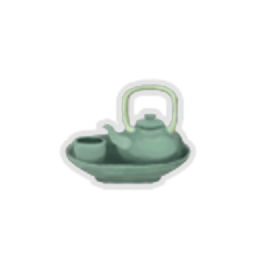
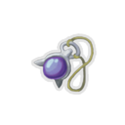
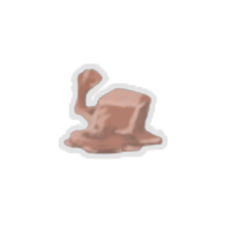
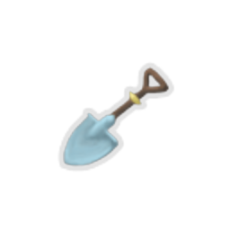

| Image | Name | Rarity | Color | Description | Flavor |
| ----- | ---- | ------ | ----- | ----------- | ------ |
|  | Burning Blood | Starter | Red | At the end of combat, heal #b6 HP. | Your body's own blood burns with an undying rage. |
|  | Cracked Core | Starter | Blue | At the start of each combat, #yChannel #b1 #yLightning. | The mysterious life force which powers the Automatons within the Spire. It appears to be cracked. |
|  | Pure Water | Starter | Purple | At the start of each combat, add a #yMiracle into your hand. | Filtered through fine sand and free of impurities. |
|  | Ring of the Snake | Starter | Green | At the start of each combat, draw #b2 additional cards. | Made from a fossilized snake. Represents great skill as a huntress. |
|  | Akabeko | Common |  | Your first Attack each combat deals #b8 additional damage. | "Muuu~" |
|  | Anchor | Common |  | Start each combat with #b10 #yBlock. | Holding this miniature trinket, you feel heavier and more stable. |
|  | Ancient Tea Set | Common |  | Whenever you enter a Rest Site, start the next combat with [E] [E] . | The key to a refreshing night's rest. |
|  | Art of War | Common |  | If you do not play any #yAttacks during your turn, gain an additional [E] next turn. | This ancient manuscript contains wisdom from a past age. |
|  | Bag of Marbles | Common |  | At the start of each combat, apply #b1 #yVulnerable to ALL enemies. | A once popular toy in the City. Useful for throwing enemies off balance. |
|  | Bag of Preparation | Common |  | At the start of each combat, draw #b2 additional cards. | Oversized adventurer's pack. Has many pockets and straps. |
|  | Blood Vial | Common |  | At the start of each combat, heal #b2 HP. | A vial containing the blood of a pure and elder vampire. |
|  | Bronze Scales | Common |  | Start each combat with #b3 #yThorns. | The sharp scales of the Guardian. Rearranges itself to protect its user. |
|  | Centennial Puzzle | Common |  | The first time you lose HP each combat, draw #b3 cards. | Upon solving the puzzle, you feel a powerful warmth in your chest. |
|  | Ceramic Fish | Common |  | Whenever you add a card to your deck, gain #b9 #yGold. | Meticulously painted, these fish were revered to bring great fortune. |
|  | Damaru | Common | Purple | At the start of your turn, gain #b1 #yMantra. | The sound of the small drum keeps your mind awake, revealing a path forward. |
|  | Data Disk | Common | Blue | Start each combat with #b1 #yFocus. | This disk contains precious data on birds and snakes. |
|  | Dream Catcher | Common |  | Whenever you #yRest, you may add a card into your deck. | The northern tribes would often use dream catchers at night, believing they led to self improvement. |
|  | Happy Flower | Common |  | Every #b3 turns, gain [E] . | This unceasingly joyous plant is a popular novelty item among nobles. |
|  | Juzu Bracelet | Common |  | Normal enemy combats are no longer encountered in #y? rooms. | A ward against the unknown. |
|  | Lantern | Common |  | Start each combat with an additional [E] . | An eerie lantern which illuminates only for the wielder. |
|  | Maw Bank | Common |  | Whenever you climb a floor, gain #b12 #yGold. No longer works when you spend any #yGold at a shop. | Surprisingly popular, despite maw attacks being a regular occurrence. |
|  | Meal Ticket | Common |  | Whenever you enter a shop, heal #b15 HP. | "Complimentary meatballs with every visit!" |
|  | Nunchaku | Common |  | Every time you play #b10 #yAttacks, gain [E] . | A good training tool. Improves the posture and agility of the wielder. |
|  | Oddly Smooth Stone | Common |  | Start each combat with #b1 #yDexterity. | You have never seen something so smooth and pristine. This must be the work of the Ancients. |
|  | Omamori | Common |  | Negate the next #b2 #rCurses you obtain. | A common charm for staving off vile spirits. This one seems to possess a spark of divine energy. |
|  | Orichalcum | Common |  | If you end your turn without #yBlock, gain #b6 #yBlock. | A green tinted metal of an unknown origin. Seemingly indestructible. |
|  | Pen Nib | Common |  | Every #b10th #yAttack you play deals double damage. | Holding the nib, you can see everyone ever slain by a previous owner of the pen. A violent history. |
|  | Potion Belt | Common |  | Upon pickup, gain #b2 Potion slots. | I can hold more Potions using this belt! |
|  | Preserved Insect | Common |  | Enemies in Elite combats have #b25% less HP. | The insect seems to create a shrinking aura that targets particularly large enemies. |
|  | Red Skull | Common | Red | While your HP is at or below #b50%, you have #b3 additional #yStrength. | A small skull covered in ornamental paint. |
|  | Regal Pillow | Common |  | Whenever you #yRest, heal an additional #b15 HP. | Now you can get a proper night's rest. |
|  | Smiling Mask | Common |  | The Merchant's card removal service now always costs #b50 #yGold. | Mask worn by the Merchant. He must have spares... |
|  | Snecko Skull | Common | Green | Whenever you apply #yPoison, apply an additional #b1 #yPoison. | A snecko skull in pristine condition. Mysteriously clean and smooth, dirt and grime fall off inexplicably. |
|  | Strawberry | Common |  | Upon pickup, raise your Max HP by #b7. | "Delicious! Haven't seen any of these since the blight." - Ranwid |
|  | The Boot | Common |  | Whenever you would deal #b4 or less unblocked attack damage, increase it to #b5. | When wound up, the boot grows larger in size. |
|  | Tiny Chest | Common |  | Every #b4th #y? room is a #yTreasure room. | "A fine prototype." - The Architect |
|  | Toy Ornithopter | Common |  | Whenever you use a potion, heal #b5 HP. | "This little toy is the perfect companion for the lone adventurer!" |
|  | Vajra | Common |  | Start each combat with #b1 #yStrength. | An ornamental relic given to warriors displaying glory in battle. |
|  | War Paint | Common |  | Upon pickup, #yUpgrade #b2 random #ySkills. | In the past, Ironclads would create wards using enchanted war paint before charging into battle. |
|  | Whetstone | Common |  | Upon pickup, #yUpgrade #b2 random #yAttacks. | "Flesh never beats steel." - Kublai the Great |
|  | Blue Candle | Uncommon |  | #yUnplayable #rCurse cards can now be played. NL Whenever you play a #rCurse, lose #b1 HP and #yExhaust it. | The flame ignites when shrouded in darkness. |
|  | Bottled Flame | Uncommon |  | Upon pickup, choose an #yAttack. Start each combat with this card in your hand. | Inside the bottle resides a flame that eternally burns. |
|  | Bottled Lightning | Uncommon |  | Upon pickup, choose a #ySkill. Start each combat with this card in your hand. | Peering into the swirling maelstrom, you see a part of yourself staring back. |
|  | Bottled Tornado | Uncommon |  | Upon pickup, choose a #yPower card. Start each combat with this card in your hand. | The bottle gently hums and whirs. |
|  | Darkstone Periapt | Uncommon |  | Whenever you obtain a #rCurse, increase your Max HP by #b6. | The stone draws power from dark energy, converting it into vitality for the wearer. |
|  | Duality | Uncommon | Purple | Whenever you play an #yAttack, gain #b1 temporary #yDexterity. | "And the sun was extinguished forever, as if curtains fell before it." - Zoroth |
|  | Eternal Feather | Uncommon |  | For every #b5 cards in your deck, heal #b3 HP whenever you enter a Rest Site. | This feather appears to be completely indestructible. What bird does this possibly come from? |
|  | Frozen Egg | Uncommon |  | Whenever you add a #yPower card into your deck, #yUpgrade it. | The egg lies inert and frozen, never to hatch. |
|  | Gold-Plated Cables | Uncommon | Blue | Your rightmost Orb triggers its passive an additional time. | "Interesting! Even automatons are affected by placebo." - Ranwid |
|  | Gremlin Horn | Uncommon |  | Whenever an enemy dies, gain [E] and draw #b1 card. | "Gremlin Nobs are capable of growing until the day they die. Remarkable." - Ranwid |
|  | Horn Cleat | Uncommon |  | At the start of your 2nd turn, gain #b14 #yBlock. | Pleasant to hold in the hand. What was it for? |
|  | Ink Bottle | Uncommon |  | Whenever you play #b10 cards, draw #b1 card. | Once exhausted, appears to refill itself in a different color. |
|  | Kunai | Uncommon |  | Every time you play #b3 #yAttacks in a single turn, gain #b1 #yDexterity. | A blade favored by assassins for its lethality at range. |
|  | Letter Opener | Uncommon |  | Every time you play #b3 #ySkills in a single turn, deal #b5 damage to ALL enemies. | Unnaturally sharp. |
|  | Matryoshka | Uncommon |  | The next #b2 non-Boss chests you open contain #b2 #yRelics. | A stackable set of painted dolls. The paint depicts an unknown bird with white eyes and blue feathers. |
|  | Meat on the Bone | Uncommon |  | If your HP is at or below #b50% at the end of combat, heal #b12 HP. | The meat keeps replenishing, never seeming to fully run out. |
|  | Mercury Hourglass | Uncommon |  | At the start of your turn, deal #b3 damage to ALL enemies. | An enchanted hourglass that endlessly drips. |
|  | Molten Egg | Uncommon |  | Whenever you add an #yAttack into your deck, #yUpgrade it. | The egg of a Phoenix. It glows red hot with a simmering lava. |
|  | Mummified Hand | Uncommon |  | Whenever you play a #yPower card, a random card in your hand costs #b0 that turn. | Frequently twitches, especially when your pulse is high. |
|  | Ninja Scroll | Uncommon | Green | At the start of each combat, add #b3 #yShivs into your hand. | Contains the secrets of assassination. |
|  | Ornamental Fan | Uncommon |  | Every time you play #b3 #yAttacks in a single turn, gain #b4 #yBlock. | The fan seems to extend and harden as blood is spilled. |
|  | Pantograph | Uncommon |  | At the start of Boss combats, heal #b25 HP. | "Solid foundations are not accidental. Tools for planning are a must." - The Architect |
|  | Paper Krane | Uncommon | Green | Enemies with #yWeak deal #b40% less damage rather than #b25%. | An origami of a creature from a past age. |
|  | Paper Phrog | Uncommon | Red | Enemies with #yVulnerable take #b75% more damage rather than #b50%. | The paper continually folds and unfolds itself into the shape of a small creature. |
|  | Pear | Uncommon |  | Upon pickup, raise your Max HP by #b10. | A common fruit before the Spireblight. |
|  | Question Card | Uncommon |  | Future card rewards have #b1 additional card to choose from. | "Those with more choices minimize the downside to chaos." - Kublai the Great |
|  | Self-Forming Clay | Uncommon | Red | Whenever you lose HP, gain #b3 #yBlock next turn. | "Most curious! It appears to form itself loosely on my thoughts! Tele-clay?" - Ranwid |
|  | Shuriken | Uncommon |  | Every time you play #b3 #yAttacks in a single turn, gain #b1 #yStrength. | Lightweight throwing weapons. Recommend going for the eyes. |
|  | Singing Bowl | Uncommon |  | When adding cards into your deck, you may raise your Max HP by #b2 instead. | This well-used artifact rings out with a beautiful melody when struck. |
|  | Strike Dummy | Uncommon |  | Cards containing "Strike" deal #b3 additional damage. | It's beat up. |
|  | Sundial | Uncommon |  | Every #b3 times you shuffle your draw pile, gain [E] [E] . | "Early man's foolish obsession with time caused them to look to the sky for guidance, hoping for something permanent." - Zoroth |
|  | Symbiotic Virus | Uncommon | Blue | At the start of each combat, #yChannel #b1 #yDark. | A little bit of bad can do a lot of good... |
|  | Teardrop Locket | Uncommon | Purple | Start each combat in #yCalm. | Its owner blind, its contents unseen. |
|  | The Courier | Uncommon |  | The Merchant restocks cards, relics, and potions. All prices are reduced by #b20%. | The Merchant's personal pet! |
|  | Toxic Egg | Uncommon |  | Whenever you add a #ySkill into your deck, #yUpgrade it. | "What a marvelous discovery! This appears to be the inert egg of some magical creature. Who or what created this?" - Ranwid |
|  | White Beast Statue | Uncommon |  | Potions always appear in combat rewards. | A small white statue of a creature you have never seen before. |
|  | Bird-Faced Urn | Rare |  | Whenever you play a #yPower card, heal #b2 HP. | This urn shows the crow god Mazaleth looking mischievous. |
|  | Calipers | Rare |  | At the start of your turn, lose #b15 #yBlock rather than all of your #yBlock. | "Mechanical precision leads to greatness" - The Architect |
|  | Captain's Wheel | Rare |  | At the start of your 3rd turn, gain #b18 #yBlock. | Wooden trinket carved with delicate precision. A name is carved into it but the language is foreign. |
|  | Champion Belt | Rare | Red | Whenever you apply #yVulnerable, apply #b1 #yWeak. | Only the greatest may wear this belt. |
|  | Charon's Ashes | Rare | Red | Whenever you #yExhaust a card, deal #b3 damage to ALL enemies. | Charon was said to be the god of rebirth, eternally dying and reviving in a burst of flame. |
|  | Cloak Clasp | Rare | Purple | At the end of your turn, gain #b1 #yBlock for each card in your hand. | A simple but sturdy design. |
|  | Dead Branch | Rare |  | Whenever you #yExhaust a card, add a random card into your hand. | The branch of a tree from a forgotten era. |
|  | Du-Vu Doll | Rare |  | For each #rCurse in your deck, start each combat with #b1 #yStrength. | A doll devised to gain strength from malicious energy. |
|  | Emotion Chip | Rare | Blue | If you lost HP during the previous turn, trigger the passive ability of all Orbs at the start of your turn. | ...<3...? |
|  | Fossilized Helix | Rare |  | Prevent the first time you would lose HP each combat. | Seemingly indestructible, you wonder what kind of creature this belonged to. |
|  | Ginger | Rare |  | You can no longer become #yWeakened. | A potent tool in many tonics. |
|  | Girya | Rare |  | You can now gain #yStrength at Rest Sites (up to 3 times). | This Girya is unfathomably heavy. You could train with this to get significantly stronger. |
|  | Golden Eye | Rare | Purple | Whenever you #yScry, #yScry #b2 additional cards. | See into the minds of those nearby, predicting their future moves. |
|  | Ice Cream | Rare |  | Energy is now conserved between turns. | "Delicious!" |
|  | Incense Burner | Rare |  | Every #b6 turns, gain #b1 #yIntangible. | The smoke imbues its owner with the spirit of the burned. |
|  | Lizard Tail | Rare |  | When you would die, heal to #b50% of your Max HP instead (works once). | A fake tail to trick enemies during combat. |
|  | Magic Flower | Rare | Red | Healing is #b50% more effective during combat. | A flower long thought extinct, somehow preserved in perfect condition. |
|  | Mango | Rare |  | Upon pickup, raise your Max HP by #b14. | The most coveted forgotten fruit. Impeccably preserved with no signs of Spireblight. |
|  | Old Coin | Rare |  | Upon pickup, gain #b300 #yGold. | Unique coins are highly valued by merchants for their historical value and rare metallic composition. |
|  | Peace Pipe | Rare |  | You can now remove cards from your deck at Rest Sites. | Clears the mind and cleanses the soul. |
|  | Pocketwatch | Rare |  | Whenever you play #b3 or less cards during your turn, draw #b3 additional cards at the start of your next turn. | The hands seem stuck on the 3 o'clock position. |
|  | Prayer Wheel | Rare |  | Normal enemies drop an additional card reward. | The wheel continues to spin, never stopping. |
|  | Shovel | Rare |  | You can now #yDig for relics at Rest Sites. | The Spire houses all number of relics from past civilizations and powerful adventurers lost to time. Time to go dig them up! |
|  | Stone Calendar | Rare |  | At the end of turn #b7, deal #b52 damage to ALL enemies. | The passage of time is imperceptible in the Spire. |
|  | The Specimen | Rare | Green | Whenever an enemy dies, transfer any #yPoison it has to a random enemy. | "Fascinating! I found a mutated creature demonstrating astounding toxic properties. Storing a sample for later examination." - Ranwid |
|  | Thread and Needle | Rare |  | Start each combat with #b4 #yPlated #yArmor. | Wrapping the magical thread around your body, you feel harder to the touch. |
|  | Tingsha | Rare | Green | Whenever you discard a card during your turn, deal #b3 damage to a random enemy. | The sound this instrument generates seems to be capable of reverberating to painful levels of volume. |
|  | Torii | Rare |  | Whenever you would receive #b5 or less unblocked attack damage, reduce it to #b1. | Holding the small Torii, you feel a sense of calm and safety drift through your mind. |
|  | Tough Bandages | Rare | Green | Whenever you discard a card during your turn, gain #b3 #yBlock. | Loss gives strength. |
|  | Tungsten Rod | Rare |  | Whenever you would lose HP, lose #b1 less. | It's very very heavy. |
|  | Turnip | Rare |  | You can no longer become #yFrail. | Best with Ginger. |
|  | Unceasing Top | Rare |  | Whenever you have no cards in hand during your turn, draw a card. | The top continues to spin effortlessly as if you were in a dream. |
|  | Wing Boots | Rare |  | You may ignore paths when choosing the next room to travel to #b3 times. | Stylish. |
|  | Bloody Idol | Special |  | Whenever you gain #yGold, heal #b5 HP. | The idol now weeps a constant stream of blood. |
|  | Cultist Headpiece | Special |  | You feel more talkative. | Part of the Flock! |
|  | Enchiridion | Special |  | At the start of each combat, add a random #yPower card into your hand. It costs #b0 for that turn. | The legendary journal of an ancient lich. |
|  | Face Of Cleric | Special |  | At the end of combat, raise your Max HP by #b1. | Everyone loves Cleric. |
|  | Golden Idol | Special |  | Enemies drop #b25% more #yGold. | Made of solid gold, you feel richer just holding it. |
|  | Gremlin Visage | Special |  | Start each combat with #b1 #yWeak. | Time to run. |
|  | Mark of the Bloom | Special |  | You can no longer heal. | In the Beyond, thoughts and reality are one. |
|  | Mutagenic Strength | Special |  | Start each combat with #b3 #yStrength. At the end of your first turn, lose #b3 #yStrength. | "The results seem fleeting, triggering when the subject is in danger." - Unknown |
|  | N'loth's Gift | Special |  | Triple the chance of finding #yRare cards from combat rewards. | The strange gift from N'loth. Whenever you try and unwrap it, another wrapped box of the same size lies within. |
|  | N'loth's Hungry Face | Special |  | The next non-Boss chest you open is empty. | You feel hungry. |
|  | Necronomicon | Special |  | The first #yAttack played each turn that costs #b2 or more is played twice. Upon pickup, obtain a special #rCurse. | Only a fool would try and harness this evil power. At night your dreams are haunted by images of the book devouring your mind. |
|  | Neow's Lament | Special |  | Enemies in your first #b3 combats will have #b1 HP. | The blessing of lamentation bestowed by Neow. |
|  | Nilry's Codex | Special |  | At the end of your turn, you may shuffle #b1 of #b3 random cards into your draw pile. | Crafted by the infamous game master himself. Said to expand one's mind. |
|  | Odd Mushroom | Special |  | When #yVulnerable, take #b25% more attack damage rather than #b50%. | "After consuming trichella parastius I felt larger and less... susceptible." - Ranwid |
|  | Red Mask | Special |  | At the start of each combat, apply #b1 #yWeak to ALL enemies. | This very stylish looking mask belongs to the leader of the Red Mask Bandits. Technically that makes you the leader now? |
|  | Spirit Poop | Special |  | It's unpleasant. | The charred remains of your offering to the spirits. |
|  | Ssserpent Head | Special |  | Whenever you enter a #y? room, gain #b50 #yGold. | The most fulfilling of lives is that in which you can buy anything! |
|  | Warped Tongs | Special |  | At the start of your turn, #yUpgrade a random card in your hand for the rest of combat. | The cursed tongs emit a strong desire to return to where they were stolen from. |
|  | Astrolabe | Boss |  | Upon pickup, #yTransform #b3 cards, then #yUpgrade them. | A tool to glean invaluable knowledge from the stars. |
|  | Black Blood | Boss | Red | Replaces #rBurning #rBlood. At the end of combat, heal #b12 HP. | The rage grows darker. |
|  | Black Star | Boss |  | Elites drop an additional relic when defeated. | Originally discovered in the town of the serpent, beside a solitary candle. |
|  | Busted Crown | Boss |  | Gain [E] at the start of your turn. Future card rewards have #b2 less cards to choose from. | The Champ's crown... or a pale imitation? |
|  | Calling Bell | Boss |  | Upon pickup, obtain a unique #rCurse and #b3 relics. | This dark iron bell rang 3 times when you found it, but now stays silent. |
|  | Coffee Dripper | Boss |  | Gain [E] at the start of your turn. You can no longer #yRest at Rest Sites. | "Yes, another cup please. Back to work. Back to work!" - The Architect |
|  | Cursed Key | Boss |  | Gain [E] at the start of your turn. Whenever you open a non-Boss chest, obtain a #rCurse. | You can feel the malicious energy emanating from the key. Power comes at a price. |
|  | Ectoplasm | Boss |  | Gain [E] at the start of your turn. You can no longer gain #yGold. | This blob of slime and energy seems to pulse with life. |
|  | Empty Cage | Boss |  | Upon pickup, remove #b2 cards from your deck. | "How unusual to cage that which you worship." - Ranwid |
|  | Frozen Core | Boss | Blue | Replaces #bCracked #bCore. If you end your turn with any empty Orb slots, #yChannel #b1 #yFrost. | The crack in your core has been filled with a pulsating cold energy. |
|  | Fusion Hammer | Boss |  | Gain [E] at the start of your turn. You can no longer #ySmith at Rest Sites. | Once wielded, the owner can never let go. |
|  | Holy Water | Boss | Purple | Replaces #pPure #pWater. At the start of each combat, add #b3 #yMiracles into your hand. | Collected from a time before the Spire. |
|  | Hovering Kite | Boss | Green | The first time you discard a card each turn, gain [E] . | The Kite floats around you in battle, propelled by a mysterious force. |
|  | Inserter | Boss | Blue | Every #b2 turns, gain #b1 Orb slot. | Push. Pull. Stack. Repeat. |
|  | Mark of Pain | Boss | Red | Gain [R] at the start of your turn. At the start of combat, shuffle #b2 #rWounds into your draw pile. | This brand was used by the northern tribes to signify warriors who had mastered pain in battle. |
|  | Nuclear Battery | Boss | Blue | At the start of each combat, #yChannel #b1 #yPlasma. | Ooooh... |
|  | Pandora's Box | Boss |  | Upon pickup, #bTransform all Strike and Defend cards. | You have a bad feeling about opening this. |
|  | Philosopher's Stone | Boss |  | Gain [E] at the start of your turn. ALL enemies start combat with #b1 #yStrength. | Raw energy emanates from the stone, empowering all nearby. |
|  | Ring of the Serpent | Boss | Green | Replaces #gRing #gof #gthe #gSnake. At the start of your turn, draw #b1 additional card. | Your ring has morphed and changed forms. |
|  | Runic Cube | Boss | Red | Whenever you lose HP, draw #b1 card. | The runes are indecipherable. |
|  | Runic Dome | Boss |  | Gain [E] at the start of your turn. You can no longer see enemy intents. | The runes are indecipherable. |
|  | Runic Pyramid | Boss |  | At the end of your turn, you no longer discard your hand. | The runes are indecipherable. |
|  | Sacred Bark | Boss |  | Double the effectiveness of potions. | A bark rumored to originate from the World tree. |
|  | Slaver's Collar | Boss |  | During Boss and Elite combats, gain [E] at the start of your turn. | Rusty miserable chains. |
|  | Snecko Eye | Boss |  | At the start of your turn, draw #b2 additional cards. Start each combat #yConfused. | An eye of a fallen snecko. Much larger than you imagined. |
|  | Sozu | Boss |  | Gain [E] at the start of your turn. You can no longer obtain potions. | You notice that magical liquids seem to lose their properties when near this relic. |
|  | Tiny House | Boss |  | Upon pickup, obtain #b1 potion. NL Gain #b50 #yGold. NL Raise your Max HP by #b5. NL Obtain #b1 card. NL Upgrade #b1 random card. | "A near perfect implementation of miniaturization. My finest work to date, but still not adequate." - The Architect |
|  | Velvet Choker | Boss |  | Gain [E] at the start of your turn. You cannot play more than #b6 cards per turn. | "Immense power, but too limited." - Kublai the Great |
|  | Violet Lotus | Boss | Purple | Whenever you exit #yCalm, gain an additional [E] . | The old texts describe that the surface of "mana pools" were littered with these flowers. |
|  | Wrist Blade | Boss | Green | #yAttacks that cost #b0 deal #b4 additional damage. | Handy for assassinations. |
|  | Brimstone | Shop | Red | At the start of your turn, gain #b2 #yStrength and ALL enemies gain #b1 #yStrength. | Emanates an infernal heat. |
|  | Cauldron | Shop |  | Upon pickup, brews #b5 random potions. | The Merchant is actually a rather skilled potion brewer. Buy 4 get 1 free. |
|  | Chemical X | Shop |  | The effects of your cost #bX cards are increased by #b2. | WARNING: Do not combine with sugar, spice, and everything nice. |
|  | Clockwork Souvenir | Shop |  | Start each combat with #b1 #yArtifact. | "So many intricate gears." |
|  | Dolly's Mirror | Shop |  | Upon pickup, obtain an additional copy of a card in your deck. | "I look funny in this." |
|  | Frozen Eye | Shop |  | When viewing your #yDraw #yPile, the cards are now shown in order. | Staring into the eye, you see a glimpse of your future. |
|  | Hand Drill | Shop |  | Whenever you break an enemy's #yBlock, apply #b2 #yVulnerable. | "Spirals are dangerous." |
|  | Lee's Waffle | Shop |  | Upon pickup, raise your Max HP by #b7 and heal all of your HP. | "Tastiest treat you will find in all the Spire! Baked today just for you." |
|  | Medical Kit | Shop |  | #yUnplayable #yStatus cards can now be played. Whenever you play a #yStatus card, #yExhaust it. | "Has everything you need! Anti-itch, anti-burn, anti-venom, and more!" |
|  | Melange | Shop | Purple | Whenever you shuffle your draw pile, #yScry #b3. | Mysterious sands from an unknown origin. Smells of cinnamon. |
|  | Membership Card | Shop |  | #b50% discount on all products! | "Bonus membership offer for my most valuable customers!" |
|  | Orange Pellets | Shop |  | Whenever you play a #yPower, #yAttack, and #ySkill in the same turn, remove all of your debuffs. | "Made from various fungi found throughout the Spire, they will stave off any affliction." |
|  | Orrery | Shop |  | Upon pickup, choose and add #b5 cards to your deck. | "Once you understand the universe..." - Zoroth |
|  | Prismatic Shard | Shop |  | Combat reward screens now contain Colorless cards and cards from other colors. | Looking through the shard, you are able to see entirely new perspectives. |
|  | Runic Capacitor | Shop | Blue | Start each combat with #b3 additional Orb slots. | More is better. |
|  | Sling of Courage | Shop |  | Start each Elite combat with #b2 #yStrength. | "A handy tool for dealing with particularly tough opponents." |
|  | Strange Spoon | Shop |  | Cards which #yExhaust when played will instead discard #b50% of the time. | Staring at the spoon, it appears to bend and twist around before your eyes. |
|  | The Abacus | Shop |  | Whenever you shuffle your draw pile, gain #b6 #yBlock. | "One...Two...Three..." |
|  | Toolbox | Shop |  | At the start of each combat, choose #b1 of #b3 random Colorless cards and add the chosen card into your hand. | A tool for every job. |
|  | Twisted Funnel | Shop | Green | At the start of each combat, apply #b4 #yPoison to ALL enemies. | "I wouldn't drink out of it." |
