| Name | Image | Upgraded image | Rarity | Type | Cost | Description |
| ---- | ----- | -------------- | ------ | ---- | ---- | ----------- |
| Corporeate |  |  | Basic | Skill | 1(0) | thevacant:Mill 5. thevacant:Return 1. |
| Defend |  |  | Basic | Skill | 1 | Gain 5(8) Block. |
| Soul Bash |  |  | Basic | Attack | 0 | thevacant:Rebound. Deal 3(4) damage. Gain 3(4) Vigor. |
| Strike |  |  | Basic | Attack | 1 | Deal 6(9) damage. |
| Back in the Mine |  |  | Common | Attack | 1 | Deal 7(10) damage. thevacant:Chip your next thevacant:Gem. |
| Battle Scars |  |  | Common | Skill | 1 | Gain 4 ([#00FF33]6[]) Vigor. thevacant:Wounded: Gain 2(3) Strength. Exhaust. |
| Cower |  |  | Common | Skill | 1 | Gain 6(8) Block. thevacant:Wounded: Gain 6(8) Block again. |
| Cursed Blast |  |  | Common | Attack | 1 | thevacant:Unnate. Deal 10(14) damage to ALL enemies. |
| Dig |  |  | Common | Skill | 1 | Gain 6(8) Block. thevacant:Mill 3(5). |
| Eye Poke |  |  | Common | Attack | 1 | Deal 2 damage 2 times. Apply 1(2) Weak. |
| Fling |  |  | Common | Attack | 1 | Deal 9(13) damage. thevacant:Mill 4. |
| Frantic Blow |  |  | Common | Attack | 2 | Deal 12(16) damage. thevacant:Wounded: Deal 12(16) damage again. |
| Grave Digger | 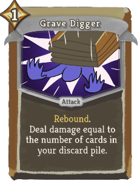 | 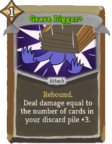 | Common | Attack | 1 | thevacant:Rebound. Deal damage equal to the number of cards in your discard pile (+3). |
| Grave Wave |  |  | Common | Attack | 1 | Deal 7(10) damage. thevacant:Wounded: Apply 2 Weak and 2 Vulnerable. |
| Jab |  |  | Common | Attack | 0 | thevacant:Rebound. Deal 6(8) damage. Shuffle this card into your draw pile. |
| Ruby Rage |  |  | Common | Skill | 1 | thevacant:Mine two size 3(4) thevacant:Rubies. |
| Sapphire Strike |  |  | Common | Attack | 1 | Deal 6(8) damage. thevacant:Mine a size 3(4) thevacant:Sapphire. |
| Shrieking Blast |  |  | Common | Attack | 1 | Deal 2(3) damage to ALL enemies 3 times. |
| Thoughtseize |  |  | Common | Attack | 1 | Deal 8(10) damage. thevacant:Return 1(2) card(s). |
| Treasure |  |  | Common | Skill | 0 | thevacant:Mine a size 1(2) thevacant:Emerald and a size 1 thevacant:Opal. Exhaust. |
| Absorb Amethyst | 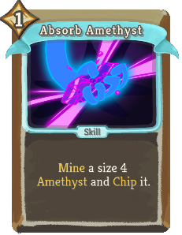 | 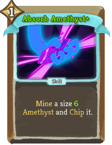 | Uncommon | Skill | 1 | thevacant:Mine a size 4(6) thevacant:Amethyst and thevacant:Chip it. |
| Acceptance |  |  | Uncommon | Power | 1 | Gain 2(3) Artifact. |
| Aw Man |  |  | Uncommon | Skill | 0 | Lose 4(2) HP. thevacant:Chip ALL your thevacant:Gems. Exhaust. |
| Brass Magnet |  |  | Uncommon | Attack | 0 | thevacant:Rebound. Deal 14(18) damage. Whenever you draw this card, discard it. |
| Burden Break |  |  | Uncommon | Power | 1 | Whenever you take damage, gain 3(4) Vigor. |
| Cleanse Soul |  |  | Uncommon | Power | 1 | (Innate.)  Whenever you thevacant:Mill a Status or Curse, Exhaust it. |
| Embrace Darkness |  |  | Uncommon | Skill | 2 | Gain 6(9) thevacant:Shroud. Apply 2 thevacant:Doom to EVERYONE. Exhaust. |
| Emerald Splash |  |  | Uncommon | Attack | 1 | Deal 9(13) damage to ALL enemies. thevacant:Mine a size 2(3) thevacant:Emerald. |
| Enchant | 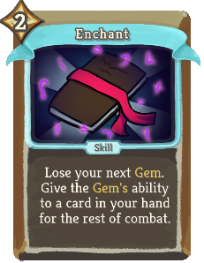 | 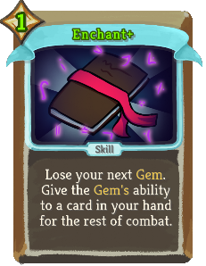 | Uncommon | Skill | 2(1) | Lose your next thevacant:Gem. Give the thevacant:Gem's ability to a card in your hand for the rest of combat. |
| Expand |  |  | Uncommon | Skill | 1 | Gain 2(3) Max HP. Lose 6 HP. Exhaust. |
| Fortify |  | 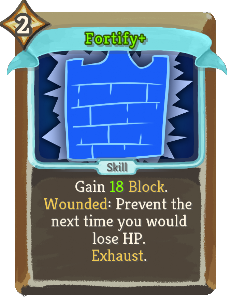 | Uncommon | Skill | 2 | Gain 10(18) Block. thevacant:Wounded: Prevent the next time you would lose HP. Exhaust. |
| Gloom |  |  | Uncommon | Power | 1 | thevacant:Mill 3(5) at the start of your turn. |
| Got Our Pickaxe | 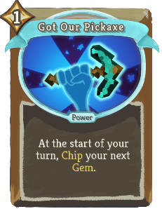 | 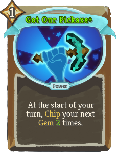 | Uncommon | Power | 1 | At the start of your turn, thevacant:Chip your next thevacant:Gem (1(2) times). |
| Hex |  |  | Uncommon | Skill | 1 | Apply 3(4) thevacant:Doom. Exhaust. |
| Immaterialize |  |  | Uncommon | Power | 1 | The next 3(4) cards you play that Exhaust return to your draw pile 2 turns later. |
| Into the Abyss |  |  | Uncommon | Power | 2 | Gain 6(9) thevacant:Shroud. At the start of your turn, apply 2 thevacant:Doom to EVERYONE. |
| Lash Out |  |  | Uncommon | Attack | 2(1) | Deal damage equal to your missing HP. Exhaust. |
| On Second Thought | 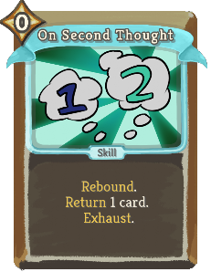 | 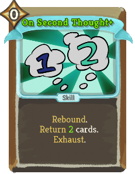 | Uncommon | Skill | 0 | thevacant:Rebound. thevacant:Return 1(2) card(s). Exhaust. |
| Onyx Blaster |  |  | Uncommon | Attack | 1 | Deal 12(14) damage. thevacant:Mine a size 2(3) thevacant:Onyx. Exhaust. |
| Opal Fracture |  |  | Uncommon | Attack | 2 | Deal 16(22) damage. thevacant:Mine a size 2(3) thevacant:Opal. |
| Opal Shine | 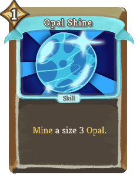 | 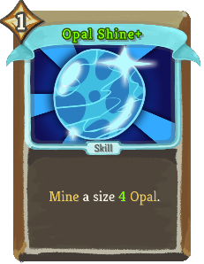 | Uncommon | Skill | 1 | thevacant:Mine a size 3(4) thevacant:Opal. |
| Reaper Blast |  |  | Uncommon | Skill | 2 | Apply 2(3) thevacant:Reap (, 2(3) Vulnerable,) and 2(3) Weak to ALL enemies. Exhaust. |
| Reaper Strike |  |  | Uncommon | Attack | 2 | Apply 2(3) thevacant:Reap and deal 14(18) damage to ALL enemies. Exhaust. |
| Recover |  |  | Uncommon | Power | 1 | At the end of battle, if you are thevacant:Wounded, heal 10(14) HP. |
| Reflection |  | 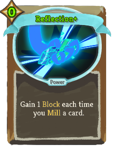 | Uncommon | Power | 1(0) | Gain 1 Block each time you thevacant:Mill a card. |
| Sneeze |  |  | Uncommon | Skill | 0 | (Innate.) Retain. thevacant:Mill 4. When Retained, increase this card's thevacant:Mill by 2. Exhaust. |
| Snowball |  | 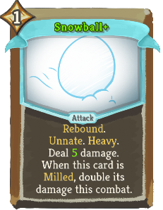 | Uncommon | Attack | 1 | thevacant:Rebound. (thevacant:Unnate. thevacant:Heavy.)  Deal 4(5) damage. When this card is thevacant:Milled, double its damage this combat. |
| Soul Barrage |  |  | Uncommon | Attack | 2 | Deal 4 damage 3(4) times. Can be upgraded any number of times. |
| Spelunk |  |  | Uncommon | Skill | 1 | Gain 5(8) Block. Choose a random thevacant:Gem to thevacant:Mine out of 3(4). |
| Spinshield |  |  | Uncommon | Skill | 2 | Gain 3(5) Block 3 times. |
| Surprise Attack |  |  | Uncommon | Attack | 0 | thevacant:Unnate. thevacant:Rebound. Deal 14(18) damage. Exhaust. |
| Threaten |  |  | Uncommon | Attack | 1 | Deal 0 damage 5(7) times. Exhaust. |
| Topaz Frenzy |  |  | Uncommon | Attack | 2 | Deal 3(5) damage 3 times. thevacant:Mine a size 6(8) thevacant:Ruby. Exhaust. |
| Unearth |  |  | Uncommon | Skill | 0 | Draw 1(2) card(s) from the bottom of your draw pile. Exhaust. |
| Void Embrace |  |  | Uncommon | Power | 1 | (Innate.)  Whenever a card you play Exhausts, gain 1 [#ee82ee]Void[]. |
| Dark Strike |  |  | Rare | Attack | 4(3) | Deal 6 damage 6 times. Apply 6 thevacant:Doom. |
| Diamond Is Unbreakable |  |  | Rare | Skill | X | thevacant:Mine a size X (X+1) thevacant:Diamond. Exhaust. |
| Dimension Tear |  |  | Rare | Attack | 2 | Deal 12(18) damage. Add your Exhaust pile to your hand. Exhaust. |
| Empty Shield |  |  | Rare | Skill | 2 | Gain Block equal to your missing HP. Exhaust. (not Exhaust.) |
| Essence Of Bismuth |  |  | Rare | Skill | 1(0) | Double debuffs on ALL enemies. Exhaust. |
| Exorcise |  |  | Rare | Skill | 2 | Cleanse all your Debuffs (and apply them to ALL enemies). Exhaust. |
| Fiend Frost | 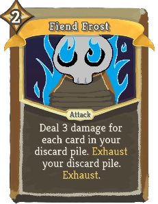 | 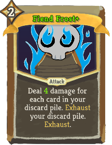 | Rare | Attack | 2 | Deal 3(4) damage for each card in your discard pile. Exhaust your discard pile. Exhaust. |
| Forge Soul |  |  | Rare | Power | 1 | (Innate.)  Whenever you thevacant:Mill a card, upgrade it for the rest of combat. |
| From Nothing |  |  | Rare | Skill | 2 | (Innate.)  thevacant:Mill your draw pile. Exhaust. |
| Gilded Pickaxe |  |  | Rare | Attack | 1 | Deal 6(8) damage twice. thevacant:Chip ALL your thevacant:Gems. |
| Memoria |  |  | Rare | Skill | 1 | The next (2) time(s) you play a card that Exhausts, play it twice. |
| Reap Soul |  | 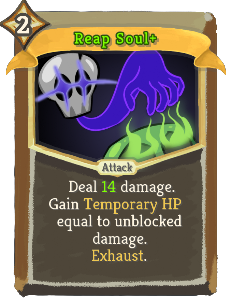 | Rare | Attack | 2 | Deal 10(14) damage. Gain Temporary_HP equal to unblocked damage. Exhaust. |
| Rejection |  |  | Rare | Power | 1 | Gain 2 Vulnerable, 2 Weak, and 4(6) Strength. |
| Requiem |  |  | Rare | Power | 3(2) | Whenever you gain HP, a buff, or a debuff, double it. |
| Runic Thoughts |  |  | Rare | Power | 1 | (thevacant:Rebound.)  Powers thevacant:Rebound. When you thevacant:Mill a Power, it costs 0 that turn. |
| Shatter | 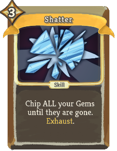 | 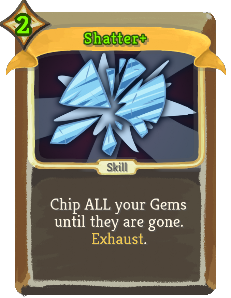 | Rare | Skill | 3(2) | Chip ALL your Gems until they are gone. Exhaust. |
| Showdown |  |  | Rare | Attack | 2 | Deal 10(14) damage 2 times to ALL enemies. Apply 2 thevacant:Doom to EVERYONE. |
| The Anvil |  |  | Rare | Skill |  | Unplayable. thevacant:Unnate. thevacant:Heavy. When this card is thevacant:Milled, deal 24(32) damage to ALL enemies. |
| Time Skip |  |  | Rare | Skill | 3 | (Draw 2 cards.)  All cards in your hand (to) cost 0 and Exhaust. Exhaust. |
| Void Form |  |  | Rare | Power | 3 | Gain 5(8) [#ee82ee]Void[]. |
