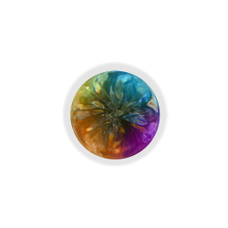
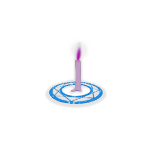

| Image | Name | Rarity | Color | Description | Flavor |
| ----- | ---- | ------ | ----- | ----------- | ------ |
|  | Black Magic 101 | Starter | The_cursed_purple | At the start of your turn, draw #b1 additional card if your draw pile has any #rCurse card. | Learn about black magic now!!! {4th Edition} |
|  | Tack | Common | The_cursed_purple | At the start of each combat, apply #b4 #yBleed to ALL enemies. | It hurts when stepping on. |
|  | Bloody Harpoon | Uncommon | The_cursed_purple | Whenever you apply #yBleed, apply an additional #b1 #yBleed. | Piercing with it, cannot move! |
|  | Demonic Mark | Uncommon | The_cursed_purple | Every time you activate an effect of #yCircle #b3 times in a single turn, gain #b1 #yStrength. | If you've seen this mark somewhere, you're just wrong. (Firmly) |
|  | Crystal Ball | Rare | The_cursed_purple | Whenever a #rCurse card is #yExhausted, deal #b5 damage to a random enemy. | Did you say the color looks like Prismatic Shard? You've gone too far. |
|  | Magic Candle | Rare | The_cursed_purple | Every time you activate an effect of #yCircle #b10 times, gain [E]. | It collects nearby mana during Rite. |
|  | Soul Vessel | Rare | The_cursed_purple | At the end of combat, heal HP equal to the number of #yExhausted #rCurse cards in this combat. | The feast of souls begins now! |
|  | Black Magic Advanced | Boss | The_cursed_purple | Replaces #gBlack #gMagic #g101. At the start of your turn, draw #b2 additional cards if your draw pile has any #rCurse card. | [The effects of curses and magic circles on human's body and side effects] |
|  | Four-Leaf Clover Charm | Boss | The_cursed_purple | Every time a card or a relic generates a random #rCurse card during combat, replace it with #rDregs. | Good luck and happiness come from gratitude. |
|  | Ominous Mark | Boss | The_cursed_purple | Gain [E] at the start of your turn. At the start of combat, shuffle #b2 random #rCurse cards into your draw pile. | Take a closer look, the mark looks shaking... |
|  | Pink Pellets | Shop | The_cursed_purple | Every time you activate an effect of #yCircle #b5 times in a single turn, remove all of your debuffs. | Selling with Orange Pellets! |
